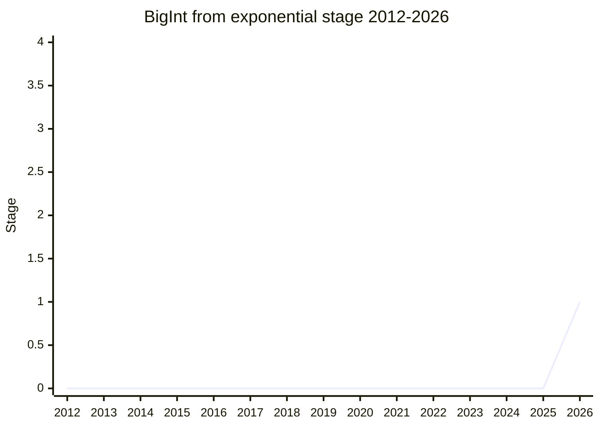

## Overview

BigInt from exponential is a proposal to **let `BigInt` accept exponential-notation strings that represent integers (for example `1.5e2` and `4.2000e+4`)**. Today `Number("1e6")` works but `BigInt("1e6")` throws a SyntaxError, an asymmetry that, when dealing with large integers, forces you either to write out every zero or to split the string yourself. The starting point was the discovery that [Amount](../proposals/amount.md)'s canonical form (an exponential string that preserves significant digits, distinguishing `1.000e3` from `1e3`) cannot be converted to `BigInt`. The same problem arises with JSON source text access (exponential notation is legal in JSON).

It began as a needs-consensus PR against ECMA-262 (#3857, a change in which `StringToBigInt` reuses the `StringNumericLiteral` grammar and constrains it to an integer MV), but after discussion across two meetings it was converted into a staged proposal. Both the string-parsing change and an extension of bigint literal syntax (`1e6n`) are in scope. The champion is [RGN](../people/RGN.md).

## Stage history

| Meeting                                                | What happened                                                                                                                                                                                          | Stage |
| ------------------------------------------------------ | ------------------------------------------------------------------------------------------------------------------------------------------------------------------------------------------------------ | ----- |
| [2026-05](../../../raw/notes/meetings/2026-05/may-19.md)  | First discussed as needs-consensus PR #3857. Opinion split on whether it should be a PR or a staged proposal, and the conclusion was deferred                                                          | -     |
| [2026-07](../../../raw/notes/meetings/2026-07/july-20.md) | On reconsideration, the PR was **converted into proposal-bigint-from-exponential and taken to Stage 1** ([WH](../people/WH.md) / [MF](../people/MF.md) / [JSL](../people/JSL.md) explicitly supported) | 0 → 1 |
| [2026-07](../../../raw/notes/meetings/2026-07/july-22.md) | Two temperature checks (whether to extend literal syntax / spillover into existing implicit conversions). Opinion split on both, to be considered in future design                                     | 1     |

> Horizontal axis = 2012-2026, vertical axis = Stage. First appeared in 2026-05 as a needs-consensus PR, and became a proposal at Stage 1 in 2026-07.

## Main issues

### Extend the constructor, or a separate method (`BigInt.parse`)?

[MF](../people/MF.md) opposed extending `BigInt(string)`, saying "I don't see why one would want to write a bigint in exponential notation. A form that allows a decimal point is especially hard to accept", and preferred a separate method such as `BigInt.parse` that accepts a more permissive grammar, including separators. [EAO](../people/EAO.md), on the other hand, opposed the separate-method idea:

> It would be very surprising for `BigInt(string)` and `BigInt.parse(string)` to parse the same string differently

([WH](../people/WH.md) also +1), and the design remains split. [KM](../people/KM.md) noted that "if the result is always an integer, allowing a decimal point is meaningless and a source of confusion", but [RGN](../people/RGN.md) replied that "unless it can accept the canonical form that indicates significant digits (`1.000e3` ≠ `1e3`), Amount's problem is not solved".

### Distinguishing literal use from dynamic parse use

[OFR](../people/OFR.md) argued for separating the use cases: "Having a string parsed in place of a literal is an antipattern, and for literal use the literal syntax (`1e6n`) should be extended. For the Amount use, we should wait until the proposal reaches its final form." [RGN](../people/RGN.md) sorted the space of possibilities: "If we do not satisfy the literal use with a function, the only remaining option is a syntax change." [PFC](../people/PFC.md) supported it, citing a real need in date-time processing (writing out the zeros equivalent to `1e9` is painful).

### Temperature checks (2026-07 day 3)

To save one design iteration, [RGN](../people/RGN.md) checked the temperature on two questions. (1) **Extending literal syntax** such as `1e6n`: Strong Positive 5 / Positive 4 / Following 3 / Confused 2 / Indifferent 2 / Unconvinced 0. (2) **Whether to propagate the new syntax into existing implicit conversions** such as `==` comparison, TypedArray, and `BigInt.asIntN` (versus keeping it to an opt-in static method): Strong Positive 4 / Positive 3 / Following 2 / Confused 2 / Indifferent 1 / Unconvinced 0. Both were mixed, and the results will be considered in future development.

## Related proposals

- [Amount](../proposals/amount.md) — the problem that the canonical form cannot be converted to `BigInt` is the origin of this proposal.
- [Fused Multiply-Add](../proposals/fused-multiply-add.md) — another proposal that grew out of an Amount design problem (conversion precision).

## Sources

- [2026-05 may-19](../../../raw/notes/meetings/2026-05/may-19.md) — first discussion of needs-consensus PR #3857 (deferred)
- [2026-07 july-20](../../../raw/notes/meetings/2026-07/july-20.md) — converted into a proposal, reached Stage 1
- [2026-07 july-22](../../../raw/notes/meetings/2026-07/july-22.md) — temperature checks
