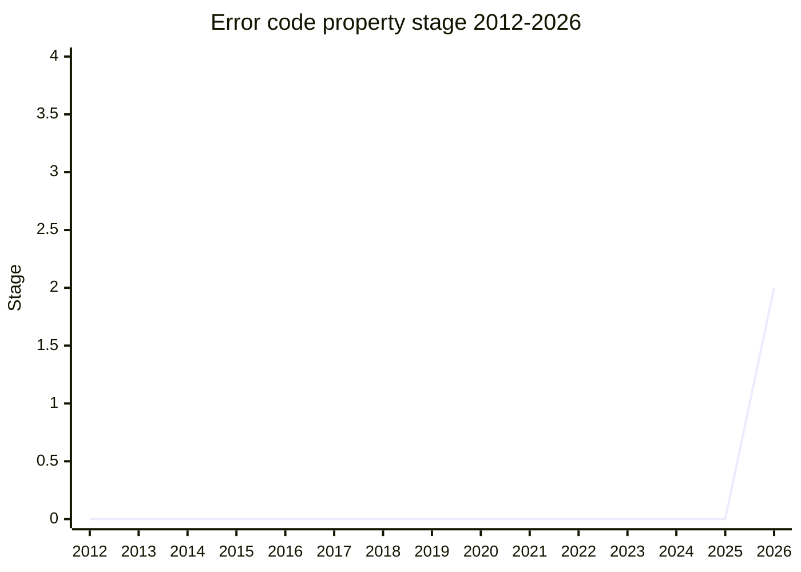

## Overview

Error code property adds a **`code` property to `Error` as a standard mechanism**. As with `cause`, it is passed through the constructor's options bag and installed on the instance as a non-enumerable own property. The value may be of any type (typically a string). The ecosystem already widely uses `code` to discriminate errors mechanically, starting with Node.js `err.code` (`ENOENT` and others), and this standardizes that practice on the language side. `SuppressedError` and `AggregateError` can also receive `code` through an options bag.

The champion is [JSL](../people/JSL.md) (James Snell, Cloudflare). It reached Stage 2 with spec text, a test262 draft, and a V8 draft implementation in place.

## Stage history

| Meeting                                                 | What happened                                                                                                                  | Stage |
| ------------------------------------------------------- | ------------------------------------------------------------------------------------------------------------------------------ | ----- |
| [2026-03](../../../raw/notes/meetings/2026-03/march-11.md) | First presented as "Error code property for Stage 1, 2, or 2.7". **Reached Stage 1**                                           | 0 → 1 |
| [2026-07](../../../raw/notes/meetings/2026-07/july-21.md)  | **Reached Stage 2**. Further advancement is conditional on alignment with DOMException                                         | 1 → 2 |
| [2026-07](../../../raw/notes/meetings/2026-07/july-22.md)  | [JHD](../people/JHD.md) / [RGN](../people/RGN.md) became the Stage 2 reviewers (filling in a nomination missed the day before) | 2     |

> Horizontal axis = 2012-2026, vertical axis = Stage. Stage 1 in 2026-03, Stage 2 in 2026-07.

## Main issues

### Clash with DOMException's `code`

The only substantive dispute. DOMException historically has a numeric `code` as a **prototype getter**. [AVK](../people/AVK.md) (on the WHATWG side) raised the concern that "`.code` would grow two meanings and cause confusion." [JSL](../people/JSL.md) / [JHD](../people/JHD.md) took the position that there is no real conflict, because both the installation (own property versus prototype getter) and the value space differ. [KG](../people/KG.md) explained that WHATWG treats DOMException's `code` as legacy and recommends `.name`. [JSL](../people/JSL.md) argued the opposite direction would be the breaking one: retargeting the ecosystem's `code` convention onto `.name`.

[KM](../people/KM.md) was cautious about advancing while [AVK](../people/AVK.md) was on leave, and [KG](../people/KG.md) held that the proposal should not go past Stage 2 without a coherent story for DOMException. The outcome was **Stage 2 only** (2.7 deferred), with "alignment with DOMException is a condition for further advancement" ([LVU](../people/LVU.md) alone also supported 2.7). The committee asked for that alignment path to be filed as an issue.

### Adding an options bag to `SuppressedError`

[MM](../people/MM.md) asked "the `SuppressedError` constructor has no options bag, does it?" and supported the proposal after confirming that it adds an options bag so both `cause` and `code` can be passed.

## Related proposals

- [Error Stack Accessor](../proposals/error-stack-accessor.md) — a neighboring proposal that also standardizes de facto behavior around Error.
- `error-cause` — the `cause` property (ES2022). This proposal matches that installation style (non-enumerable own property plus an options bag).

## Sources

- [2026-03 march-11](../../../raw/notes/meetings/2026-03/march-11.md) — reached Stage 1
- [2026-07 july-21](../../../raw/notes/meetings/2026-07/july-21.md) — reached Stage 2
- [2026-07 july-22](../../../raw/notes/meetings/2026-07/july-22.md) — reviewer nomination ([JHD](../people/JHD.md) / [RGN](../people/RGN.md))
