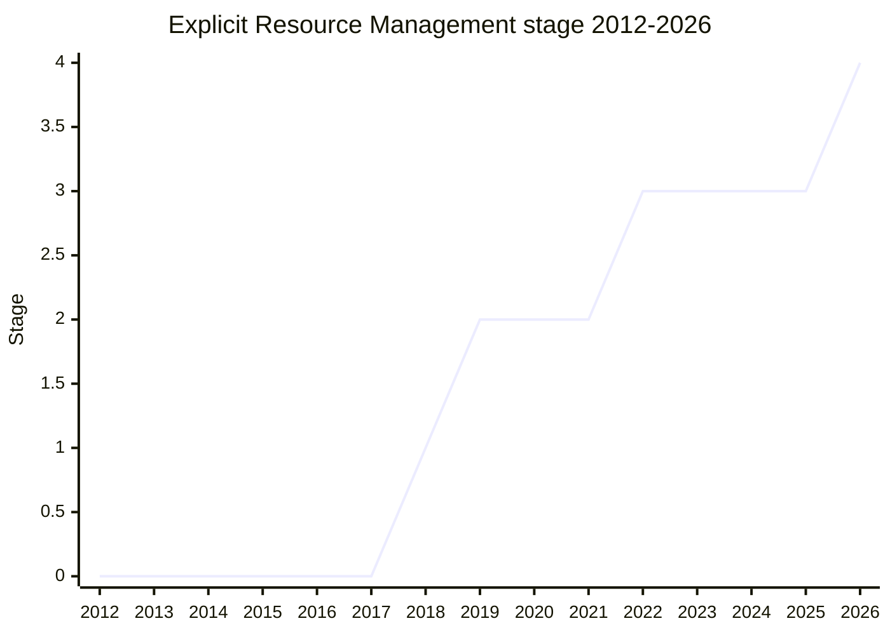

## Overview

Explicit Resource Management gives JavaScript **deterministic resource disposal** tied to block scope. A `using x = ...` / `await using x = ...` declaration is RAII (resource acquisition is initialization) style: it acquires the resource where it is declared and disposes it when the declaration leaves scope. Disposal calls a `Symbol.dispose` (sync) / `Symbol.asyncDispose` (async) method, and the proposal also provides a protocol for defining these on an object.

Along with that it introduces the container classes `DisposableStack` / `AsyncDisposableStack` (for aggregating resources, and for interoperating with existing APIs that do not yet support dispose syntax) and `SuppressedError`, which wraps both when the block body and the disposal each throw. The motivation is to dispose resources such as file IO, the network, and memory efficiently and deterministically, rather than leaving it to the GC or to `close` / `dispose` conventions that differ per package.

The champion was [RBN](../people/RBN.md) (Ron Buckton), consistently, for many years. It reached Stage 3 in 2022-12, and because that was before the Stage 2.7 process existed it **went directly from 2 to 3**. The last gate was not design but a backlog of Test262 review. After **conditional Stage 4** in 2025-05, it became formally Stage 4 (finished) in 2026-05, once every test had been merged.

## Stage history

| Meeting                                                 | What happened                                                                                                                 | Stage         |
| ------------------------------------------------------- | ----------------------------------------------------------------------------------------------------------------------------- | ------------- |
| [2018-07](../../../raw/notes/meetings/2018-07/july-24.md)  | Reached Stage 1 (then `proposal-using-statement`). [WH](../people/WH.md) had concerns about the `using` syntax                | 0 → 1         |
| [2019-07](../../../raw/notes/meetings/2019-07/july-25.md)  | Reached Stage 2 (tabled on the 23rd, approved on the 25th). [YK](../people/YK.md)/[WH](../people/WH.md) as reviewers          | 1 → 2         |
| [2021-10](../../../raw/notes/meetings/2021-10/oct-27.md)   | Dropped the `try using` block in favor of an RAII declaration, `using const`. [SYG](../people/SYG.md) added as a reviewer     | 2             |
| [2022-11](../../../raw/notes/meetings/2022-11/dec-01.md)   | **Reached Stage 3** (directly 2 → 3). `AsyncDisposableStack` and `async using` stayed at Stage 2                              | 2 → 3         |
| [2023-03](../../../raw/notes/meetings/2023-03/mar-23.md)   | Async ERM reached Stage 3. Settled the keyword order of `await using` (conditional on [WH](../people/WH.md)'s grammar review) | (async) 2 → 3 |
| [2023-07](../../../raw/notes/meetings/2023-07/july-11.md)  | Finished merging sync and async into one repository. Consensus on a set of normative PRs                                      | 3             |
| [2025-04](../../../raw/notes/meetings/2025-04/april-15.md) | Consensus on a PR forbidding `using` in a bare `case` of `switch` (V8/SpiderMonkey asked to lower it to try/finally)          | 3             |
| [2025-05](../../../raw/notes/meetings/2025-05/may-28.md)   | **conditional Stage 4** (waiting on the remaining Test262 and final approval of the ECMA-262 PR)                              | 3 → (cond.) 4 |
| [2026-05](../../../raw/notes/meetings/2026-05/may-19.md)   | **Stage 4 (finished)**. Every condition met; all editors approved and Test262 merged                                          | (cond.) 4 → 4 |

> Horizontal axis = 2012-2026, vertical axis = Stage. Stage 1 in 2018-07, Stage 2 in 2019-07, Stage 3 in 2022-12 (before the Stage 2.7 process, so directly 2 → 3). 2023-2024 was a period of normative changes, flat at Stage 3. Conditional Stage 4 was obtained in 2025-05, but "finished" is 2026-05, so the end-of-2025 value is 3. Formally Stage 4 in 2026-05.

## Main issues

### Syntax bikeshed (`using`, `try (...)`, or a dedicated keyword)

The longest issue, running from 2018 through 2021. At first there were two shapes: a `using` keyword that needs a cover grammar, and a `try (...)`-style block.

> ([WH](../people/WH.md), 2018-07) I am against the `using` syntax. It stacks a cover grammar on top of a cover grammar. The `try` syntax would be fine.

An informal user survey also heard that the new syntax causes confusion and that a dedicated keyword is easier to understand, but in 2021-10 [RBN](../people/RBN.md) dropped the `try using` block and it converged on `using` / `await using` declarations.

### Async dispose and the keyword order of `await using`

[MM](../people/MM.md) blocked async dispose unless there is a clear syntactic marker at the interleaving point. The answer was the `await` keyword, but opinion split on the order: `using await`, `await using`, or `async using`. After a vote in 2023-03, [RBN](../people/RBN.md) leaned toward `await using`.

> ([RBN](../people/RBN.md), 2023-03) As champion, my preference is leaning toward `await using`. The keyword order also matches the precedent (C#).

[MM](../people/MM.md) also said the concerns that had him supporting `using await` are completely resolved by `await using`. It was confirmed that the grammar needs only a two-token lookahead, and it reached Stage 3.

### Merging the sync and async proposals

The async variant (`AsyncDisposableStack` / `async using`) was once split off at Stage 2, then later merged back into the main proposal.

> ([RBN](../people/RBN.md), 2023-07) We had agreed to merge the async and sync proposals. On top of that, we merged both proposals into a single repository.

### The long wait for conditional Stage 4 (Test262 review backlog)

The gate to formal Stage 4 was not new design but a backlog of Test262 review and merge.

> ([RBN](../people/RBN.md), 2025-05) The tests themselves were finished several years ago. Review and merge just are not done, because of the size. It was only a backlog from the number of tests.

In 2026-05 it was reported that every Test262 test had been approved and merged, and that every editor had approved it. Following the precedent for conditional advancement (advance at the moment the conditions are met), it became finished and Stage 4 with no further vote.

## Related proposals

- `async-explicit-resource-management` — originally a split-off follow-on (`AsyncDisposableStack` and `await using`). Merged into the main proposal in 2023 (no separate page).
- `error-cause` — `SuppressedError` is a similar thing, representing an exception suppressed during resource disposal (in the error-cause lineage). Proposal page not yet written.
- `iterator-helpers` / Python-style context manager / `Symbol.enter` — discussed in 2023-07 as follow-up candidates (nothing settled).

## Sources

- [2018-07 july-24](../../../raw/notes/meetings/2018-07/july-24.md) — Stage 1
- [2019-07 july-23](../../../raw/notes/meetings/2019-07/july-23.md), [july-25](../../../raw/notes/meetings/2019-07/july-25.md) — Stage 2 (tabled, then approved)
- [2021-10 oct-27](../../../raw/notes/meetings/2021-10/oct-27.md) — to `using const` RAII
- [2022-11 dec-01](../../../raw/notes/meetings/2022-11/dec-01.md) — Reached Stage 3
- [2023-03 mar-21](../../../raw/notes/meetings/2023-03/mar-21.md), [mar-23](../../../raw/notes/meetings/2023-03/mar-23.md) — `await using` settled / Async ERM Stage 3
- [2023-07 july-11](../../../raw/notes/meetings/2023-07/july-11.md), [july-12](../../../raw/notes/meetings/2023-07/july-12.md) — sync/async merge / follow-up discussion
- [2024-04 april-09](../../../raw/notes/meetings/2024-04/april-09.md), [2024-06 june-13](../../../raw/notes/meetings/2024-06/june-13.md) — a set of normative PRs
- [2025-02 february-18](../../../raw/notes/meetings/2025-02/february-18.md) — spec bugfix
- [2025-04 april-15](../../../raw/notes/meetings/2025-04/april-15.md) — forbid `using` in `switch` / `case`
- [2025-05 may-28](../../../raw/notes/meetings/2025-05/may-28.md) — conditional Stage 4
- [2026-05 may-19](../../../raw/notes/meetings/2026-05/may-19.md) — Stage 4 (finished)
