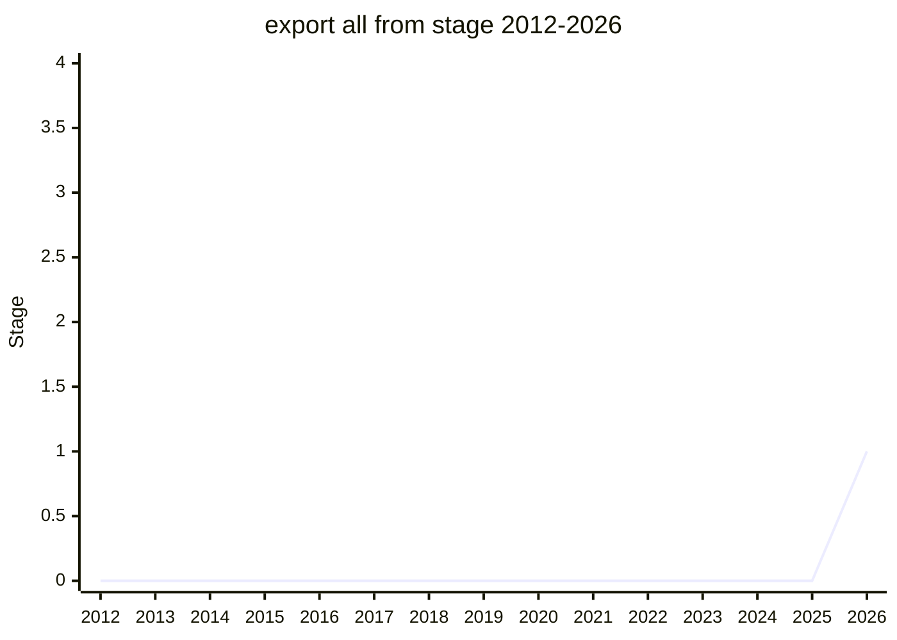

## Overview

export all from extends module re-export syntax (an ergonomics improvement on the `export * from` family). The author is Guy Bedford. The champion is [NRO](../people/NRO.md) (Nicolò Ribaudo). It continues the existing re-export line of `export * as ns from` and `export default from`.

## Stage history

| Meeting                                               | What happened              | Stage |
| ----------------------------------------------------- | -------------------------- | ----- |
| [2026-05](../../../raw/notes/meetings/2026-05/may-20.md) | **Reached Stage 1**        | → 1   |
| [2026-05](../../../raw/notes/meetings/2026-05/may-21.md) | Call for Stage 2 reviewers | 1     |

> Horizontal axis = 2012-2026, vertical axis = Stage. Reached Stage 1 in 2026-05 (first presented). The same meeting's day 3 also called for Stage 2 reviewers.

## Main issues

The speaker did not provide a summary or conclusion for this topic (the notes do not record one). What is recorded is that it reached Stage 1 and that Stage 2 reviewers were called for.

## Related proposals

- `export-default-from` / `export-ns-from` (`export * as ns from`) — the existing re-export-syntax line. No proposal pages yet.
- family: [Modules](../families/modules.md)

## Sources

- [2026-05 may-20](../../../raw/notes/meetings/2026-05/may-20.md) — Stage 1
- [2026-05 may-21](../../../raw/notes/meetings/2026-05/may-21.md) — call for Stage 2 reviewers
