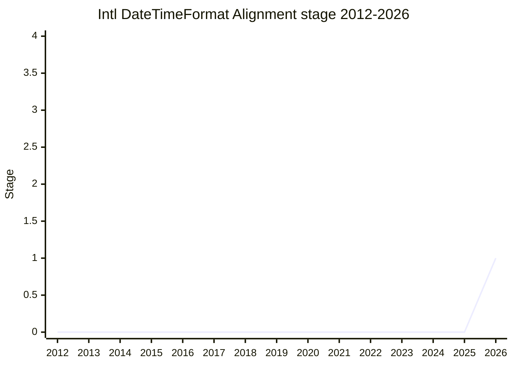

## Overview

Intl.DateTimeFormat Alignment With Other Standards is an ECMA-402 proposal **so that HTML, JavaScript, and Unicode MessageFormat can use the same datetime formatting options**. In WHATWG, [LCA](../people/LCA.md) is advancing a proposal to add a `format` attribute to the `<time>` element so that localized time formatting is possible without JavaScript, and Unicode MessageFormat is also in the middle of designing a datetime formatting API. These are introducing options that `Intl.DateTimeFormat` does not have (`dateFields` / `timePrecision`) and different spellings (such as `dateLength`), so the motivation is to align formatting options across the whole web stack.

The concrete proposal adds `dateFields` (which parts of the date to include) and `timePrecision` (to what precision to include the time) to `Intl.DateTimeFormat`, and also considers naming alignment such as `dateLength` (an alias of `dateStyle`) and `timeZoneStyle` (a better name for `timeZoneName`). **It adds no new data or capabilities** and stays within what can be expressed by mapping onto the existing datetime component options. A design based on ICU4X's semantic skeleton also moves toward preventing nonsensical combinations that the current API allows, such as "July at 36" (month plus minute only). The champion is [EAO](../people/EAO.md).

## Stage history

| Meeting                                                | What happened                                                                                                                                                                                      | Stage |
| ------------------------------------------------------ | -------------------------------------------------------------------------------------------------------------------------------------------------------------------------------------------------- | ----- |
| [2026-07](../../../raw/notes/meetings/2026-07/july-22.md) | First presentation (already supported by TG2). [JSL](../people/JSL.md) / [SFC](../people/SFC.md) / [LVU](../people/LVU.md) supported it, and it **reached Stage 1** with essentially no discussion | 0 → 1 |

> X-axis = 2012-2026, y-axis = Stage. First appearance in 2026-07, at Stage 1.

## Main issues

### Spelling can be adjusted in either direction

The HTML-side PR is at stage 1 of the WHATWG process, and Unicode MessageFormat is also waiting for the semantic skeleton to be finalized, so the spelling of option names (`dateLength` vs `dateStyle`, and so on) can **be negotiated in either direction: ECMA-402 matches the other side, or it asks the other side to change**. [EAO](../people/EAO.md), on the premise of coordinating with the MessageFormat WG and WHATWG, aims at one set of options that can be used anywhere.

### The shape of the solution is not fixed yet

[SFC](../people/SFC.md) supported Stage 1 with the caveat that the problem statement (the motivation slides) is good, but the solution still needs work. How to reconcile the new options with the current `Intl.DateTimeFormat` structure, in which `style shortcuts` and `datetime component options` are mutually exclusive, is a design problem from here on.

## Related proposals

- [Stable Formatting](../proposals/stable-formatting.md) — likewise a proposal by [EAO](../people/EAO.md), in the line of making Intl output easier to use from other layers of the web stack.
- [Intl.MessageFormat](../../proposals/intl-messageformat.md) — a proposal to expose Unicode MessageFormat to JS. This proposal's datetime options aim to line up with MessageFormat's formatting functions.
- [Intl Sequence Units](../proposals/intl-sequence-units.md) — an ECMA-402 proposal from the same period.

## Sources

- [2026-07 july-22](../../../raw/notes/meetings/2026-07/july-22.md) — first presentation; reached Stage 1
