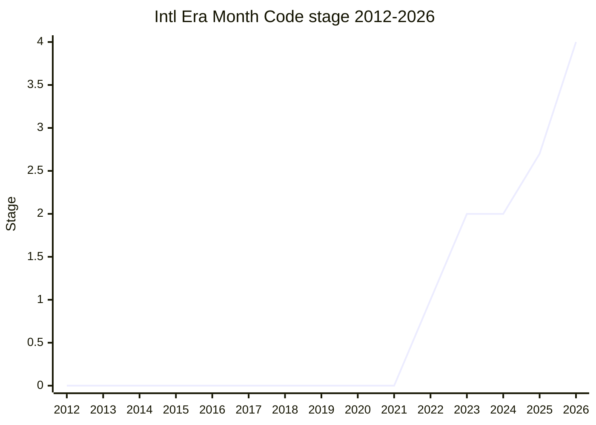

## Overview

Intl Era/Month Code specifies, in ECMA-402, the **behavior of era / eraYear / monthCode for non-ISO 8601 calendars**, which [Temporal](temporal.md) deliberately left out of scope. Temporal fully specifies only the ISO 8601 calendar and UTC. For the roughly 20 calendars CLDR defines — Hebrew, the various Islamic calendars, Buddhist, Chinese, Ethiopian, Coptic, Japanese, Dangi, and others — it left the semantics of era code and month code blank. This proposal fills that blank with a minimum of semantics.

The design aim is to avoid over-specification and to minimize divergence between implementations at the same time. It does not specify the calendar arithmetic itself (something ECMAScript should not be the authority for). But if the identifier strings (era code, monthCode) are not aligned, the same JS code can be interpreted differently across engines, so it puts a guardrail there. The authority for the identifiers is not something TC39 invents. The settled policy is that **CLDR (Unicode) is the authority, and ECMA-402 refers to it**. The original author, [FYT](../people/FYT.md), coordinated with the CLDR TC and upstreamed the era codes.

What it specifies is mainly a description of the supported calendars (in the end a **closed list**), the valid era codes and aliases, the valid range of era year for each calendar, the epoch year of PlainDate, the constrained behavior of "adding a year" on a lunisolar calendar, and the range from which PlainMonthDay picks a reference year. It kept pace with Temporal's Stage 4, and both reached Stage 4 together in 2026-03.

## Stage history

| Meeting                                                        | What happened                                                                                                                                                  | Stage   |
| -------------------------------------------------------------- | -------------------------------------------------------------------------------------------------------------------------------------------------------------- | ------- |
| [2022-11](../../../raw/notes/meetings/2022-11/dec-01.md)       | Reached Stage 1. [SFC](../people/SFC.md) presented for [FYT](../people/FYT.md). Where the authority for identifiers sits was the issue                         | 0 → 1   |
| [2023-01](../../../raw/notes/meetings/2023-01/feb-01.md)       | Reached Stage 2. Presented by [FYT](../people/FYT.md). [EAO](../people/EAO.md) and [SFC](../people/SFC.md) became Stage 3 reviewers                            | 1 → 2   |
| [2025-04](../../../raw/notes/meetings/2025-04/april-16.md)     | Stage 2 update. [SFC](../people/SFC.md) took it over, changed era codes to be based on era names, and presented the Hijri / out-of-range policy. No transition | 2       |
| [2025-07](../../../raw/notes/meetings/2025-07/july-30.md)      | **Reached Stage 2.7** (conditional). [USA](../people/USA.md) presented jointly with [PFC](../people/PFC.md)                                                    | 2 → 2.7 |
| [2025-09](../../../raw/notes/meetings/2025-09/september-23.md) | 2.7 update plus consensus on two normative changes (revert leap month to `overflow: reject`, allow reference years through 2035)                               | 2.7     |
| [2025-11](../../../raw/notes/meetings/2025-11/november-20.md)  | **Deferred** Stage 3 because of late-breaking normative changes. Consensus on removing CLDR era aliases and similar                                            | 2.7     |
| [2026-01](../../../raw/notes/meetings/2026-01/january-20.md)   | **Reached Stage 3**. Presented by [BAN](../people/BAN.md). A closed calendar list, a reference-year table for rare leap months, and others                     | 2.7 → 3 |
| [2026-03](../../../raw/notes/meetings/2026-03/march-10.md)     | **Reached Stage 4**. Presented by [BAN](../people/BAN.md). SpiderMonkey 99.9% / V8 99.7% conformant, editor sign-off in                                        | 3 → 4   |

> Horizontal axis = 2012-2026, vertical axis = Stage. The proposal repo opened in 2022-06, so most years of the corpus do not exist (0). Stage 1 in 2022-11, Stage 2 in 2023-01. 2023-2024 is about two years of stall (flat at 2). Stage 2.7 in 2025-07, Stage 3 in 2026-01, Stage 4 in 2026-03. It passed through 3 and 4 within 2026, so the year-end value is 4.

## Main issues

### Is the authority for identifiers TC39 or CLDR?

Whether ECMA-402 invents the era code / monthCode identifiers itself, or defers to an external authority, was the central issue at Stage 1 (2022-11). [MF](../people/MF.md) raised the concern.

> ([MF](../people/MF.md), 2022-11) I am uneasy about us defining this data. I would rather another body, which has many more experts, define it, and we normatively refer to that.

[USA](../people/USA.md) was also concerned that "the original proposal looked as if standardization depended entirely on TC39." [FYT](../people/FYT.md) turned toward making CLDR the authority, formed a working group with the CLDR TC, and upstreamed the era codes, which settled it.

### "Adding a year" on a lunisolar calendar, and leap months

The issue was what to do when a year that has a leap month, such as Adar I of Hebrew 5784, is advanced `+1 year` and that month does not exist in the next year. In 2025-07 the behavior was to move on to the next non-leap month. In 2025-09 that was **reverted** to the earlier behavior of throwing a RangeError when `overflow` is `"reject"` (lining up with how ISO 8601 treats February 29).

> ([BAN](../people/BAN.md), 2025-09) The rule for which month to land on when advancing from a leap month differs by calendar, and in many respects it is outside our jurisdiction. Fall toward strictness. If we lose that, we can always loosen it later.

### A reference year for rare leap months and leap days

PlainMonthDay internally refers to a real ISO 8601 date, but a month-day that happens only once in several centuries, such as a winter leap month in the Chinese calendar, cannot use 1972 as the reference year. In 2025-09 the reference-year range was extended from 1972 to a maximum of 2035 (to catch the Chinese leap months of 2033 / 2034). In 2026-01, very rare combinations are handled by a hardcoded table: an unlisted one throws a RangeError under `overflow: reject`, and under constrain it clamps to the non-leap version.

### Footgun calendars (islamic / islamic-rgsa)

Whether to keep calendar identifiers that have no substance, or that invite misuse, was an issue in 2026-01. `islamic-rgsa` (requested by Oracle, unimplemented and unused) is ignored in the format `ca` option, and the simulation-based "islamic" was also made a fallback. Together with that, the available calendars became a **closed list**, avoiding an interoperability problem.

> ([SFC](../people/SFC.md), 2026-01) The specification for this calendar, requested in the early 2010s, was never implemented, and because it was never implemented, shipping it in an engine would only be a footgun.

## Related proposals

- [Temporal](temporal.md) — the parent proposal. This proposal fills in, on the ECMA-402 side, the era / monthCode behavior of non-ISO 8601 calendars that Temporal deliberately left out of scope. Temporal was the forcing function, and the Stage 4 PR is also planned to merge together with Temporal.

## Sources

- [2022-11 dec-01](../../../raw/notes/meetings/2022-11/dec-01.md) — Stage 1 (the authority-of-identifiers issue)
- [2023-01 feb-01](../../../raw/notes/meetings/2023-01/feb-01.md) — Stage 2
- [2025-04 april-16](../../../raw/notes/meetings/2025-04/april-16.md) — Stage 2 update ([SFC](../people/SFC.md) took it over)
- [2025-07 july-30](../../../raw/notes/meetings/2025-07/july-30.md) — reached Stage 2.7
- [2025-09 september-23](../../../raw/notes/meetings/2025-09/september-23.md) — 2.7 update plus normative changes
- [2025-11 november-20](../../../raw/notes/meetings/2025-11/november-20.md) — Stage 3 deferred, plus normative
- [2026-01 january-20](../../../raw/notes/meetings/2026-01/january-20.md) — reached Stage 3
- [2026-03 march-10](../../../raw/notes/meetings/2026-03/march-10.md) — reached Stage 4
