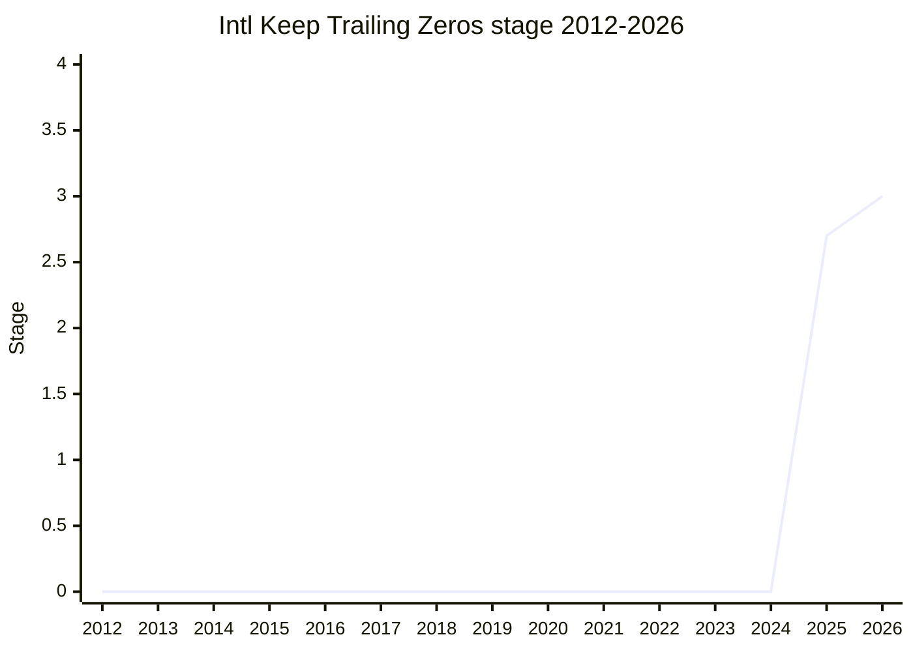

## Overview

Keep Trailing Zeros is a proposal to add, to `Intl.NumberFormat` and `Intl.PluralRules`, a way to **keep trailing fractional zeros**. For example, when you want to format `1.5` as `"1.50"` to show significant digits, it lets you keep trailing zeros that the current rounding and digit settings would drop.

The champion is [EAO](../people/EAO.md) (Eemeli Aro). It is an ECMA-402 proposal and belongs to the `intl` family.

## Stage history

| Meeting                                                    | What happened                                                                                                                                 | Stage   |
| ---------------------------------------------------------- | --------------------------------------------------------------------------------------------------------------------------------------------- | ------- |
| [2025-05](../../../raw/notes/meetings/2025-05/may-28.md)      | Reached Stage 1                                                                                                                               | → 1     |
| [2025-07](../../../raw/notes/meetings/2025-07/july-29.md)     | **Reached Stage 2**. [RGN](../people/RGN.md) / [SFC](../people/SFC.md) became reviewers and finished the review during the meeting            | 1 → 2   |
| [2025-07](../../../raw/notes/meetings/2025-07/july-30.md)     | **Reached Stage 2.7** (continued on day 3 of the same meeting. [WH](../people/WH.md)'s blocking concern was split into a separate discussion) | 2 → 2.7 |
| [2025-11](../../../raw/notes/meetings/2025-11/november-18.md) | Update (merge plan for PR #10 / #12; confirmed that the current behavior in issue #11 is acceptable)                                          | 2.7     |
| [2026-05](../../../raw/notes/meetings/2026-05/may-19.md)      | **Reached Stage 3**. Merged PR #19 / #20 with reviewer approval                                                                               | 2.7 → 3 |

> X-axis = 2012-2026, y-axis = Stage. Stage 1 was 2025-05. In the same 2025-07 meeting it passed Stage 2 (day 1) and then Stage 2.7 (day 3) in succession, and reached Stage 3 in 2026-05. The end-of-2025 value is 2.7.

## Main issues

### Framed as a bugfix

This proposal does not change the public API. It is framed as a bugfix of the internal behavior of `Intl.NumberFormat` / `Intl.PluralRules` (keeping trailing zeros on digit strings). If the current behavior turns out to be useful, or a web incompatibility is found, the plan is to handle it by adding a value to the existing `trailingZeroDisplay` option.

### Passing Stage 2 then 2.7 in the same meeting (2025-07)

It reached Stage 2 on day 1. Reviewers [RGN](../people/RGN.md) / [SFC](../people/SFC.md) **finished the review during the meeting**, and on the day-3 continuation it reached Stage 2.7. A blocking concern [WH](../people/WH.md) raised about the `ToIntlMathematicalValue` abstract operation was split out as outside the scope of this proposal and did not block progress.

### Reaching Stage 3 (2026-05)

Open PRs #19 and #20 were presented already approved by reviewers, and support for Stage 3 was obtained on the basis of merging both PRs.

## Related proposals

- [Stable Formatting](../proposals/stable-formatting.md) / [Intl Default Behaviours](../proposals/intl-default-behaviours.md) / [Intl Sequence Units](../proposals/intl-sequence-units.md) — the group of ECMA-402 proposals that moved in the same meeting (of these, trailing zeros and stable formatting are championed by [EAO](../people/EAO.md)).
- family: `intl`

## Sources

- [2025-05 may-28](../../../raw/notes/meetings/2025-05/may-28.md) — Stage 1
- [2025-07 july-29](../../../raw/notes/meetings/2025-07/july-29.md) — Stage 2
- [2025-11 november-18](../../../raw/notes/meetings/2025-11/november-18.md) — update
- [2026-05 may-19](../../../raw/notes/meetings/2026-05/may-19.md) — Stage 3
