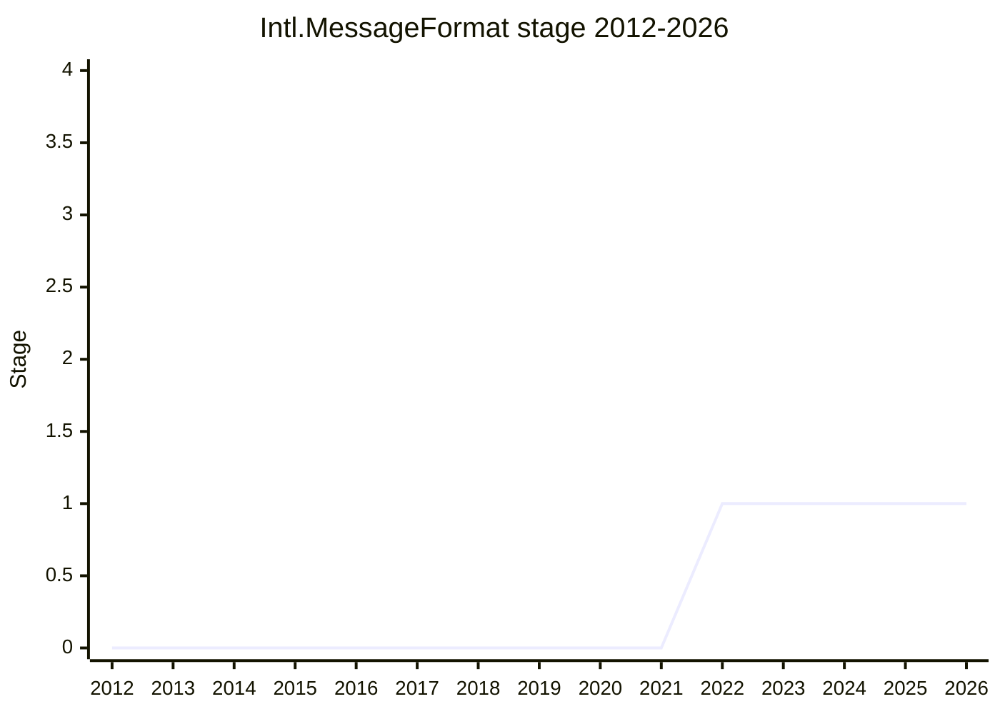

## Overview

`Intl.MessageFormat` is an ECMA-402 proposal that exposes **MessageFormat 2.0 (MF2)**, which the Unicode Consortium is developing, to JavaScript. MF2 is a DSL (a dedicated syntax) and a data model that express a translated message, including plural, gender, and select, in a form both developers and translators can work with. It reorganizes the territory that the older ICU MessageFormat (v1) and the ICU4J polyfill covered, as a new standard syntax whose authority is CLDR.

The proposal originally included both formatting a single message (`Intl.MessageFormat`) and formatting a "resource" that bundles several related messages. In 2022-11 the latter was split into a separate Stage 1 proposal, `Intl.MessageResource` (this page covers the former). A large feature of the formatting API, unlike the other `Intl.*` formatters, is that the input is **user data** that has passed through a translator's hands, so it fails easily. The design aims at a model that does not throw on an error and treats it as non-fatal (an `onError` callback, and similar).

As of 2026-06 this proposal **remains at Stage 1 and is "stuck."** Around advancing to Stage 2, a fundamental concern keeps coming back and is not resolved: whether a new DSL and parser with little track record may be put into the language.

## Stage history

| Meeting                                                        | What happened                                                                                                                                                                                       | Stage |
| -------------------------------------------------------------- | --------------------------------------------------------------------------------------------------------------------------------------------------------------------------------------------------- | ----- |
| [2022-03](../../../raw/notes/meetings/2022-03/mar-30.md)       | **Reached Stage 1**. Presented by [EAO](../people/EAO.md) (co-champion: [DLM](../people/DLM.md)). The ambiguity of the word `message`, and whether this is a library or a language, were the issues | 0 → 1 |
| [2022-11](../../../raw/notes/meetings/2022-11/nov-29.md)       | The resource-formatting part was split off as `Intl.MessageResource`, and that reached Stage 1. The main proposal concentrates on a single message (stage unchanged)                                | 1     |
| [2023-09](../../../raw/notes/meetings/2023-09/september-26.md) | Stage 1 update. Broad agreement with the progress. Error handling and the complexity of the custom-formatter API were the issues. No transition                                                     | 1     |
| [2024-02](../../../raw/notes/meetings/2024-02/feb-7.md)        | Stage 2 was discussed and deferred. Planned to come back with a direction that **drops the syntax parser and aims at Stage 2 on the data model alone**. No transition                               | 1     |
| [2024-04](../../../raw/notes/meetings/2024-04/april-10.md)     | Status update. TG2 (especially Google i18n) opposed removing the parser, and **the proposal is stuck**. The decision waits on industry adoption of MF2                                              | 1     |
| [2024-06](../../../raw/notes/meetings/2024-06/june-11.md)      | Stage 1 open question. Discussed error-handling design patterns (options 1 through 6). New options went to the champion group. No transition                                                        | 1     |

> Reached Stage 1 in 2022-03. Stalled at Stage 1 through 2026. In 2024-02 a plan appeared to "drop the parser and take Stage 2 on the data model alone," but in 2024-04 it collapsed under TG2's opposition, and it has not advanced since (flat).

## Main issues

### Should it enter the language — concern about a DSL and parser with no track record

The largest dispute. Strong caution was shown repeatedly about putting a new DSL and its parser into JavaScript "permanently." Already at Stage 1, [KG](../people/KG.md) said "it is good that there is a standard tool, but I do not think this is essentially 'language-like' rather than 'library-like'," and pointed out that there are already many template engines.

In 2024-02, [MF](../people/MF.md) said only things that, like JSON, are "time-tested" should enter the language, and argued "it is hard to enshrine it in JavaScript until, after some years of use, we can be confident of 'permanent soundness.'" [KG](../people/KG.md) also said "designing a DSL correctly with no experience of use is somewhere between inhumanly difficult and impossible" and "I want to see more than three companies use it for several years and be satisfied." [SYG](../people/SYG.md) cited a 2023 case in which a CLDR change caused a date/time formatting failure in browsers, and questioned Unicode's stability guarantee.

Against that, [ZB](../people/ZB.md) appealed to advance: "there is nobody else in the world who understands and cares about the evolution of localization formats as much as the people designing MF2" and "by not putting the DSL into JavaScript, we are tragically delaying the development of web localization by ten years."

### The plan to drop the syntax parser, and how it collapsed

The conclusion of 2024-02 (feb-7) was that including a syntax parser could take years to standardize, so **for now, supporting only the data-model representation of a message and dropping the parser would unblock advancement**. The Speaker's Summary says "for standardizing the syntax (the DSL) to be persuasive, we would need to see a dozen organizations of various sizes, including organizations that were not involved in developing MF2, using the MF2 syntax meaningfully across the whole stack in production. This is probably required at Stage 2.7." [KG](../people/KG.md) said "advancing to Stage 2 on the API part alone is less concerning. My concern is specific to the DSL," and [MF](../people/MF.md) in the end also agreed that "advancing the data model alone, without the surface syntax, helps."

[SFC](../people/SFC.md) urged that "I do not know whether every TG2 delegate has reviewed this plan. Waiting a few months does no harm," and [EAO](../people/EAO.md) deferred the request at this meeting: "I will not ask for Stage 2 before discussing it in TG2."

The status update of 2024-04 (april-10) reported that this plan had collapsed. According to [EAO](../people/EAO.md), TG2's feedback showed concern about removing the parser (especially Google's i18n group). [EAO](../people/EAO.md): "on the whole this is stuck now, and it might move someday." Further: "TC39 / TG2 have, in a sense, outsourced the development to Unicode CLDR. We do not comment on whether MF2.0 is good; we wait for the industry to adopt it. If it is adopted, that means it is good, and we might consider further advancement." The next move was left outside the standards body (industry adoption).

### The division of labor with Unicode — syntax is Unicode, the API is TC39

The body of MF2 (the syntax DSL and the data model) is **developed on the Unicode side**, and TC39 only puts a JS API on top of it. The division of labor is a vertical stack. [EAO](../people/EAO.md) called this structure "stacking" (2024-04 april-10):

> The MessageFormat 2 message syntax is **defined at Unicode**. And the JavaScript API is defined **only at TC39**.

The layers sort into three:

1. **Unicode** — the MF2 syntax and data model themselves (normative).
2. **ICU** (ICU4C / ICU4J) — the reference implementation. As of 2024-04 it had entered **tech preview**. [DE](../people/DE.md) said "if the ICU tech preview stabilizes over 6, 12, or 18 months, that gives TC39 a strong signal that the syntax is stable."
3. **TC39 / TG2** — only define the JS API of `Intl.MessageFormat` on that premise. According to [EAO](../people/EAO.md), this JS API has been almost the same shape since 2013, and about one third of web localization already depends on `intl-messageformat`, a polyfill equivalent to the old version (ICU MessageFormat 1).

Because of this division, TG2 left the evaluation of MF2's contents itself to the Unicode side (the remark by [EAO](../people/EAO.md), quoted above under "dropping the syntax parser," that they "outsourced it to Unicode CLDR"). [SFC](../people/SFC.md) also stated the order, Unicode first and TC39 following: "right now we are concentrating on **development on the Unicode side**, and once that is done we will put energy into the JavaScript / web platform side." As a result, TC39's condition for advancing is subordinate to "has the syntax that came from Unicode been adopted by the industry and stabilized," and **doubt about the stability of Unicode / CLDR**, such as the CLDR-caused date/time formatting failure (2023) that [SYG](../people/SYG.md) cited, is itself a reason to hesitate to advance at TC39.

> Note: inside Unicode, MF2 is a technical standard developed by the Message Format Working Group under the CLDR Technical Committee, and ICU is its reference implementation (in the notes, [EAO](../people/EAO.md) calls these together "Unicode CLDR").

### Error handling — a model that does not throw, and the shape of the API

`Intl.MessageFormat` aims at a design that does not throw on an error, because the input originates with a user or a translator and fails easily. In 2023-09, [EAO](../people/EAO.md) explained the reason for a non-fatal error: "unlike the other Intl formatters it depends on user data, and it comes through several workflows such as a translator, so the chance that it eventually fails (in part) is higher than for the others." Against that, [DE](../people/DE.md) said "I had expected it to throw if there is an error," and also raised concern about the size and complexity of the custom-formatter API. [JHD](../people/JHD.md) questioned a design in which `onError` returns void.

In 2024-06 (june-11), [SFC](../people/SFC.md) presented three design patterns for error handling and the committee discussed them. After distinguishing a **message error**, detected when the message is built, from a **resolution error**, which appears at format time (when placeholders are supplied):

- **Option 1** (an `onError` callback; the current plan) — [DLM](../people/DLM.md): "my strongest preference is not to throw. A throw is easy to forget to write, and a missing localized string is common." [JWS](../people/JWS.md) also: "what is most common in user space is Option 1."
- **Option 2** (throw an exception) — most delegates agreed this is undesirable.
- **Option 3** (a return-value object with metadata) — [USA](../people/USA.md) said "1 or 3, far better than 2," and described Option 1 as "more JavaScript-like" and Option 3 as "more Rust-like."

[RGN](../people/RGN.md) opposed the `onError` callback because reentrancy is confusing for control flow. The conclusion was "concern about reentrancy in Option 1," "broad agreement that Option 2 is out," "no strong opposition to Option 3, but the majority prefer another plan," and "add new options 4, 5, and 6 and consider them in the champion group." It was not settled.

### Confusion over the word `message`

At the Stage 1 session, [CM](../people/CM.md) said "I am very confused by the way the word 'message' is used. In my world this is not a message; it is a chunk of text." At a later meeting (2022-11), [EAO](../people/EAO.md) restated the term explicitly: "a message here is a message intended for a human to read, not something exchanged between computers." [USA](../people/USA.md), for their part, supported it: "this is one of the most important pieces of the internationalization puzzle. I am really glad it came to Stage 1."

## Related proposals

- `Intl.MessageResource` — the sibling proposal that was split from this one in 2022-11 and reached Stage 1 (formatting a "resource" of related messages). Not close-read yet.
- [Intl Era/Month Code](intl-era-month-code.md) — another internationalization proposal in ECMA-402.
- [Temporal](temporal.md) — can be referred to when `Intl.MessageFormat` handles a date-time value (there is a mention that in 2026-03 MF2 found a problem in Temporal's `PlainTime` parse behavior).
- [Amount](amount.md) (formerly `Measure`) — MF2 is cited as a motivation for passing a number plus a unit or currency into MessageFormat, so that a translator does not localize the value (2024-10 / 2024-12 / 2025-09, and others).

### An easy thing to confuse it with — Template Instantiation / DOM Parts (reference; outside TC39's scope)

`Intl.MessageFormat` is sometimes confused with "doesn't this overlap HTML Template Instantiation," but the two are different things. Template Instantiation / DOM Parts is a **DOM-side proposal of W3C/WHATWG (WICG webcomponents)** and is outside TC39's jurisdiction (it does not appear in this wiki's source material, `raw/notes`). The following is a reference arrangement based on external material:

- **Template Instantiation** — proposed by Apple in 2017-11. A **declarative template API** that clones a `<template>` while substituting values, branching, and looping with mustache syntax `{{ }}` (`HTMLTemplateElement.createInstance()` → `TemplateInstance`, `update()`, template parts, and extensible template processors). The original scope was judged too wide (syntax, plus parts, plus a processor, as one set). After discussion in 2017 and 2019, it was split toward a plan to **firm up the lower-layer DOM Parts first**.
- **DOM Parts** — a joint Apple/Google proposal. A **low-level mechanism that marks and updates**, about as fast as an id, the variable places in a DOM tree (child nodes, a content attribute, a JS property, and so on) (`ChildNodePart` / `NodePart` / `AttributePart`, an imperative API and a declarative API inside `<template>`). It does **not** include expression evaluation, if/else, loop, or a template-processing model (deferred to later consideration).
- **How they sit** — DOM Parts is the low layer that says "where in the DOM to update," and Template Instantiation is the high layer that, on top of that, gives "syntax and data binding." They are a hierarchy, not competitors. As of 2025-03, discussion continues on a plan to take DOM Parts first.
- **How this differs from `Intl.MessageFormat`** — MessageFormat is i18n **string** formatting (language-dependent branching of plural / gender / select), and the output is a string, not the DOM. Only the surface of "inserting a value into a template" is similar. The problem solved (per-language formatting versus building a DOM) and the standards body (Unicode plus TC39 versus W3C/WHATWG) are both different.

> Sources (external, outside this wiki's material): [WICG/webcomponents DOM-Parts.md](https://github.com/WICG/webcomponents/blob/gh-pages/proposals/DOM-Parts.md) / [Template-Instantiation.md](https://github.com/WICG/webcomponents/blob/gh-pages/proposals/Template-Instantiation.md) / [Template Instantiation 2025-03-26 minutes](https://www.w3.org/2025/03/26-webcomponents-minutes.html).

## Sources

- [2022-03/mar-30](../../../raw/notes/meetings/2022-03/mar-30.md) — Intl.MessageFormat for Stage 1
- [2022-11/nov-29](../../../raw/notes/meetings/2022-11/nov-29.md) — Intl MessageResource for Stage 1 (split from this proposal)
- [2023-09/september-26](../../../raw/notes/meetings/2023-09/september-26.md) — Stage 1 update and discussion
- [2024-02/feb-6](../../../raw/notes/meetings/2024-02/feb-6.md) — I have some questions (when to standardize a DSL)
- [2024-02/feb-7](../../../raw/notes/meetings/2024-02/feb-7.md) — Continuation: the plan to drop the parser; Stage 2 deferred
- [2024-04/april-10](../../../raw/notes/meetings/2024-04/april-10.md) — status update (stuck)
- [2024-06/june-11](../../../raw/notes/meetings/2024-06/june-11.md) — error handling design patterns
