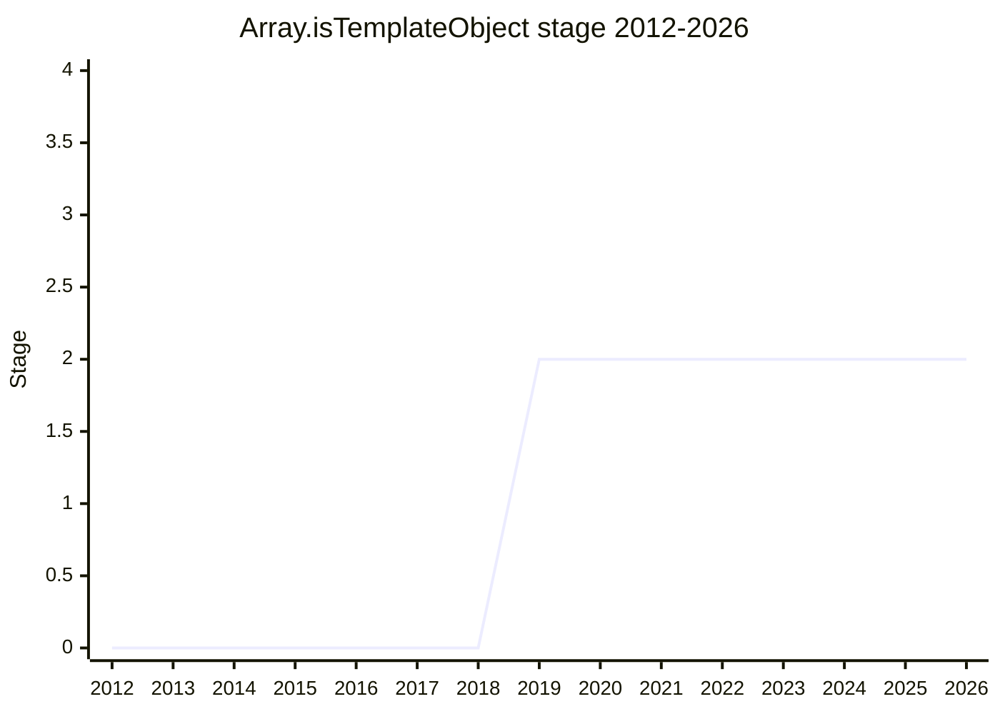

## Overview

`Array.isTemplateObject` was a proposal for an API that tells whether an object is a real template-literal call-site object (the array passed as the first argument of a tagged template). The intended use was a safe DSL built on tagged templates (SQL, HTML, and others), guaranteeing that the input is a fixed template that really came from source. The motivation is close to the safety use cases of the Trusted Types line.

The champions are [MSL](../people/MSL.md) (Mike Samuel), [KOT](../people/KOT.md) (Krzysztof Kotowicz), [JHD](../people/JHD.md) (Jordan Harband), and [ZTZ](../people/ZTZ.md) (Zbigniew Tenerowicz). It was withdrawn in 2026-05 (the "Withdrawn" section of the canonical inactive proposals).

## Stage history

| Meeting                                                      | What happened                                                                                                                                                          | Stage         |
| ------------------------------------------------------------ | ---------------------------------------------------------------------------------------------------------------------------------------------------------------------- | ------------- |
| [2019-06](../../../raw/notes/meetings/2019-06/june-5.md)     | **Reached Stage 2** (asked `for Stage 1 or 2` and went straight to Stage 2). Stage 3 reviewers: [MM](../people/MM.md) / [JRL](../people/JRL.md)                        | → 2           |
| [2019-12](../../../raw/notes/meetings/2019-12/december-4.md) | Update. Stayed at Stage 2                                                                                                                                              | 2             |
| [2021-01](../../../raw/notes/meetings/2021-01/jan-25.md)     | Continued discussion. Same-realm versus cross-realm treatment was the issue. Stayed at Stage 2                                                                         | 2             |
| [2024-04](../../../raw/notes/meetings/2024-04/april-10.md)   | Next steps. Stayed at Stage 2                                                                                                                                          | 2             |
| [2024-07](../../../raw/notes/meetings/2024-07/july-31.md)    | Asked for Stage 2.7 (did not advance)                                                                                                                                  | 2             |
| [2026-05](../../../raw/notes/meetings/2026-05/may-19.md)     | **Consensus to withdraw** ([JHD](../people/JHD.md) and [CDA](../people/CDA.md) said "withdrawn" explicitly. Weak implementer demand and interest, plus realm concerns) | 2 → withdrawn |

> Horizontal axis = 2012-2026, vertical axis = Stage. In 2019-06 it went **straight to Stage 2** without Stage 1 (the agenda was `for Stage 1 or 2`; the conclusion was "Stage 2 acceptance"). It then stalled at Stage 2 for a long time. In 2024-07 it aimed at 2.7 and did not advance. Withdrawn in 2026-05 (the line ends in 2026).

## Main issues

### The same-realm / cross-realm problem

A design that judges template-object identity across realms kept producing an undesirable constraint (dependence on controlling realm initialization). The concern was that it could depend on realm-initialization control on the web-standards side.

### Withdrawn (2026-05)

Consensus to withdraw the proposal, because implementers had little need or interest, and the realm-related concerns remained. The Conclusion text in the notes uses the umbrella word "inactive," but [JHD](../people/JHD.md) said "This one I'm going to mark as withdrawn," and [CDA](../people/CDA.md) also said "this one is withdrawn." The canonical inactive proposals also put it in the "Withdrawn" section. The status is therefore `withdrawn`.

## Related proposals

- [Dynamic Code Brand Checks](dynamic-code-brand-checks.md) — a brand-check line in the Trusted Types / safety context, which the same Mike Samuel and Krzysztof Kotowicz were involved in.

## Sources

- [2019-06 june-5](../../../raw/notes/meetings/2019-06/june-5.md) — reached Stage 2 ("Stage 2 acceptance")
- [2019-12 december-4](../../../raw/notes/meetings/2019-12/december-4.md) — update (stayed at Stage 2)
- [2021-01 jan-25](../../../raw/notes/meetings/2021-01/jan-25.md) — continued discussion (stayed at Stage 2)
- [2024-04 april-10](../../../raw/notes/meetings/2024-04/april-10.md) — stayed at Stage 2
- [2024-07 july-31](../../../raw/notes/meetings/2024-07/july-31.md) — Stage 2.7 requested (did not advance)
- [2026-05 may-19](../../../raw/notes/meetings/2026-05/may-19.md) — withdrawn
