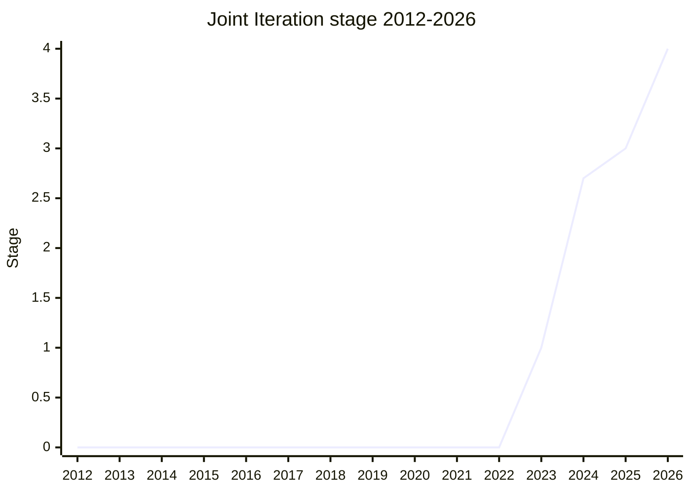

## Overview

Joint Iteration **processes two or more iterators / iterables together, one corresponding position at a time**. It is the operation many languages and frameworks call `zip()`, and the final API is two static methods.

- `Iterator.zip` — takes an iterable of iterables and yields a **tuple (array)** sized to the number of inputs (positional shape).
- `Iterator.zipKeyed` — takes an object whose values are iterables and yields an **object (record)** with the same names (named shape). Similar to a named version of `Promise.all`.

The second argument is an options bag. The mode is one of `"shortest"` (the default: stop when the first one is exhausted), `"longest"` (continue to the end and fill with a `padding` value), or `"strict"` (TypeError unless every iterator ends at the same time). Strings passed as input are not iterated, even though they are iterable. That matches Iterator Helpers' move away from implicitly iterating strings. The champion is [MF](../people/MF.md), who carried it through every stage.

## Stage history

| Meeting                                                     | What happened                                                                                                                               | Stage   |
| ----------------------------------------------------------- | ------------------------------------------------------------------------------------------------------------------------------------------- | ------- |
| [2023-09](../../../raw/notes/meetings/2023-09/september-27.md) | Reached Stage 1. `Joint iteration for Stage 1` ([MF](../people/MF.md))                                                                      | 0 → 1   |
| [2023-11](../../../raw/notes/meetings/2023-11/november-28.md)  | Stage 1 update. Preview of the `Iterator.zip` API. No transition                                                                            | 1       |
| [2024-02](../../../raw/notes/meetings/2024-02/feb-6.md)        | Reached Stage 2                                                                                                                             | 1 → 2   |
| [2024-04](../../../raw/notes/meetings/2024-04/april-11.md)     | Continued discussion of whether to include an array zip. Not a blocker; continued on GitHub. No transition                                  | 2       |
| [2024-06](../../../raw/notes/meetings/2024-06/june-12.md)      | **Reached Stage 2.7**. Three open questions settled on the spot (`zipToArrays`→`zip`, do not iterate strings, two Booleans→one mode string) | 2 → 2.7 |
| [2024-07](../../../raw/notes/meetings/2024-07/july-30.md)      | Naming discussion. Renamed `zipToObject`→`zipKeyed`. No transition                                                                          | 2.7     |
| [2025-11](../../../raw/notes/meetings/2025-11/november-18.md)  | **Reached Stage 3**. test262 tests and a spec-compliant polyfill pass                                                                       | 2.7 → 3 |
| [2026-05](../../../raw/notes/meetings/2026-05/may-19.md)       | **Reached Stage 4**. Shipped in SpiderMonkey; V8 implementation complete                                                                    | 3 → 4   |

> Horizontal axis = 2012-2026, vertical axis = Stage. First seen in 2023-09 (Stage 1). Stage 2 in 2024-02, Stage 2.7 in 2024-06 (several transitions in the same year, so the year-end value is 2.7). Stage 3 in 2025-11, Stage 4 in 2026-05.

## Main issues

### Splitting the methods and naming (`zip` / `zipKeyed`)

[MF](../people/MF.md) initially proposed a single method that branched on type, but the committee preferred a split, which became `zipToArrays` / `zipToObjects`. An on-the-spot decision in 2024-06 renamed `zipToArrays`→`zip`, and 2024-07 renamed `zipToObject`→`zipKeyed`. A prepared statement from [SYG](../people/SYG.md) (V8) prompted a revisit of the naming and the mode design.

> ([SYG](../people/SYG.md)'s prepared statement, read by [RPR](../people/RPR.md), 2024-06) V8 has the following concerns about Stage 2.7, but **will not block** if the committee otherwise agrees: we do not like the current method names; we do not like using two Booleans rather than a single string constant for mutually exclusive options.

### Choosing a mode (two Booleans → one mode string)

In response to [SYG](../people/SYG.md)'s concern, 2024-06 unified the two Booleans into a single string option, `"shortest"` / `"longest"` / `"strict"`. That avoids lining up two Booleans to represent mutually exclusive modes.

### Whether to iterate strings

Strings are iterable, but in 2024-06 the committee chose not to iterate strings passed as input. [LCA](../people/LCA.md) supported "do not implicitly iterate strings" as a consistent policy for the committee as a whole.

### Whether to include an array variant (`Array.zip`)

[JHD](../people/JHD.md) wanted a variant that zips arrays directly, but [MF](../people/MF.md) left it out of the main proposal: the usual joint-iteration use case continues with some operation other than `toArray`, so the motivation is questionable.

> ([MF](../people/MF.md), 2024-10) I did not want that questionable motivation to hurt the joint iteration proposal, so I did not include it in the main proposal.

The array variant was split out as a separate proposal, `array-zip` (Stage 1 in 2024-10, [JHD](../people/JHD.md)).

## Related proposals

- `iterator-helpers` — the policy of not iterating strings aligns with this (proposal page not yet written).
- `async-iterator-helpers` — [MM](../people/MM.md) prompted a check that the APIs correspond (not yet written).
- `array-zip` — the array variant split out of the joint-iteration proposal proper (Stage 1 in 2024-10; not yet written).
- In the same group: `iterator-sequencing` / `iterator-chunking` (not yet written).

## Sources

- [2023-09 september-27](../../../raw/notes/meetings/2023-09/september-27.md) — Stage 1
- [2023-11 november-28](../../../raw/notes/meetings/2023-11/november-28.md) — Stage 1 update (`Iterator.zip` preview)
- [2024-02 feb-6](../../../raw/notes/meetings/2024-02/feb-6.md) — Stage 2
- [2024-04 april-11](../../../raw/notes/meetings/2024-04/april-11.md) — continued discussion of array zip
- [2024-06 june-12](../../../raw/notes/meetings/2024-06/june-12.md) — Stage 2.7, plus the naming / mode / string decisions
- [2024-07 july-30](../../../raw/notes/meetings/2024-07/july-30.md) — rename to `zipKeyed`
- [2025-11 november-18](../../../raw/notes/meetings/2025-11/november-18.md) — Stage 3
- [2026-05 may-19](../../../raw/notes/meetings/2026-05/may-19.md) — Stage 4
