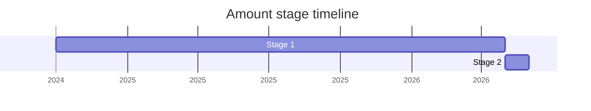

## 概要

Amount(旧称 **Measure**、`proposal-measure` → `proposal-amount`)は、**数値と単位を 1 つにまとめた immutable な value type** を JavaScript に追加する提案です。数値(number / BigInt / 数値文字列)と unit 識別子(例 `kilogram`)を組み合わせて 1 つの `Amount` を作り、`value` / `unit` アクセサ、別単位への変換 `convertTo()`(例 kg → lb)、ローカライズ出力 `toLocaleString()`、シリアライズ用 `toString()` を備えます。

動機は二つの面を持ちます。一つは **i18n の単位フォーマットの「誤用回避」**: `Intl.NumberFormat` の unit 機能を非ローカライズ目的に流用されるのを避け、純粋な数値+単位の運搬・変換を ECMA-262 側の値型として提供する(元は smart units の文脈から派生)。もう一つは **i18n の外でも使える汎用の measurement 値**としての需要です。Stage 2 案では unit conversion を 262 側(`Amount`)に持たせ、フォーマット(402)側の負担を減らす方向を採っています。

champion は [BAN](../people/BAN.md)(Ben Allen)。numeric value を厳密に扱う `decimal` 提案と近く、両者を束ねる "unified vision" も検討されましたが、別提案として進める整理になりました。

## ステージ遷移

| 会合                                                        | できごと                                                                                                          | Stage |
| ----------------------------------------------------------- | ----------------------------------------------------------------------------------------------------------------- | ----- |
| [2024-10](../../raw/notes/meetings/2024-10/october-10.md)   | [BAN](../people/BAN.md) が "Measure object" を発表し、同会合で **Stage 1 到達**(numeric representation WG 結成)   | 0 → 1 |
| [2024-12](../../raw/notes/meetings/2024-12/december-05.md)  | Measure の Stage 1 update                                                                                         | 1     |
| [2025-02](../../raw/notes/meetings/2025-02/february-19.md)  | decimal と measure の "unified vision"。merge への committee 支持は乏しく Measure の use case にも不確実性        | 1     |
| [2025-04](../../raw/notes/meetings/2025-04/april-16.md)     | Stage 1 update。decimal & measure を "Amounts" として整理する方向                                                 | 1     |
| [2025-07](../../raw/notes/meetings/2025-07/july-29.md)      | **Measure → Amount に改名**。Stage 2 を狙うも未達(open topic 継続)                                                | 1     |
| [2025-09](../../raw/notes/meetings/2025-09/september-22.md) | Amount for Stage 2(複数 continuation)も Stage 2 に至らず                                                          | 1     |
| [2025-11](../../raw/notes/meetings/2025-11/november-20.md)  | Amount の Stage 1 update                                                                                          | 1     |
| [2026-03](../../raw/notes/meetings/2026-03/march-10.md)     | Stage 2 を要求するも見送り(「5 月に再挑戦」)                                                                      | 1     |
| [2026-05](../../raw/notes/meetings/2026-05/may-20.md)       | **Stage 2 到達**。reviewer は [WH](../people/WH.md) / [JHD](../people/JHD.md)。conversion 精度は Stage 2 中の課題 | 1 → 2 |

> 各 Stage の横棒 = その stage に居た期間(横軸 = 実時間)。2024-10 に "Measure" として Stage 1(同会合)。改名(Measure→Amount)と複数回の Stage 2 挑戦を経て、2026-05 に Stage 2 到達。

## 主な論点

### Measure と Decimal の関係(unified vision)

数値を厳密に扱う `decimal` と、数値+単位を運ぶ `measure`/`amount` は隣接領域で、2025-02 に両者を統合する "unified vision" が提示されました。しかし champion グループ外からの統合支持はほとんど無く、Measure のユースケースにも不確実性が示されました([JMN](../people/JMN.md) が [BAN](../people/BAN.md) の医療休暇中に代理発表)。結果として **merge せず別提案として**進め、Decimal は numeric value、Amount は value+unit のコンテナ、という役割分担に落ち着きました。

### i18n 用途と汎用用途の緊張

Amount はもともと「Intl の unit フォーマットの誤用を避ける」目的(smart units 文脈)から生まれましたが、i18n の外でも使える汎用の measurement 値にすべきかで設計が揺れました。

> ([BAN](../people/BAN.md), 2024-10) これを「内部化のツールの誤用を避けるために渋々足すもの」と捉えるなら変換は i18n に必要な範囲だけでよい。だが CLDR で可能な変換をすべて支持する道もある。内も外も含め、これが何であるべき/何でありうるかの意見が欲しい。

Stage 2 案では unit conversion を `Amount`(262)に持たせ、402(フォーマット)側の守備範囲を狭める方向を採っています。

### Stage 2 への複数回の失敗

改名(Measure→Amount)は済んだものの、2025-07・2025-09 と Stage 2 に届きませんでした。unit 識別子の許容範囲、単位なし(no-unit)の表現、シリアライズ形式、変換数学の精度といった open topic が残ったためです。2026-03 でも見送られ(「5 月に再挑戦」)、最終的に 2026-05 で Stage 2 に到達しました。

### conversion math の精度

[WH](../people/WH.md) は変換時の rounding 誤差を複数指摘しました(例: 5 グラム → トンが厳密な `0.000005` でなく `0.0000049999999999999996` になる)。spec は CLDR の係数を number 空間で乗除するのではなく、`sourceFactor / targetFactor` を mathematical value として扱う方向へ改めましたが、素朴な実装では約 2,100 個の数値定数を保持する負担も生じます。Stage 2 到達時も「**精度の改善は Stage 2 の中で**行う」ことが許容される前提でした([EAO](../people/EAO.md) が 2026-05 に発表)。

### 単位なしの表現とシリアライズ

unit 不在をどう表すかが論点で、`Intl.NumberFormat`(Intl Unit Protocol)へ渡す際の整合から **null**(`undefined` ではなく)を採る方向。`toString()` は `[value unit]` 形式とし、単位なしには暫定で `~` を用いる案です。`foot-and-inch` のような sequence unit への対応も Stage 2 で詰めるとされています。

## 関連提案

- `decimal` — 厳密な十進数値。Amount の value 部分の候補で、2025-02 に "unified vision" として一緒に議論された(統合はせず)。提案ページ未作成。
- Intl Unit Protocol(`Intl.NumberFormat` の options bag)— Amount を formatter に渡す受け口。no-unit を null にする整合はこれと関係。
- Stable Formatting / Sequence Units — ECMA-402 のフォーマット側。Amount に sequence unit 対応を入れる動機。
- `smart-unit-preferences`(Younies Mahmoud, ECMA-402)— Amount の前史的動機(unit フォーマット誤用回避)。

## 出典

- [2024-10 october-10](../../raw/notes/meetings/2024-10/october-10.md) — "Measure object" 発表、Stage 1 到達
- [2024-12 december-05](../../raw/notes/meetings/2024-12/december-05.md) — Measure Stage 1 update
- [2025-02 february-19](../../raw/notes/meetings/2025-02/february-19.md) — decimal & measure の unified vision(merge 支持は乏しい)
- [2025-04 april-16](../../raw/notes/meetings/2025-04/april-16.md) — Stage 1 update("Amounts" への整理)
- [2025-07 july-29](../../raw/notes/meetings/2025-07/july-29.md) — Measure → Amount 改名、Stage 2 未達
- [2025-09 september-22](../../raw/notes/meetings/2025-09/september-22.md) — Amount for Stage 2(継続、未達)
- [2025-11 november-20](../../raw/notes/meetings/2025-11/november-20.md) — Amount Stage 1 update
- [2026-03 march-10](../../raw/notes/meetings/2026-03/march-10.md) — Stage 2 要求も見送り
- [2026-05 may-20](../../raw/notes/meetings/2026-05/may-20.md) — Stage 2 到達(reviewer [WH](../people/WH.md) / [JHD](../people/JHD.md))
