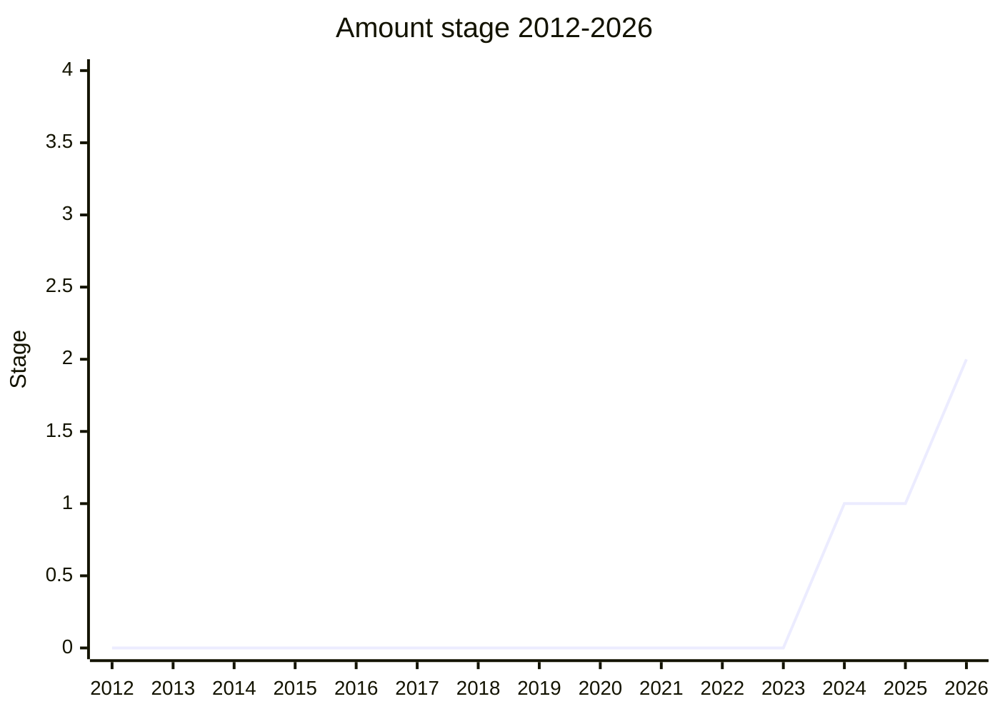

## Overview

Amount (formerly **Measure**, `proposal-measure` → `proposal-amount`) is a proposal to add to JavaScript an immutable value type that bundles a number and a unit into one. It combines a numeric value (number / BigInt / numeric string) with a unit identifier (for example `kilogram`) to make a single `Amount`, and provides `value` / `unit` accessors, conversion to another unit via `convertTo()` (for example kg → lb), localized output via `toLocaleString()`, and `toString()` for serialization.

The motivation has two sides. One is **avoiding misuse of i18n unit formatting**: keep `Intl.NumberFormat`'s unit feature from being co-opted for non-localized purposes, and provide pure number-plus-unit transport and conversion as a value type on the ECMA-262 side (it originally grew out of the smart units context). The other is demand for a **general-purpose measurement value that is also usable outside i18n**. The Stage 2 design puts unit conversion on the 262 side (`Amount`) and reduces the burden on the formatting (402) side.

The champion is [BAN](../people/BAN.md) (Ben Allen). It sits close to the `decimal` proposal, which handles numeric values strictly. A "unified vision" that would bundle the two was considered, but the outcome was to proceed with them as separate proposals.

## Stage history

| Meeting                                                     | What happened                                                                                                                                                                               | Stage |
| ----------------------------------------------------------- | ------------------------------------------------------------------------------------------------------------------------------------------------------------------------------------------- | ----- |
| [2024-10](../../raw/notes/meetings/2024-10/october-10.md)   | [BAN](../people/BAN.md) presented a "Measure object," and at the same meeting it **reached Stage 1** (a numeric representation WG was formed)                                               | 0 → 1 |
| [2024-12](../../raw/notes/meetings/2024-12/december-05.md)  | Measure Stage 1 update                                                                                                                                                                      | 1     |
| [2025-02](../../raw/notes/meetings/2025-02/february-19.md)  | A "unified vision" for decimal and measure. Little committee support for a merge, and uncertainty about Measure's use cases                                                                 | 1     |
| [2025-04](../../raw/notes/meetings/2025-04/april-16.md)     | Stage 1 update. A direction of organizing decimal and measure as "Amounts"                                                                                                                  | 1     |
| [2025-07](../../raw/notes/meetings/2025-07/july-29.md)      | **Renamed from Measure to Amount**. Aimed at Stage 2 but did not reach it (open topics continue)                                                                                            | 1     |
| [2025-09](../../raw/notes/meetings/2025-09/september-22.md) | Amount for Stage 2 (several continuations), but it did not reach Stage 2                                                                                                                    | 1     |
| [2025-11](../../raw/notes/meetings/2025-11/november-20.md)  | Amount Stage 1 update                                                                                                                                                                       | 1     |
| [2026-03](../../raw/notes/meetings/2026-03/march-10.md)     | Requested Stage 2 but it was deferred ("try again in May")                                                                                                                                  | 1     |
| [2026-05](../../raw/notes/meetings/2026-05/may-20.md)       | **Reached Stage 2**. Reviewers are [WH](../people/WH.md) / [JHD](../people/JHD.md). Conversion precision is an issue during Stage 2                                                         | 1 → 2 |
| [2026-07](../../raw/notes/meetings/2026-07/july-22.md)      | Presented both sides on how to treat duration units (undecided). The `BigInt` conversion problem that comes from canonical form, and conversion precision, each went to a separate proposal | 2     |

```mermaid
xychart-beta
    title "Amount stage 2012-2026"
    x-axis [2012, 2013, 2014, 2015, 2016, 2017, 2018, 2019, 2020, 2021, 2022, 2023, 2024, 2025, 2026]
    y-axis "Stage" 0 --> 4
    line [0, 0, 0, 0, 0, 0, 0, 0, 0, 0, 0, 0, 1, 1, 2]
```

> X-axis = 2012-2026, y-axis = Stage. First appearance is 2024-10 (Stage 1 at the same meeting). In 2025 there was a rename (Measure to Amount) and several attempts at Stage 2, but it did not get there and **stayed flat at Stage 1**. Reached Stage 2 in 2026-05. The agenda-index labels 2024-10 as "stage 0," but that is the agenda item name; the Conclusion approved Stage 1 (the notes are taken as authoritative).

## Main issues

### How Measure relates to Decimal (unified vision)

`decimal`, which handles numbers strictly, and `measure` / `amount`, which carries a number plus a unit, are adjacent. In 2025-02 a "unified vision" that would merge the two was presented. There was almost no support for a merge from outside the champion group, and uncertainty about Measure's use cases was also shown ([JMN](../people/JMN.md) presented on behalf of [BAN](../people/BAN.md) while [BAN](../people/BAN.md) was on medical leave). The result was to **proceed as separate proposals without merging**, settling into a division of roles: Decimal is the numeric value, and Amount is the container for value plus unit.

### Tension between i18n use and general-purpose use

Amount originally grew out of the goal of avoiding misuse of Intl's unit formatting (the smart units context), but the design wavered over whether it should also be a general-purpose measurement value usable outside i18n.

> ([BAN](../people/BAN.md), 2024-10) If we treat this as something we are reluctantly adding in order to avoid misuse of the internationalization tool, then conversion only needs to cover what i18n requires. But there is also a path of supporting every conversion that CLDR makes possible. I want opinions, from both inside and outside, on what this should be and what it could be.

The Stage 2 design puts unit conversion on `Amount` (262) and narrows the scope of the 402 (formatting) side.

### Several failures to reach Stage 2

The rename (Measure to Amount) was done, but it did not reach Stage 2 in 2025-07 or 2025-09. Open topics remained: the allowed range of unit identifiers, how to represent no unit, the serialization format, and the precision of the conversion math. It was deferred again in 2026-03 ("try again in May"), and finally reached Stage 2 in 2026-05.

### Precision of the conversion math

[WH](../people/WH.md) pointed out several rounding errors on conversion (for example, 5 grams to tonnes becomes `0.0000049999999999999996` rather than the exact `0.000005`). The spec was revised away from multiplying and dividing CLDR factors in number space, toward treating `sourceFactor / targetFactor` as a mathematical value, but a naive implementation also bears the cost of holding about 2,100 numeric constants. Even when it reached Stage 2, the premise was that **improving precision would be done during Stage 2** ([EAO](../people/EAO.md) presented in 2026-05).

### Proposals that spun out of it (2026-07)

Amount's design problems produced two independent proposals. The problem that a canonical form (an exponential-notation string) is not accepted by `BigInt(string)` was split out as [BigInt from exponential](../proposals/bigint-from-exponential.md) (Stage 1 in 2026-07), and the FMA operation that supports the precision of the conversion math was split out as [Fused Multiply-Add](../proposals/fused-multiply-add.md) (`Math.fma`, Stage 2 in 2026-07). Whether time/duration units should be handled by Amount and by [Intl Sequence Units](../proposals/intl-sequence-units.md) was left undecided in 2026-07, with both sides presented ([RGN](../people/RGN.md) supported inclusion, saying it is inconsistent for an Amount that allows any well-formed unit to reject only time units, while [PFC](../people/PFC.md) prioritized not creating a second set of duration-conversion rules different from [Temporal](../proposals/temporal.md)).

### Representing the absence of a unit, and serialization

How to represent the absence of a unit was an issue. For consistency when passing a value to `Intl.NumberFormat` (the Intl Unit Protocol), the direction is to use **null** (not `undefined`). `toString()` uses a `[value unit]` form, with a provisional `~` when there is no unit. Support for sequence units such as `foot-and-inch` is also to be worked out at Stage 2.

## Related proposals

- `decimal` — exact decimal numbers. A candidate for the value part of Amount; discussed together in 2025-02 as a "unified vision" (not merged). No proposal page yet.
- [BigInt from exponential](../proposals/bigint-from-exponential.md) — spun out of the problem that Amount's canonical form (an exponential-notation string) cannot be converted to `BigInt` (Stage 1 in 2026-07).
- [Fused Multiply-Add](../proposals/fused-multiply-add.md) — the FMA operation needed to specify Amount's unit conversion (Stage 2 in 2026-07).
- Intl Unit Protocol (`Intl.NumberFormat`'s options bag) — the intake for passing an Amount to a formatter. Making no-unit null, for consistency, is related to this.
- Stable Formatting / Sequence Units — the formatting side of ECMA-402. The motivation for adding sequence-unit support to Amount.
- `smart-unit-preferences` (Younies Mahmoud, ECMA-402) — a prior motivation for Amount (avoiding misuse of unit formatting).

## Sources

- [2024-10 october-10](../../raw/notes/meetings/2024-10/october-10.md) — presented "Measure object"; reached Stage 1
- [2024-12 december-05](../../raw/notes/meetings/2024-12/december-05.md) — Measure Stage 1 update
- [2025-02 february-19](../../raw/notes/meetings/2025-02/february-19.md) — unified vision for decimal and measure (little support for a merge)
- [2025-04 april-16](../../raw/notes/meetings/2025-04/april-16.md) — Stage 1 update (organizing them as "Amounts")
- [2025-07 july-29](../../raw/notes/meetings/2025-07/july-29.md) — renamed Measure to Amount; did not reach Stage 2
- [2025-09 september-22](../../raw/notes/meetings/2025-09/september-22.md) — Amount for Stage 2 (continued; not reached)
- [2025-11 november-20](../../raw/notes/meetings/2025-11/november-20.md) — Amount Stage 1 update
- [2026-03 march-10](../../raw/notes/meetings/2026-03/march-10.md) — requested Stage 2 but it was deferred
- [2026-05 may-20](../../raw/notes/meetings/2026-05/may-20.md) — reached Stage 2 (reviewers [WH](../people/WH.md) / [JHD](../people/JHD.md))
- [2026-07 july-22](../../raw/notes/meetings/2026-07/july-22.md) — both sides on duration units; `Math.fma` at Stage 2 (conversion precision)
