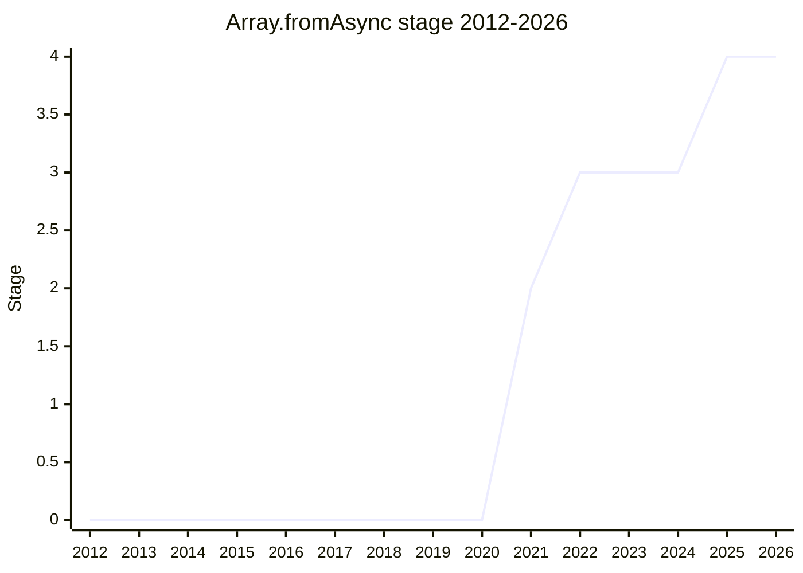

## Overview

`Array.fromAsync` is to `for await` what `Array.from` is to `for`: it drains an async iterable (or a sync iterable, or a non-iterable array-like) into a flat array, returning a promise that resolves to the array or rejects on any error. Like `Array.from`, it accepts an optional map function and uses the `this` value as the constructor. It is championed by [JSC](../people/JSC.md) (J. S. Choi).

The design rule throughout was to match the behavior of `for await` wherever the two could disagree. The sharpest consequence: **omitting the map function is not equivalent to passing the identity function**, because the map function's return value is awaited while values pulled straight from an async iterable are not - matching `for await` was judged more important than identity-function equivalence.

## Stage history

| Meeting                                                                         | What happened                                                                                                                                       | Stage |
| ------------------------------------------------------------------------------- | --------------------------------------------------------------------------------------------------------------------------------------------------- | ----- |
| [2021-08](https://github.com/tc39/notes/blob/main/meetings/2021-08/aug-31.md)   | Reached Stage 1                                                                                                                                     | → 1   |
| [2021-10](https://github.com/tc39/notes/blob/main/meetings/2021-10/oct-26.md)   | Update. `TypedArray.fromAsync` is out of scope for this proposal                                                                                    | 1     |
| [2021-12](https://github.com/tc39/notes/blob/main/meetings/2021-12/dec-14.md)   | Reached Stage 2                                                                                                                                     | 1 → 2 |
| [2022-01](https://github.com/tc39/notes/blob/main/meetings/2022-01/jan-24.md)   | Stage 3 requested but not advanced; the double-await question continued on [issue #19](https://github.com/tc39/proposal-array-from-async/issues/19) | 2     |
| [2022-09](https://github.com/tc39/notes/blob/main/meetings/2022-09/sep-14.md)   | Reached Stage 3, conditional on editor review                                                                                                       | 2 → 3 |
| [2023-05](https://github.com/tc39/notes/blob/main/meetings/2023-05/may-15.md)   | Consensus on the #41 fix: don't construct the `this` value twice when it is the `Array` constructor (found by implementers)                         | 3     |
| [2025-04](https://github.com/tc39/notes/blob/main/meetings/2025-04/april-14.md) | Advised that landing [ecma262#2600](https://github.com/tc39/ecma262/pull/2600) changes the behavior of the widely-implemented proposal              | 3     |
| [2025-05](https://github.com/tc39/notes/blob/main/meetings/2025-05/may-28.md)   | Conditional Stage 4: Stage 4 as soon as all three editors sign off on [ecma262#3581](https://github.com/tc39/ecma262/pull/3581)                     | 3 → 4 |

> Stage 1 in 2021-08, Stage 2 in 2021-12, Stage 3 in 2022-09, Stage 4 in 2025-05 (conditional on editor sign-off, granted in the same session).

## Main issues

### Double-await and the identity-function trap (issue #19)

Should the values fed to the map function be awaited? The answer follows `for await`: an input from an async iterable is **not** awaited before being mapped, while values from a sync iterable or an array-like are. This made the 2022-01 Stage 3 attempt stall, and it leaves the counter-intuitive consequence that `fromAsync(x)` and `fromAsync(x, v => v)` can differ for async-iterable input. [JSC](../people/JSC.md) at Stage 4: "I just got the Mozilla MDN documentation to update a mistake about this... Now everyone agrees it's okay for the identity function to not be equivalent to omitting it or it being nullish. It's more important for it to match `for await`."

### Closing sync iterators on error (ecma262#2600)

A plenary-approved change to ECMA-262 (merged 2025-03) requires input sync iterables to be closed even when the `fromAsync` call rejects. [KG](../people/KG.md) presented its effect on `Array.fromAsync` in 2025-04; all engines had to pick up the new test (V8/Chrome/Edge already passed, Safari in Technology Preview, SpiderMonkey had a freshly filed bug at the time of the Stage 4 ask).

### Three years waiting on editor sign-off

Stage 3 (2022-09) was granted conditional on editor review, and [JSC](../people/JSC.md) never produced the ECMA-262 pull request until 2025 - so the proposal carried its Stage 3 condition straight into the Stage 4 ask ("I would also like to know if there's any approvals or blocks"). [LCA](../people/LCA.md) quipped the stepped-out editor was "ashamed not reviewing it for three years". Stage 4 was granted conditional on the three editors signing off on [ecma262#3581](https://github.com/tc39/ecma262/pull/3581), which also makes this **the first proposal built on the "built-in async functions" infrastructure** ([ecma262#2942](https://github.com/tc39/ecma262/pull/2942)); async iterator helpers were slated to follow on the same machinery.

## Related proposals

- `async-iterator-helpers` - slated to be the next consumer of the same built-in async function infrastructure.
- [Iterator Sequencing](iterator-sequencing.md) - the sync side of the iterator library expansion (`Iterator.concat`).

## Sources

- [2021-08 aug-31](https://github.com/tc39/notes/blob/main/meetings/2021-08/aug-31.md) - Stage 1
- [2021-12 dec-14](https://github.com/tc39/notes/blob/main/meetings/2021-12/dec-14.md) - Stage 2
- [2022-01 jan-24](https://github.com/tc39/notes/blob/main/meetings/2022-01/jan-24.md) - Stage 3 ask stalled on double-await
- [2022-09 sep-14](https://github.com/tc39/notes/blob/main/meetings/2022-09/sep-14.md) - Stage 3 (conditional on editor review)
- [2025-04 april-14](https://github.com/tc39/notes/blob/main/meetings/2025-04/april-14.md) - behavior change advisory after ecma262#2600
- [2025-05 may-28](https://github.com/tc39/notes/blob/main/meetings/2025-05/may-28.md) - conditional Stage 4
