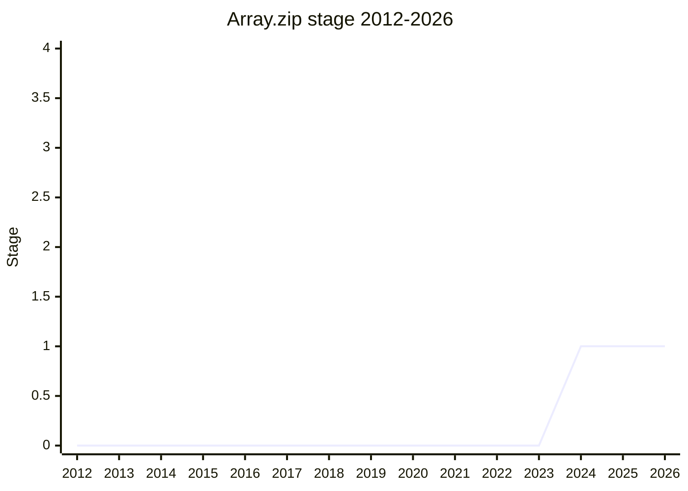

## Overview

`Array.zip` and `Array.unzip` (with `from`-style variants, e.g. `Array.zip.from` for iterables): pair-wise combining of arrays into tuples-of-arrays and back. It is the Array-flavored slice of the [Joint Iteration](joint-iteration.md) proposal - same shape, but eager and returning real arrays instead of lazy iterators. [JHD](../people/JHD.md) presented it as the "method extraction" of `Iterator.zip` for the many call sites that just want arrays.

## Stage history

| Meeting                                                                           | Event                                                                                                                                           | Stage |
| --------------------------------------------------------------------------------- | ----------------------------------------------------------------------------------------------------------------------------------------------- | ----- |
| [2024-10](https://github.com/tc39/notes/blob/main/meetings/2024-10/october-09.md) | Presented asking for Stage 1/2/2.7 in one go; **reached Stage 1 only** - advancement beyond that gated on Joint Iteration's Stage 3+ usage data | → 1   |

> First seen 2024-10, Stage 1 only.

## Main issues

### The usage-data gate

The committee declined the Stage 2/2.7 asks because the design questions are the same as Joint Iteration's, and those should be answered with evidence from a shipping iterator version first. [MF](../people/MF.md)'s condition: all the motivating use cases he had seen were "zip followed by other iterator operations" - which is what `Iterator.zip` already provides - so this proposal needs usage data from Stage 3+ Joint Iteration showing a genuine array-shaped demand, "no cheating by putting them in a bunch of your libraries".

### Ergonomics overlap with Iterator.zip

[SYG](../people/SYG.md) questioned whether the eager array version earns its place when `.toArray()` already converts: `Iterator.zip(...).toArray()` is short and chains. The champions' case rests on readability of the Array entry point and avoiding the iterator protocol for the common case - to be revisited with data.

## Related proposals

- [Joint Iteration](joint-iteration.md) - the iterator-flavored original; this proposal's advancement is explicitly gated on it.

## Sources

- [2024-10 october-09](https://github.com/tc39/notes/blob/main/meetings/2024-10/october-09.md) - Stage 1 ([JHD](../people/JHD.md))
