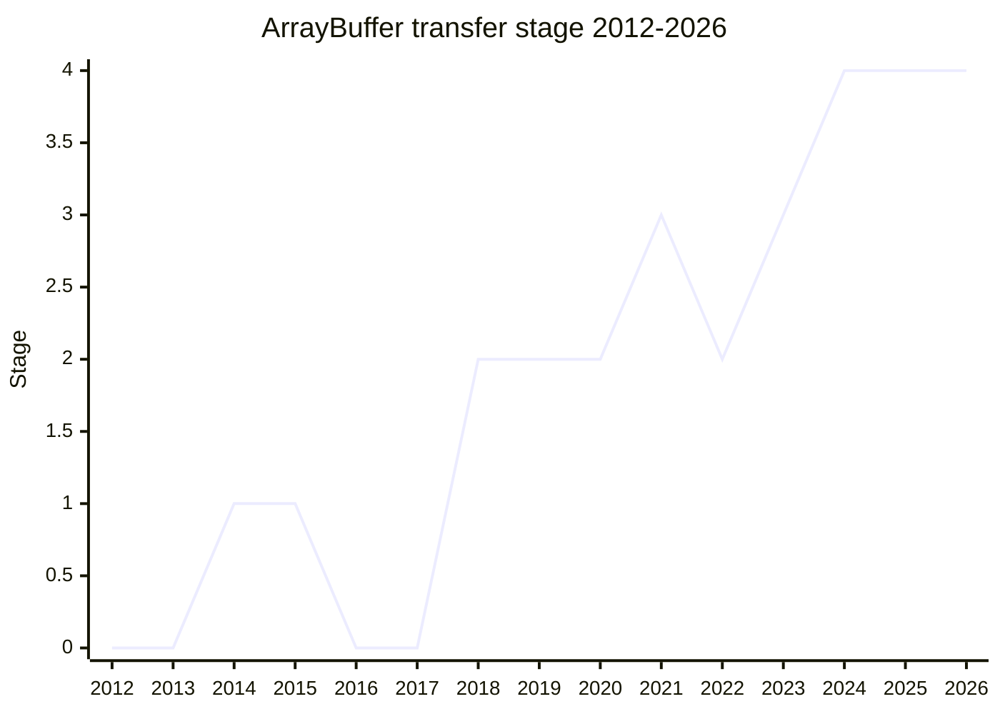

## Overview

Adds `ArrayBuffer.prototype.transfer()` and `ArrayBuffer.prototype.transferToFixedLength()`, plus an `ArrayBuffer.prototype.detached` getter. `transfer` hands the buffer's backing memory over to a new ArrayBuffer and detaches the original - the idiomatic way to take (limited) ownership of a buffer instead of paying for a defensive `slice()` copy. The copy is specified as a copy, but engines can implement a same-length transfer as a zero-copy move.

The motivation is race safety around asynchronous use. [DD](../people/DD.md) (2018-07): binary data "has potential for race conditions... Node.js in particular directly reads the buffer from another thread w/o locking. The defensive way to write this code is to write a copy... The idiomatic way to do this in JS is to slice it. However, this adds time and space consumption to every time you use an array buffer, and that's very sad." [SYG](../people/SYG.md)'s 2023-01 example: an async `validateAndWrite` function where a stray `setTimeout` can overwrite the buffer between the two awaits - with `transfer`, the original handle is detached, so nothing can.

The `detached` getter came along as "the authoritative way to find out if an ArrayBuffer is in fact detached" - detecting detachment was previously a mess of thrown errors and sentinel values.

Championed by [DD](../people/DD.md) (Domenic Denicola, original author), later [SYG](../people/SYG.md), [JHD](../people/JHD.md), and [YNP](../people/YNP.md). Shipped in ES2024.

## Stage history

| Meeting                                                                        | Event                                                                                                                                                                                                                                                                                                                                              | Stage         |
| ------------------------------------------------------------------------------ | -------------------------------------------------------------------------------------------------------------------------------------------------------------------------------------------------------------------------------------------------------------------------------------------------------------------------------------------------- | ------------- |
| [2014-09](https://github.com/tc39/notes/blob/main/meetings/2014-09/sept-23.md) | Prehistory: a static `ArrayBuffer.transfer` (designed by Luke Wagner, presented by Brendan Eich / Allen Wirfs-Brock), motivated by growing asm.js heaps. "Stage 1 acceptance"                                                                                                                                                                      | 0 → 1         |
| [2016-09](https://github.com/tc39/notes/blob/main/meetings/2016-09/sept-27.md) | `ArrayBuffer.transfer retraction` ([SYG](../people/SYG.md)): implemented in Firefox and removed, need reduced by WebAssembly; conclusion "Retracted"                                                                                                                                                                                               | 1 → withdrawn |
| [2017-09](https://github.com/tc39/notes/blob/main/meetings/2017-09/sept-28.md) | [DD](../people/DD.md) revived it as Stage 0 (conclusion: "you can't stop me from making it stage 0")                                                                                                                                                                                                                                               | 0             |
| [2018-07](https://github.com/tc39/notes/blob/main/meetings/2018-07/july-24.md) | First presented standalone by [DD](../people/DD.md) ("Long history of sitting at Stage 0. Reintroducing."). Reached Stage 2. [DE](../people/DE.md) noted the overlap with HTML's `structuredClone` transfer capability                                                                                                                             | → 2           |
| [2021-05](https://github.com/tc39/notes/blob/main/meetings/2021-05/may-26.md)  | The transfer method had been folded into the resizable ArrayBuffers proposal, which reached Stage 3 ("Proposal is unconditionally stage 3"); `transfer` thereby sat at Stage 3 as part of it while the standalone proposal went quiet                                                                                                              | 2 → 3         |
| [2022-11](https://github.com/tc39/notes/blob/main/meetings/2022-11/nov-29.md)  | Broken back out into its own proposal and **demoted to Stage 2** (conclusion: "Proposal split, .transfer goes to stage 2"): the semantics as specified inside resizable buffers did not preserve resizability when transferring, which was "confusing but surprising" ([SYG](../people/SYG.md), as recapped in 2023-01: "demoted to stage 3 to 2") | 3 → 2         |
| [2023-01](https://github.com/tc39/notes/blob/main/meetings/2023-01/feb-01.md)  | **Reached Stage 3** with the names `transfer` and `transferToFixedLength` (an earlier draft named the latter `fix` - "everyone else thought that was a terrible name"), plus the `detached` getter. Reviewers: [PHE](../people/PHE.md), [RBN](../people/RBN.md), [MAH](../people/MAH.md)                                                           | 2 → 3         |
| [2024-02](https://github.com/tc39/notes/blob/main/meetings/2024-02/feb-6.md)   | **Reached Stage 4**                                                                                                                                                                                                                                                                                                                                | 3 → 4         |

> A static `ArrayBuffer.transfer` reached Stage 1 in 2014-09 and was retracted in 2016-09 (plotted as 0 for 2016-2017; [DD](../people/DD.md) re-raised it as Stage 0 in 2017-09). Stage 2 in 2018-07, then a long quiet stretch; from 2021-05 the method lived inside the resizable buffers proposal at Stage 3, and in 2022-11 it was split back out and demoted to Stage 2. Stage 3 in 2023-01, Stage 4 in 2024-02 - shipped in ES2024.

## Main issues

### Broken out of resizable buffers (2022-11)

While the transfer API lived inside the resizable ArrayBuffers proposal, its semantics did not preserve resizability when transferring - behavior [SYG](../people/SYG.md) described as "confusing but surprising". The feature was broken out into its own proposal to give the semantics time to change, and was demoted from Stage 3 to Stage 2 in the process (2022-11). The redesign settled on resizability being preserved by `transfer` (same max byte length) and discarded by `transferToFixedLength`.

### Copy-on-write instead of transfer? (2023-01)

[MAH](../people/MAH.md) pushed hard for copy-on-write buffers instead: a `slice()` that shares memory until first mutation would transparently give the same performance without a new ownership API. [SYG](../people/SYG.md) explained why V8 will not do it: the fixed ArrayBuffer data pointer is a security mitigation - JITs bake the pointer into optimized code, and a portable copy-on-write implementation has to move that pointer on first write, opening "a whole class of letting-you-access-arbitrary-memory bugs". Not a question of impossibility but of blast radius under buggy execution; "patches welcome" if someone can design around it. [MAH](../people/MAH.md) asked that the option at least stay open.

[DE](../people/DE.md) pointed at a higher-level alternative for the same pattern (a gist by [DD](../people/DD.md)). [SYG](../people/SYG.md): "A generic taker thing would be pretty cool"; [DE](../people/DE.md): "it’s basically like a run time borrow checker. But very, very simple." Nobody campaigned it.

### One method or two? (2023-01)

Whether the fixed-length case should be an option (an options bag on a single `transfer`) or a second method. [SYG](../people/SYG.md) preferred two simple methods - `transfer` with a single optional length argument for the majority case, `transferToFixedLength` for the rest - and noted the earlier draft name `fix` had been unanimously rejected. [JHD](../people/JHD.md) ran the temperature check ("either one is fine"); no one had strong opinions and the two-method design stood. A side note from [MF](../people/MF.md): the rename landed at the last minute - "We should try to avoid last-minute changes" (no deeper process concern, per the follow-up in Matrix).

## Related proposals

- [Immutable ArrayBuffer](../proposals/immutable-arraybuffer.md) - the immutability counterpart in the same buffer-lineage space.
- `resizable-arraybuffer` - the proposal transfer was broken out of (no page yet).

## Sources

- [2014-09 sept-23](https://github.com/tc39/notes/blob/main/meetings/2014-09/sept-23.md) - static `ArrayBuffer.transfer` Stage 1
- [2016-09 sept-27](https://github.com/tc39/notes/blob/main/meetings/2016-09/sept-27.md) - retracted
- [2017-09 sept-28](https://github.com/tc39/notes/blob/main/meetings/2017-09/sept-28.md) - revived as Stage 0
- [2018-07 july-24](https://github.com/tc39/notes/blob/main/meetings/2018-07/july-24.md) - Stage 2
- [2021-05 may-26](https://github.com/tc39/notes/blob/main/meetings/2021-05/may-26.md) - resizable buffers (with `transfer`) Stage 3
- [2022-11 nov-29](https://github.com/tc39/notes/blob/main/meetings/2022-11/nov-29.md) - split out, demoted to Stage 2
- [2023-01 feb-01](https://github.com/tc39/notes/blob/main/meetings/2023-01/feb-01.md) - Stage 3 (`transfer` / `transferToFixedLength` / `detached`)
- [2024-02 feb-6](https://github.com/tc39/notes/blob/main/meetings/2024-02/feb-6.md) - Stage 4
