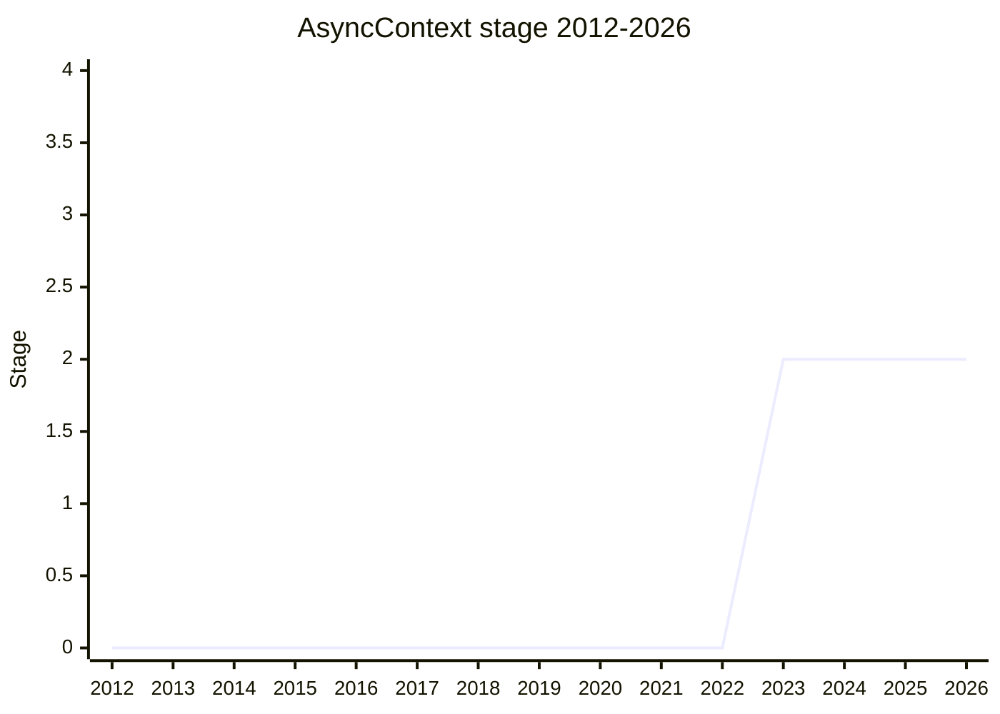

## Overview

`AsyncContext` propagates values implicitly through async code flows: a variable set before an `await` (or across a callback boundary) is read back correctly when execution resumes, without threading it through every function signature. It is the standard-library counterpart of Node.js `AsyncLocalStorage`, and its consumers are mostly library and framework authors: tracing (OpenTelemetry), front-end frameworks that need to know which UI component the running code belongs to, and server frameworks that need a request context across `await`.

The proposal is unusual in that most of its surface is not ECMA-262 but the **web platform integration**: which context an event listener sees, how long a captured context stays alive, and how the many web APIs that take callbacks interact with propagation. That integration, not the core API, is where the proposal has been stuck - between "the use cases are convincing" and "the implementation cost across the web platform is very large".

## Stage history

| Meeting                                                                             | What happened                                                                                                                                                        | Stage  |
| ----------------------------------------------------------------------------------- | -------------------------------------------------------------------------------------------------------------------------------------------------------------------- | ------ |
| [2020-06](https://github.com/tc39/notes/blob/main/meetings/2020-06/june-3.md)       | First presented by [CZW](../people/CZW.md) as "Async Context"                                                                                                        | (none) |
| [2020-07](https://github.com/tc39/notes/blob/main/meetings/2020-07/july-23.md)      | Stage 1 ask rejected ("Not going to stage 1"). The proposal then went dormant                                                                                        | (none) |
| [2023-01](https://github.com/tc39/notes/blob/main/meetings/2023-01/feb-01.md)       | Revived by [JRL](../people/JRL.md); reached Stage 1 with explicit support from several delegates                                                                     | → 1    |
| [2023-03](https://github.com/tc39/notes/blob/main/meetings/2023-03/mar-23.md)       | Reached Stage 2 (explicit support from [KG](../people/KG.md), [SYG](../people/SYG.md), [CDA](../people/CDA.md), [SRV](../people/SRV.md), [DE](../people/DE.md), DMR) | 1 → 2  |
| [2023-05](https://github.com/tc39/notes/blob/main/meetings/2023-05/may-17.md)       | Stage 2 update; remains at Stage 2                                                                                                                                   | 2      |
| [2023-09](https://github.com/tc39/notes/blob/main/meetings/2023-09/september-27.md) | Update; development continues                                                                                                                                        | 2      |
| [2024-04](https://github.com/tc39/notes/blob/main/meetings/2024-04/april-09.md)     | Stage 2 update                                                                                                                                                       | 2      |
| [2024-10](https://github.com/tc39/notes/blob/main/meetings/2024-10/october-09.md)   | Update                                                                                                                                                               | 2      |
| [2024-12](https://github.com/tc39/notes/blob/main/meetings/2024-12/december-02.md)  | Requested Stage 2.7 reviewers; [JSL](../people/JSL.md) & [MM](../people/MM.md) will review                                                                           | 2      |
| [2025-04](https://github.com/tc39/notes/blob/main/meetings/2025-04/april-14.md)     | Stage 2 update: framework testimonials, and a reworked web integration answering Mozilla's memory-leak feedback. Browsers split on the cost/benefit tradeoff         | 2      |
| [2025-05](https://github.com/tc39/notes/blob/main/meetings/2025-05/may-28.md)       | Web integration brainstorming (discussion, not a consensus-seeking change)                                                                                           | 2      |
| [2025-07](https://github.com/tc39/notes/blob/main/meetings/2025-07/july-28.md)      | Short web-integration update; no decisions                                                                                                                           | 2      |
| [2025-09](https://github.com/tc39/notes/blob/main/meetings/2025-09/september-23.md) | `AsyncContext` `yield*` normative change: no concerns raised                                                                                                         | 2      |
| [2026-05](https://github.com/tc39/notes/blob/main/meetings/2026-05/may-20.md)       | Web integration status update (the proposal is now ~75% web platform integration). Feedback: propagation rules should be as simple as lexical scoping                | 2      |

> First presented in 2020-06; the 2020-07 Stage 1 ask was rejected and the proposal went dormant. Revived in 2023-01 (Stage 1), Stage 2 in 2023-03, and flat at Stage 2 since - the Stage 2.7 reviewers were named in 2024-12 but the web-integration cost question still gates advancement.

## Main issues

### The 2020 rejection and the 2023 revival

The first attempt stalled immediately: presented in 2020-06 by [CZW](../people/CZW.md), the 2020-07 Stage 1 ask came back "Not going to stage 1". The proposal then sat dormant for two and a half years before [JRL](../people/JRL.md) (Justin Ridgewell) brought it back in 2023-01, this time reaching Stage 1, and Stage 2 two months later in 2023-03 - fast, because the core API (a `Variable` whose value is scoped to an async flow, plus `Snapshot`) was by then well understood from `AsyncLocalStorage`'s years of production use in Node.js.

### Web integration: memory leaks and the dispatch-context redesign

The hard part. In the version presented in Tokyo (2023), `addEventListener` implicitly captured an `AsyncContext.Snapshot`, which [Mozilla](../people/DLM.md) flagged as a large increase in potential memory leaks: a listener registered once and never removed keeps its whole captured context alive forever. The 2025-04 update presented the reworked model:

- Context **propagates from the place where the callback is triggered** ("dispatch context") instead of being captured at registration time. A `click()` call propagates its context into the listeners it dispatches; for async-dispatched events (`XMLHttpRequest.send()`), the context is stored only for the duration of the request.
- Events not caused by JavaScript (a user click, another agent) run in the **root context**, with a per-`Variable` scoped fallback mechanism for regions (e.g. a server-side request) that want to re-identify themselves.
- For APIs like `setTimeout` the observable behavior is unchanged - the new model describes them as starting an async operation that propagates context, which matches what a promise-based implementation would do.

[Mozilla](../people/DLM.md) remained unconvinced: "we are going to have to change a very large number of APIs... it feels like it was a case by case basis rather than like one - it was not just one place to change things". [SYG](../people/SYG.md) stated Chrome's position as **positive despite the concerns**, precisely because the frameworks on record would adopt it ("it is relatively rare for the things that we are pushing"). [DE](../people/DE.md) framed the goal as integration that is mostly inferable from WebIDL rather than per-API work. The recorded conclusion: use cases found convincing, but "it's still not clear yet that they are worth the implementation cost required by the proposal's web integration. Different browsers have opposite opinions about this tradeoff."

### Framework testimonials

The 2025-04 session doubled as a use-case hearing. React: an `async` transition callback loses everything after its first `await` - the React docs call it "a limitation of JavaScript" and say they are waiting on `AsyncContext`. Vue: works around it by transpiling every `await` (`withAsyncContext`), which forces whole-codebase transpilation including third-party code. Solid.js: `await` inside a tracking scope loses both the tracking scope and the ownership context. Svelte: `getRequestEvent` works on the server, but the client-side equivalent is impossible without transforms. [CZW](../people/CZW.md) described Bloomberg's internal framework running multiple application bundles in one environment ("co-location"), which depends on engine-level context tracking, and [SHS](../people/SHS.md) described Google's polyfill used for interaction tracing where loose coupling (event listeners, signal handlers, RPC middleware) makes explicit parameter-passing impossible.

### Stage 2.7 has been pending since 2024

Reviewers ([JSL](../people/JSL.md), [MM](../people/MM.md)) were named in 2024-12, but as of 2026-05 the proposal is still at Stage 2: the 2026-05 status update reported progress on the web side and a design principle - "prefer awkward behavior that can be clearly explained over less awkward behavior with troublesome edge cases" - rather than an advancement ask.

## Related proposals

- [Disposable AsyncContext](disposable-asynccontext.md) - a separate Stage 1 proposal (same champion group) adding `using` support to `AsyncContext.Variable` for ergonomics that `run()`'s function-scope requirement makes awkward.
- [Explicit Resource Management](explicit-resource-management.md) - the `using` syntax that Disposable AsyncContext wants to hook into; the debate over special-casing it is documented there and in the Disposable page.

## Sources

- [2020-06 june-3](https://github.com/tc39/notes/blob/main/meetings/2020-06/june-3.md) - first presentation ([CZW](../people/CZW.md))
- [2020-07 july-23](https://github.com/tc39/notes/blob/main/meetings/2020-07/july-23.md) - Stage 1 ask rejected
- [2023-01 feb-01](https://github.com/tc39/notes/blob/main/meetings/2023-01/feb-01.md) - Stage 1
- [2023-03 mar-23](https://github.com/tc39/notes/blob/main/meetings/2023-03/mar-23.md) - Stage 2
- [2023-05 may-17](https://github.com/tc39/notes/blob/main/meetings/2023-05/may-17.md) - Stage 2 update
- [2023-09 september-27](https://github.com/tc39/notes/blob/main/meetings/2023-09/september-27.md) - update
- [2024-04 april-09](https://github.com/tc39/notes/blob/main/meetings/2024-04/april-09.md) - Stage 2 update
- [2024-10 october-09](https://github.com/tc39/notes/blob/main/meetings/2024-10/october-09.md) - update
- [2024-12 december-02](https://github.com/tc39/notes/blob/main/meetings/2024-12/december-02.md) - Stage 2.7 reviewers named
- [2025-04 april-14](https://github.com/tc39/notes/blob/main/meetings/2025-04/april-14.md) - framework testimonials + dispatch-context redesign
- [2025-05 may-28](https://github.com/tc39/notes/blob/main/meetings/2025-05/may-28.md) - web integration brainstorming
- [2025-07 july-28](https://github.com/tc39/notes/blob/main/meetings/2025-07/july-28.md) - web integration update
- [2025-09 september-23](https://github.com/tc39/notes/blob/main/meetings/2025-09/september-23.md) - `yield*` change, no concerns
- [2026-05 may-20](https://github.com/tc39/notes/blob/main/meetings/2026-05/may-20.md) - web integration status update
