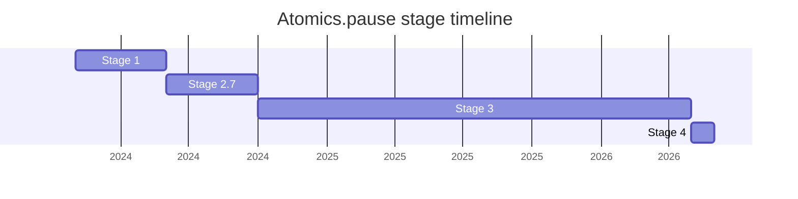

## 概要

`Atomics.pause` は、`Atomics` オブジェクトに単一のメソッド `Atomics.pause` を追加する提案です。これは CPU への spin-loop ヒントで、観測可能な挙動を持たず常に `undefined` を返します。spin lock(SharedArrayBuffer 上の mutex の fast path など)で OS レベルの sleep(`Atomics.wait`)へ落ちる前に短時間だけ spin する際、CPU に「いま busy loop 中だ」と知らせるためのものです。

ハードウェアには x86 の `PAUSE`、ARM の ISB(instruction synchronization barrier)/`YIELD` のように同目的の命令があり、C/C++ では `_mm_pause()` 等の intrinsic で使えますが、JS にはこれを表現する手段がありませんでした。本提案はそれを engine hook として提供します。当初のスコープは「micro wait(CPU ヒント)」と「mini wait(ブロックできない環境向けの、`Atomics.wait` のタイムアウト clamp 版)」の両方を含む広いものでしたが、後者は落とされ、CPU ヒントのメソッドのみに絞った上で `Atomics.pause` に改名されました。champion は [SYG](../people/SYG.md) で、Stage 4 は [SYG](../people/SYG.md) が他業務へ移ったため [KM](../people/KM.md) が代理で発表しました。

## ステージ遷移

| 会合                                                      | できごと                                                                                             | Stage   |
| --------------------------------------------------------- | ---------------------------------------------------------------------------------------------------- | ------- |
| [2024-02](../../raw/notes/meetings/2024-02/feb-6.md)      | Stage 1 到達。`Micro and mini waits in JS for stage 1`(当時は microwait + clamp 付き `Atomics.wait`) | → 1     |
| [2024-04](../../raw/notes/meetings/2024-04/april-08.md)   | スコープを CPU ヒントのみに縮小。spec text 未準備のため Stage 2 consensus を **withdraw**            | 1       |
| [2024-06](../../raw/notes/meetings/2024-06/june-13.md)    | `Atomics.pause` に改名。**Stage 2.7 到達**(記録上の Stage 2 を経ず 1 → 2.7)                          | 1 → 2.7 |
| [2024-07](../../raw/notes/meetings/2024-07/july-29.md)    | Stage 3 を狙うも、iteration 引数の意味で [WH](../people/WH.md) と認識齟齬が判明し進めず              | 2.7     |
| [2024-07](../../raw/notes/meetings/2024-07/july-31.md)    | 継続討議。引数の意味を「大きい N = 長い pause」へ反転。Stage 3 も Stage 2 も consensus なし          | 2.7     |
| [2024-10](../../raw/notes/meetings/2024-10/october-09.md) | **Stage 3 到達**。optional iteration 引数付き、Test262 landed                                        | 2.7 → 3 |
| [2026-05](../../raw/notes/meetings/2026-05/may-19.md)     | **Stage 4 到達**。未使用の optional 引数を削除する normative change を承認した上で advance           | 3 → 4   |

> 各 Stage の横棒 = その stage に居た期間(横軸 = 実時間)。2024-02 Stage 1(2024-04 の Stage 2 申請は withdraw)→ 2024-06 Stage 2.7(**記録上の Stage 2 は経ず**)→ 2024-10 Stage 3 →(約 1 年半)→ 2026-05 Stage 4。

## 主な論点

### optional な iteration 引数 — 意味の反転と最終的な削除

spin-loop の iteration 数(backoff ヒント)を表す整数引数が、3 会合にわたる最大の争点でした。2024-07 で [WH](../people/WH.md) が「提示された spec text は前回合意した意味の逆だ」と指摘します。

> ([WH](../people/WH.md), 2024-07) 前回達成したと思っていた合意は幻だった。

[SYG](../people/SYG.md) は [WH](../people/WH.md) の読みに合わせ「大きい数ほど長く pause する」へ意味を反転(負値で count-down も許可)。2024-10 の Stage 3 では optional 引数(0 起点、正で長く・負で短く)で決着しました。

### Stage 4 での引数削除(normative change)

2026-05 で [KM](../people/KM.md) が「どのエンジンもこの引数を実装していない」として引数の全削除を提案しました。[RBN](../people/RBN.md) は「引数が無いと開発者を手書きの busy loop へ導き、長期的に取り返しがつかない」と懸念しましたが、blocking はしませんでした。

> ([NRO](../people/NRO.md), 2026-05) どのエンジンもこの引数を尊重しないなら、引数があっても人々は質の悪いコードを書く必要を感じ続ける。spec に入れることに効果があるとは思えない。

> ([WH](../people/WH.md), 2026-05) この引数を将来意味のあるものにする余地を残すため、今は含めるべきでない。

決着は引数削除の normative change に consensus し、その上で Stage 4 到達。

### なぜ引数を設けたか(no-arg ではなく)

[SYG](../people/SYG.md) は「JS は性能のばらつきが大きく、interpreter と JIT で pause の量を揃えたい。引数で spin-loop の iteration を伝えればエンジンが実行階層ごとに pause を調整できる」と説明しました。引数削除はこの調整余地を一旦手放すことを意味します。

### テスト不能性 / Stage 3 入りの基準

[MF](../people/MF.md) は「presence と callability 以外ほとんどテストできない」と指摘し、[DE](../people/DE.md) も SharedArrayBuffer メモリモデルのテスト困難性に言及しました。これが Stage 2 ではなく 2.7(editorial 裁量)を選んだ理由でもあります。

## 関連提案

- `shared-array-buffer`(SharedArrayBuffer)— `Atomics.pause` が対象とする spin lock の基盤。
- `Atomics.waitAsync` / `Atomics.wait` — `Atomics.pause` は CPU レベルの fast-path ヒントで、OS レベルでブロックする `Atomics.wait` を補完する(落とされた "mini wait" は `Atomics.wait` の clamp 版だった)。
- `structs`(shared structs)— [RBN](../people/RBN.md) が「`Atomics.pause` は structs 提案と強く関連する」と言及(lock-free アルゴリズム実装に有用)。

## 出典

- [2024-02 feb-6](../../raw/notes/meetings/2024-02/feb-6.md) — Stage 1(micro and mini waits)
- [2024-04 april-08](../../raw/notes/meetings/2024-04/april-08.md) — Stage 2 申請 withdraw
- [2024-06 june-13](../../raw/notes/meetings/2024-06/june-13.md) — `Atomics.pause` 改名・Stage 2.7
- [2024-07 july-29](../../raw/notes/meetings/2024-07/july-29.md) — Stage 3 狙うも認識齟齬で進まず
- [2024-07 july-31](../../raw/notes/meetings/2024-07/july-31.md) — 継続討議、consensus なし
- [2024-10 october-09](../../raw/notes/meetings/2024-10/october-09.md) — Stage 3 到達
- [2026-05 may-19](../../raw/notes/meetings/2026-05/may-19.md) — Stage 4 到達(引数削除の normative change 込み)
