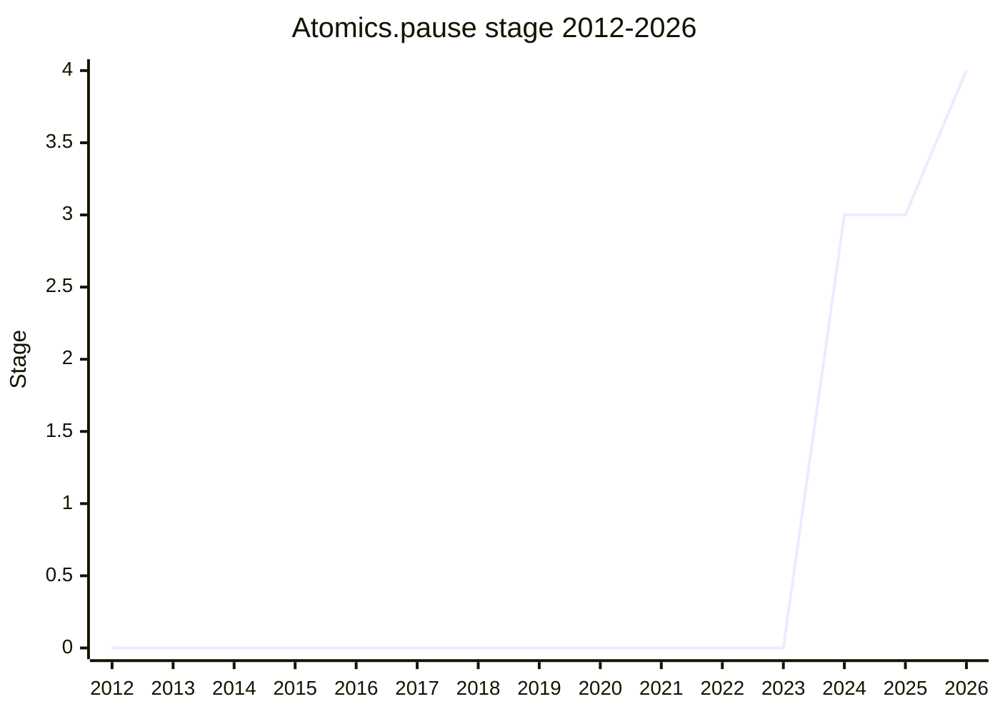

## Overview

`Atomics.pause` adds a single method, `Atomics.pause`, to the `Atomics` object. It is a spin-loop hint to the CPU: it has no observable behavior and always returns `undefined`. When a spin lock (the fast path of a mutex on a SharedArrayBuffer, and the like) spins briefly before falling into an OS-level sleep (`Atomics.wait`), this tells the CPU "I am in a busy loop right now."

Hardware already has instructions for the same purpose, such as x86 `PAUSE` and ARM's ISB (instruction synchronization barrier) / `YIELD`, and C/C++ can use them through intrinsics such as `_mm_pause()`, but JS had no way to express this. This proposal provides it as an engine hook. The original scope was broad and covered both "micro wait (a CPU hint)" and "mini wait (a timeout-clamped `Atomics.wait`, for environments that cannot block)," but the latter was dropped. It was narrowed to the CPU-hint method only, and renamed `Atomics.pause`. The champion is [SYG](../people/SYG.md). At Stage 4, [SYG](../people/SYG.md) had moved on to other work, so [KM](../people/KM.md) presented on his behalf.

## Stage history

| Meeting                                                   | What happened                                                                                                                           | Stage   |
| --------------------------------------------------------- | --------------------------------------------------------------------------------------------------------------------------------------- | ------- |
| [2024-02](../../raw/notes/meetings/2024-02/feb-6.md)      | Reached Stage 1. `Micro and mini waits in JS for stage 1` (at the time, microwait plus a clamped `Atomics.wait`)                        | → 1     |
| [2024-04](../../raw/notes/meetings/2024-04/april-08.md)   | Narrowed the scope to the CPU hint only. **Withdrew** the Stage 2 consensus because the spec text was not ready                         | 1       |
| [2024-06](../../raw/notes/meetings/2024-06/june-13.md)    | Renamed to `Atomics.pause`. **Reached Stage 2.7** (1 → 2.7, without a recorded Stage 2)                                                 | 1 → 2.7 |
| [2024-07](../../raw/notes/meetings/2024-07/july-29.md)    | Aimed at Stage 3, but a mismatch with [WH](../people/WH.md) over the meaning of the iteration argument came out, and it did not advance | 2.7     |
| [2024-07](../../raw/notes/meetings/2024-07/july-31.md)    | Continued discussion. Flipped the argument's meaning to "a larger N means a longer pause." No consensus for Stage 3 or for Stage 2      | 2.7     |
| [2024-10](../../raw/notes/meetings/2024-10/october-09.md) | **Reached Stage 3**. Optional iteration argument; Test262 landed                                                                        | 2.7 → 3 |
| [2026-05](../../raw/notes/meetings/2026-05/may-19.md)     | **Reached Stage 4**. Advanced after approving a normative change that removes the unused optional argument                              | 3 → 4   |

```mermaid
xychart-beta
    title "Atomics.pause stage 2012-2026"
    x-axis [2012, 2013, 2014, 2015, 2016, 2017, 2018, 2019, 2020, 2021, 2022, 2023, 2024, 2025, 2026]
    y-axis "Stage" 0 --> 4
    line [0, 0, 0, 0, 0, 0, 0, 0, 0, 0, 0, 0, 3, 3, 4]
```

> Horizontal axis = 2012-2026, vertical axis = Stage. First seen in 2024-02. Within 2024 it went Stage 1, then the Stage 2 request was withdrawn, then Stage 2.7 (2024-06), then Stage 3 (2024-10), so the year-end value is 3. It never passed through a recorded Stage 2 (the only Stage 2 request, in 2024-04, was withdrawn, and June went 1 → 2.7). 2025 is flat, with no agenda item in the corpus, and Stage 4 came in 2026-05.

## Main issues

### The optional iteration argument — meaning flipped, then removed

An integer argument for the spin-loop iteration count (a backoff hint) was the biggest dispute, across three meetings. In 2024-07 [WH](../people/WH.md) pointed out that the spec text on offer was the reverse of the meaning agreed last time.

> ([WH](../people/WH.md), 2024-07) The agreement I thought we had reached last time turned out to be an illusion.

[SYG](../people/SYG.md) flipped the meaning to match [WH](../people/WH.md)'s reading: a larger number pauses longer (negative values also allowed, as a count-down). At Stage 3 in 2024-10 it was settled as an optional argument (0-based; positive means longer, negative means shorter).

### Removing the argument at Stage 4 (normative change)

In 2026-05 [KM](../people/KM.md) proposed deleting the argument entirely, because no engine implements it. [RBN](../people/RBN.md) was concerned that without the argument developers are led into hand-written busy loops, which cannot be undone in the long run, but he did not block.

> ([NRO](../people/NRO.md), 2026-05) If no engine honors this argument, people will keep feeling they have to write bad code even if the argument is there. I do not think putting it in the spec does any good.

> ([WH](../people/WH.md), 2026-05) So that we leave room to make this argument meaningful later, we should not include it now.

The outcome was consensus on the normative change that removes the argument, and then Stage 4.

### Why there was an argument at all (not no-arg)

[SYG](../people/SYG.md) explained that JS performance varies a lot, and he wanted the amount of pause to line up between the interpreter and the JIT. If the argument tells the engine how many spin-loop iterations there are, the engine can adjust the pause per execution tier. Removing the argument means giving up that room to adjust, for now.

### Untestability, and the bar for Stage 3

[MF](../people/MF.md) pointed out that beyond presence and callability there is almost nothing you can test, and [DE](../people/DE.md) also mentioned how hard the SharedArrayBuffer memory model is to test. That is also why 2.7 (editorial discretion) was chosen rather than Stage 2.

## Related proposals

- `shared-array-buffer` (SharedArrayBuffer) — the foundation of the spin locks that `Atomics.pause` targets.
- `Atomics.waitAsync` / `Atomics.wait` — `Atomics.pause` is a CPU-level fast-path hint that complements `Atomics.wait`, which blocks at the OS level (the dropped "mini wait" was a clamped `Atomics.wait`).
- `structs` (shared structs) — [RBN](../people/RBN.md) said "`Atomics.pause` is strongly related to the structs proposal" (useful for implementing lock-free algorithms).

## Sources

- [2024-02 feb-6](../../raw/notes/meetings/2024-02/feb-6.md) — Stage 1 (micro and mini waits)
- [2024-04 april-08](../../raw/notes/meetings/2024-04/april-08.md) — Stage 2 request withdrawn
- [2024-06 june-13](../../raw/notes/meetings/2024-06/june-13.md) — renamed `Atomics.pause`, Stage 2.7
- [2024-07 july-29](../../raw/notes/meetings/2024-07/july-29.md) — aimed at Stage 3, but did not advance because of a mismatch
- [2024-07 july-31](../../raw/notes/meetings/2024-07/july-31.md) — continued discussion, no consensus
- [2024-10 october-09](../../raw/notes/meetings/2024-10/october-09.md) — Reached Stage 3
- [2026-05 may-19](../../raw/notes/meetings/2026-05/may-19.md) — Reached Stage 4 (including the normative change that removes the argument)
