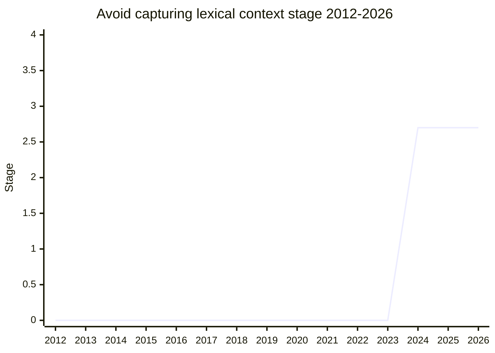

## Overview

Indirect eval (`const f = eval; f(code)`, `new Function(code)`, ...) is specified to behave like a normal function that happens to evaluate code in the global scope: it captures no lexical context. Since 2015, however, ECMA-262 has threaded the _active ScriptOrModule_ through indirect eval so hosts (HTML) can wire up `location.href` resolution, unhandled-rejection attribution, and similar caller-sensitive behavior. Dynamic `import()` is the one case where this leaks observable semantics into ECMA-262 itself: a dynamic import inside indirect eval resolves its specifier against **the module that called the eval**, not against the module the eval'd code was defined in - dynamic scoping through what is supposed to be a plain function call.

The change (originally normative PR [ecma262#3374](https://github.com/tc39/ecma262/pull/3374), converted to a proposal) stops using the active ScriptOrModule for dynamic import through indirect eval: the referrer becomes null, like an inline event handler, so both ways of calling the same function behave the same. The constraint is that HTML's own uses must keep working - only the dynamic-import case changes. Notably, implementations already disagree: Chrome and Firefox follow the ECMA-262 behavior, Safari does something else, so there is no interop to preserve.

The champion is [NRO](../people/NRO.md). **Not listed in the tc39/proposals canonical tables** - its stage rests on the meeting conclusion alone.

## Stage history

| Meeting                                                                        | Event                                                                                                                                                                                                                                     | Stage |
| ------------------------------------------------------------------------------ | ----------------------------------------------------------------------------------------------------------------------------------------------------------------------------------------------------------------------------------------- | ----- |
| [2024-07](https://github.com/tc39/notes/blob/main/meetings/2024-07/july-31.md) | Presented as a needs-consensus PR; converted to a **Stage 2.7 proposal** at [KM](../people/KM.md)'s suggestion (merge gated on two implementations). Support from [DLM](../people/DLM.md), [MM](../people/MM.md), [SYG](../people/SYG.md) | → 2.7 |

> Born at Stage 2.7 in 2024-07 (converted straight from a normative PR, skipping the lower stages as PR-conversions do).

## Main issues

### Why remove dynamic scoping at all

[NRO](../people/NRO.md)'s framing: refactoring is safe to move code around _except_ for lexically captured things, and dynamic scoping breaks that safety. Indirect eval was supposed to be the exception-free case - "the only dynamic scoping we have is indirect eval" - and this leak is a bug class waiting to happen. [SYG](../people/SYG.md) initially pressed "indirect eval is dynamic scoping all the way down, why get rid of it for indirect eval?", and was convinced by the realm-not-scope model: indirect eval reads its realm pointer from the function, not from the call site, and the import referrer was the one thing that still read the call site. [MM](../people/MM.md) added the conceptual framing: direct eval is a special form (like `if`), not a dynamically-scoped call. [KKL](../people/KKL.md) supplied a security motivation - the leak lets sandboxed code sense its referrer outside its confinement boundary, which matters for same-realm confinement designs.

### The prioritization trap

The consensus came with eyes open:

> ([SYG](../people/SYG.md), 2024-07) This seems corner casey to me that means it's likely to be deprioritized. After all the years we don't have interop on the incumbent settings object ... I don't want to give false promises if we give consensus that will get done sooner than later.

[DLM](../people/DLM.md) would not commit to implementing first and wanted another browser to run an experiment for web-compat signals; [KM](../people/KM.md)'s two-implementations-before-merge gate became the mechanism. Stage 2.7 here means Test262 plus WPT tests, given the behavior depends heavily on embedder wiring.

## Related proposals

- `ShadowRealm` - the confinement motivation [KKL](../people/KKL.md) described (no page yet).
- `module-scope-ceiling` - the supply-chain-security sibling in the modules family (no page yet).

## Sources

- [2024-07 july-31](https://github.com/tc39/notes/blob/main/meetings/2024-07/july-31.md) - PR converted to Stage 2.7 proposal ([NRO](../people/NRO.md))
