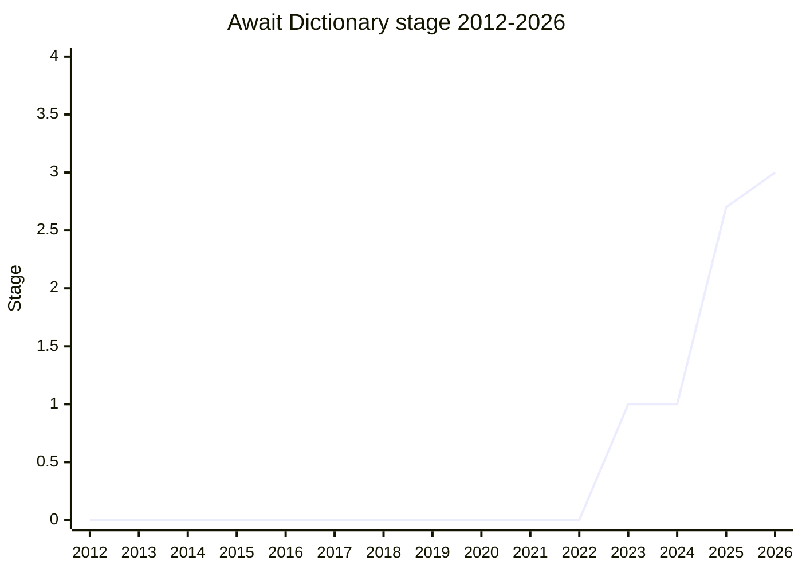

## 概要

Await Dictionary は、`Promise.all` の「名前付き版」である **`Promise.allKeyed` / `Promise.allSettledKeyed`** を追加する提案です。Promise の dictionary(名前付きの bag)を渡すと、同じ名前を持つ object に resolve する Promise が返り、名前で destructure できます。`Promise.all` の位置ベース API では「何番目の Promise が何番目の変数に対応するか」を数えて突き合わせる必要があり、項目が増えたり条件分岐が混ざるほど読みにくく誤りやすい、という人間側の問題を解決します。また、個別に順次 `await` する書き方と違い、全 Promise に一括で handler が付くため、複数 reject 時の unhandled promise rejection も避けられます。

命名は先行して advance した `Iterator.zip` / `Iterator.zipKeyed` のパターン(ordered 版 + Keyed 版)を鏡映したものです。元の作者は Alexander J. Vincent で、[ACE](../people/ACE.md) が引き継いで champion group([ACE](../people/ACE.md) / [JHD](../people/JHD.md) / [CDA](../people/CDA.md))が推進しています。

## ステージ遷移

| 会合                                                        | できごと                                                                                                                                                                                                                                         | Stage   |
| ----------------------------------------------------------- | ------------------------------------------------------------------------------------------------------------------------------------------------------------------------------------------------------------------------------------------------ | ------- |
| [2023-03](../../raw/notes/meetings/2023-03/mar-22.md)       | [ACE](../people/ACE.md) が問題提起(ordinal API の可読性)。[KG](../people/KG.md) / [RBN](../people/RBN.md) が明示支持、[MM](../people/MM.md) は「機能が元を取らない」と消極姿勢を登録しつつ不反対で **Stage 1**                                   | 0 → 1   |
| [2025-09](../../raw/notes/meetings/2025-09/september-23.md) | update。`allSettledKeyed` を含めるか委員会の温度感を確認([KG](../people/KG.md) が「全く同じ動機が当てはまる」と包含を支持)。[JSL](../people/JSL.md) は「2.7 は時期尚早」                                                                         | 1       |
| [2025-11](../../raw/notes/meetings/2025-11/november-18.md)  | `allSettledKeyed` を追加した spec 完成版で、**Stage 2 を経ず直接 Stage 2.7**([MF](../people/MF.md)/[DLM](../people/DLM.md)/[DJM](../people/DJM.md)/[WH](../people/WH.md)/[CDA](../people/CDA.md)/[JSL](../people/JSL.md) ほか多数支持・反対なし) | 1 → 2.7 |
| [2026-07](../../raw/notes/meetings/2026-07/july-20.md)      | test262 に 89 テスト merge、Boa / SpiderMonkey が 100% pass、[JHD](../people/JHD.md) の polyfill も全 pass。**Stage 3 到達**                                                                                                                     | 2.7 → 3 |

> 横軸=2012-2026、縦軸=Stage。2023-03 に Stage 1、2 年の休眠を挟んで 2025-11 に Stage 2 を経ず直接 Stage 2.7、2026-07 に Stage 3。

## 主な論点

### API か syntax か

Stage 1 当時、[SFC](../people/SFC.md) は「API に限定せず構文的な解決も探るべき」と主張し、HAX は Swift の `async let` を例に別解の探索を求めました。[KG](../people/KG.md) は「`Promise.all` が既にある以上、構文をやるとしても library 形式は先に必要で、構文はより cross-cutting な別提案で扱うべき」と整理し、この方針が維持されました。2025-09 にも champion 側から「構文は別提案でやる方がよい(動的な object のユースケースは構文で覆えない)」と再確認されています。

### 汎用の dataflow への拡張可能性

[WH](../people/WH.md) は Stage 1 時に「これは問題の部分集合への解にすぎない。動的な dataflow graph の問題を解いた後にまた別 library を足す羽目になるのは避けたい」と、より汎用的な解の探索を求めました。[JFI](../people/JFI.md) は signals との関係にも言及。最終的な API はシンプルな `allKeyed` / `allSettledKeyed` に絞られています。

### `allSettledKeyed` を含めるか

champion の [ACE](../people/ACE.md) 自身はユースケースの少なさから消極的でしたが、2025-09 に [KG](../people/KG.md) が

> `Promise.all` の動機がそのまま `allSettled` にも当てはまる。実装の追加負担もほぼ無く、外すほうが奇妙だ

と包含を主張し、2025-11 の spec には `allSettledKeyed` が追加されました。`race` / `any` は「list を返さないので keyed 版が意味を持たない」として対象外です([MM](../people/MM.md) の「4 倍に増殖する」懸念への回答)。

### Stage 2 を経ない 2.7 直行

2025-11 時点で spec text が完成していたため、[ACE](../people/ACE.md) は Stage 2 を跳ばして 2.7 を要求し、異論なく通過しました。[JHD](../people/JHD.md) は waterfall の性能問題(直列化の回避)を動機として補強しています。

## 関連提案

- [Joint Iteration](../proposals/joint-iteration.md) — `Iterator.zip` / `Iterator.zipKeyed`。`allKeyed` の命名はこの提案の zip/zipKeyed パターンの鏡映。
- `map-get-and-delete` ほか collection 系とは独立。

## 出典

- [2023-03 mar-22](../../raw/notes/meetings/2023-03/mar-22.md) — Stage 1 到達
- [2025-09 september-23](../../raw/notes/meetings/2025-09/september-23.md) — update(allSettledKeyed の温度感確認)
- [2025-11 november-18](../../raw/notes/meetings/2025-11/november-18.md) — Stage 2.7 到達(2 を経ず直行)
- [2026-07 july-20](../../raw/notes/meetings/2026-07/july-20.md) — Stage 3 到達
