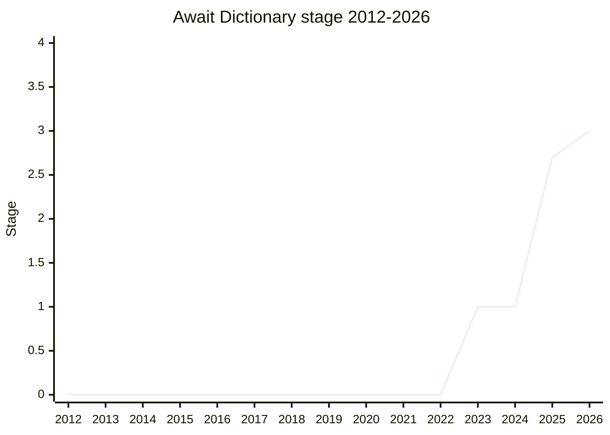

## Overview

Await Dictionary adds **`Promise.allKeyed` / `Promise.allSettledKeyed`**, a "named version" of `Promise.all`. Pass a dictionary of Promises (a named bag) and you get back a Promise that resolves to an object with the same names, which you can destructure by name. It solves a human-side problem with `Promise.all`'s positional API: you have to count and match "which Promise corresponds to which variable," and the more items there are, or the more conditionals get mixed in, the harder it is to read and the easier it is to get wrong. Unlike awaiting each one in sequence, a handler is attached to every Promise at once, so unhandled promise rejections when several reject are also avoided.

The naming mirrors the pattern of `Iterator.zip` / `Iterator.zipKeyed` (an ordered variant plus a Keyed variant), which had already advanced. The original author is Alexander J. Vincent; [ACE](../people/ACE.md) took it over, and the champion group ([ACE](../people/ACE.md) / [JHD](../people/JHD.md) / [CDA](../people/CDA.md)) is driving it.

## Stage history

| Meeting                                                                             | What happened                                                                                                                                                                                                                                                                                         | Stage   |
| ----------------------------------------------------------------------------------- | ----------------------------------------------------------------------------------------------------------------------------------------------------------------------------------------------------------------------------------------------------------------------------------------------------- | ------- |
| [2023-03](https://github.com/tc39/notes/blob/main/meetings/2023-03/mar-22.md)       | [ACE](../people/ACE.md) raised the problem (readability of the ordinal API). [KG](../people/KG.md) / [RBN](../people/RBN.md) supported it explicitly; [MM](../people/MM.md) registered a lukewarm view that "the feature does not pay for itself" but did not oppose, so **Stage 1**                  | 0 → 1   |
| [2025-09](https://github.com/tc39/notes/blob/main/meetings/2025-09/september-23.md) | Update. Checked the committee's temperature on including `allSettledKeyed` ([KG](../people/KG.md) supported inclusion: "exactly the same motivation applies"). [JSL](../people/JSL.md) said "2.7 is premature"                                                                                        | 1       |
| [2025-11](https://github.com/tc39/notes/blob/main/meetings/2025-11/november-18.md)  | With the finished spec that adds `allSettledKeyed`, **straight to Stage 2.7 without passing through Stage 2** ([MF](../people/MF.md)/[DLM](../people/DLM.md)/[DJM](../people/DJM.md)/[WH](../people/WH.md)/[CDA](../people/CDA.md)/[JSL](../people/JSL.md) and many others in support, no opposition) | 1 → 2.7 |
| [2026-07](https://github.com/tc39/notes/blob/main/meetings/2026-07/july-20.md)      | 89 tests merged into test262; Boa / SpiderMonkey pass 100%; [JHD](../people/JHD.md)'s polyfill also passes everything. **Reached Stage 3**                                                                                                                                                            | 2.7 → 3 |

```mermaid
xychart-beta
    title "Await Dictionary stage 2012-2026"
    x-axis [2012, 2013, 2014, 2015, 2016, 2017, 2018, 2019, 2020, 2021, 2022, 2023, 2024, 2025, 2026]
    y-axis "Stage" 0 --> 4
    line [0, 0, 0, 0, 0, 0, 0, 0, 0, 0, 0, 1, 1, 2.7, 3]
```

> Horizontal axis = 2012-2026, vertical axis = Stage. Stage 1 in 2023-03, then a two-year dormancy, straight to Stage 2.7 in 2025-11 without passing through Stage 2, and Stage 3 in 2026-07.

## Main issues

### API or syntax

At Stage 1, [SFC](../people/SFC.md) argued that the search should not be limited to an API and should also look at a syntactic solution, and HAX asked to explore alternatives, citing Swift's `async let` as an example. [KG](../people/KG.md) framed it as: since `Promise.all` already exists, even if syntax is done, the library form is needed first, and syntax should be handled in a more cross-cutting separate proposal. That direction was kept. In 2025-09 the champions reconfirmed that syntax is better done as a separate proposal (the dynamic-object use case cannot be covered by syntax).

### Extending it to general dataflow

At Stage 1, [WH](../people/WH.md) asked for a more general solution: this is only a solution to a subset of the problem, and he did not want the committee to end up adding yet another library after solving the dynamic dataflow-graph problem. [JFI](../people/JFI.md) also mentioned the relationship to signals. The final API is narrowed to the simple `allKeyed` / `allSettledKeyed`.

### Whether to include `allSettledKeyed`

Champion [ACE](../people/ACE.md) was himself lukewarm, because there are few use cases, but in 2025-09 [KG](../people/KG.md) argued for inclusion:

> The motivation for `Promise.all` applies as-is to `allSettled`. The extra implementation cost is almost none, and leaving it out would be the stranger choice.

`allSettledKeyed` was added to the 2025-11 spec. `race` / `any` are out of scope because they do not return a list, so a keyed variant would not be meaningful (the answer to [MM](../people/MM.md)'s concern that it would proliferate fourfold).

### Straight to 2.7, skipping Stage 2

Because the spec text was already complete as of 2025-11, [ACE](../people/ACE.md) asked to skip Stage 2 and go to 2.7, and it passed without objection. [JHD](../people/JHD.md) reinforced the motivation with the waterfall performance problem (avoiding serialization).

## Related proposals

- [Joint Iteration](../proposals/joint-iteration.md) — `Iterator.zip` / `Iterator.zipKeyed`. The naming of `allKeyed` mirrors this proposal's zip/zipKeyed pattern.
- Independent of `map-get-and-delete` and the other collection proposals.

## Sources

- [2023-03 mar-22](https://github.com/tc39/notes/blob/main/meetings/2023-03/mar-22.md) — Reached Stage 1
- [2025-09 september-23](https://github.com/tc39/notes/blob/main/meetings/2025-09/september-23.md) — update (temperature check on allSettledKeyed)
- [2025-11 november-18](https://github.com/tc39/notes/blob/main/meetings/2025-11/november-18.md) — Reached Stage 2.7 (straight through, without Stage 2)
- [2026-07 july-20](https://github.com/tc39/notes/blob/main/meetings/2026-07/july-20.md) — Reached Stage 3
