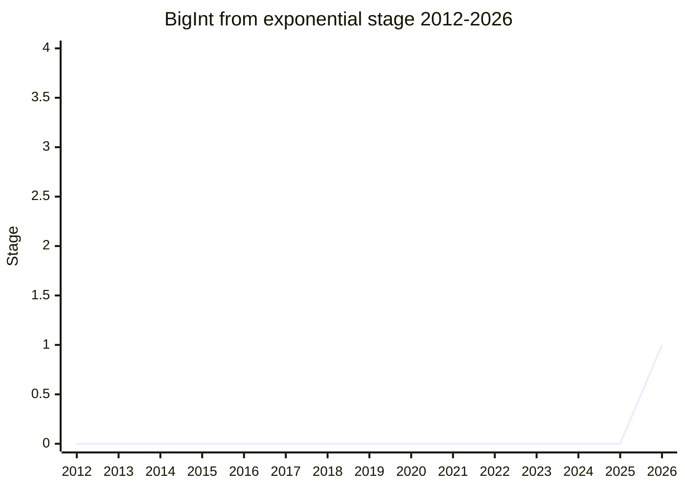

## 概要

BigInt from exponential は、**整数を表す指数表記文字列(例 `1.5e2`、`4.2000e+4`)を `BigInt` で受理できるようにする**提案です。現状 `Number("1e6")` は動くのに `BigInt("1e6")` は SyntaxError になる非対称があり、大きな整数を扱う際にゼロを全部書き下すか、文字列を自力で分解する必要があります。発端は [Amount](../proposals/amount.md) の canonical form(有効数字を保持する指数表記文字列。`1.000e3` と `1e3` を区別する)が `BigInt` に変換できないという発見で、JSON の source text access(JSON では指数表記が合法)でも同じ問題が起きます。

もともと ECMA-262 への needs-consensus PR(#3857、`StringToBigInt` が `StringNumericLiteral` 文法を再利用して整数 MV に制約する変更)でしたが、2 会合の議論を経て staged proposal に転換されました。string parsing の変更と bigint literal 構文の拡張(`1e6n`)の両方がスコープです。champion は [RGN](../people/RGN.md)。

## ステージ遷移

| 会合                                                   | できごと                                                                                                                                                      | Stage |
| ------------------------------------------------------ | ------------------------------------------------------------------------------------------------------------------------------------------------------------- | ----- |
| [2026-05](../../raw/notes/meetings/2026-05/may-19.md)  | needs-consensus PR #3857 として初議論。PR か staged proposal かで意見が割れ、結論持ち越し                                                                     | -     |
| [2026-07](../../raw/notes/meetings/2026-07/july-20.md) | 再議の結果、PR を **proposal-bigint-from-exponential に転換して Stage 1**([WH](../people/WH.md) / [MF](../people/MF.md) / [JSL](../people/JSL.md) が明示支持) | 0 → 1 |
| [2026-07](../../raw/notes/meetings/2026-07/july-22.md) | temperature check 2 件(literal 構文拡張の是非 / 既存の暗黙変換への波及)。いずれも意見が割れ、今後の設計で考慮                                                 | 1     |

> 横軸=2012-2026、縦軸=Stage。2026-05 に needs-consensus PR として初出、2026-07 に proposal 化して Stage 1。

## 主な論点

### constructor 拡張か、別 method(`BigInt.parse`)か

[MF](../people/MF.md) は「なぜ bigint を指数表記で書きたいのか分からない。decimal point を許す形は特に受け入れ難い」と `BigInt(string)` の拡張に反対し、`BigInt.parse` のような別 method で separator 込みの寛容な文法を受ける方向を選好しました。一方 [EAO](../people/EAO.md) は

> `BigInt(string)` と `BigInt.parse(string)` が同じ文字列に異なる parse をするのは非常に驚きだ

と別 method 案に反対し([WH](../people/WH.md) も +1)、設計は割れたままです。[KM](../people/KM.md) は「結果が常に整数なら decimal point を許す意味がなく混乱の元」と指摘しましたが、[RGN](../people/RGN.md) は「有効数字を示す canonical form(`1.000e3` ≠ `1e3`)を受けられなければ Amount の問題が解決しない」と応答しました。

### literal 用途と動的 parse 用途の区別

[OFR](../people/OFR.md) は「literal の代わりに文字列を parse させるのは antipattern であり、literal 用途なら literal 構文(`1e6n`)を拡張すべき。Amount 用途なら提案が最終形に達するまで待つべき」と用途の切り分けを主張。[RGN](../people/RGN.md) は「literal 用途を関数で満たさないなら残る選択肢は構文変更しかない」と可能性空間を整理しました。[PFC](../people/PFC.md) は日時処理での実需(`1e9` 相当のゼロの書き下しが苦痛)を挙げて支持しています。

### temperature check(2026-07 day 3)

設計 iteration を 1 回省くために [RGN](../people/RGN.md) が 2 件の温度感を確認しました。(1) `1e6n` のような **literal 構文拡張**: Strong Positive 5 / Positive 4 / Following 3 / Confused 2 / Indifferent 2 / Unconvinced 0。(2) `==` 比較・TypedArray・`BigInt.asIntN` など**既存の暗黙変換へ新構文を波及させるか**(vs opt-in の static method に留めるか): Strong Positive 4 / Positive 3 / Following 2 / Confused 2 / Indifferent 1 / Unconvinced 0。いずれも mixed で、結果は今後の開発で考慮されます。

## 関連提案

- [Amount](../proposals/amount.md) — canonical form が `BigInt` に変換できない問題が本提案の発端。
- [Fused Multiply-Add](../proposals/fused-multiply-add.md) — 同じく Amount の設計課題(conversion 精度)から派生した提案。

## 出典

- [2026-05 may-19](../../raw/notes/meetings/2026-05/may-19.md) — needs-consensus PR #3857 の初議論(持ち越し)
- [2026-07 july-20](../../raw/notes/meetings/2026-07/july-20.md) — proposal 化、Stage 1 到達
- [2026-07 july-22](../../raw/notes/meetings/2026-07/july-22.md) — temperature checks
