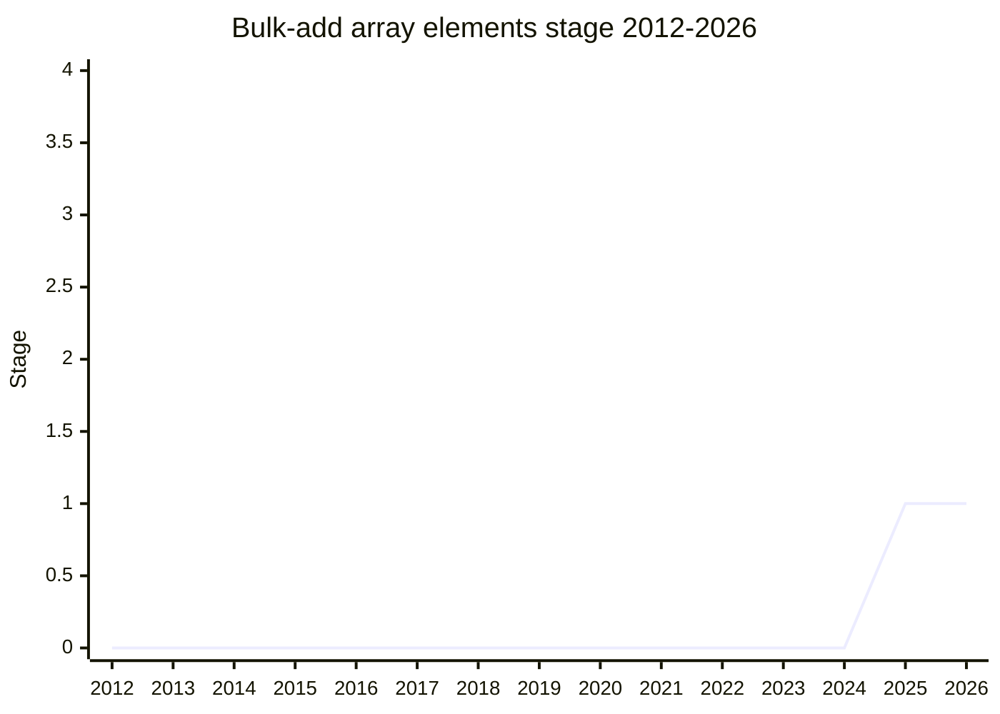

## Overview

A method to bulk-add multiple elements (from an array or iterable) to an existing array - presented as `Array.prototype.pushAll`. The idiomatic `arr.push(...newElements)` spreads every element onto the call stack, so a large input overflows: spreading a 200,000-element generator into `push` throws a `RangeError` that is really a stack overflow. The workarounds (a `for-of` loop, or pushing in pieces) are more verbose, and pushing in a loop also risks quadratic re-allocation of the backing store. A dedicated method would be auto-completable, discoverable next to `push`, and optimizable in one shot.

The champion is [DRR](../people/DRR.md) (Daniel Rosenwasser, TypeScript team at Microsoft), who hit this repeatedly on real teams ("this happened on basically every team that I have worked at"). Stage 1 was granted for a deliberately broad **problem statement** rather than the proposed shape:

> Problem statement: It should be straightforward and safe to bulk-add multiple elements to an existing array.

[KG](../people/KG.md) had the statement extended to cover insertion too ("I would like [the] problem statement for this to be extensive enough to include splice and unshift even if we ultimately decide we don't want to do these things. It's basically the same problem."), and [JHD](../people/JHD.md) noted the problem statement would become the proposal repo's name - hence the canonical name "Bulk-add array elements" (`tc39/proposal-bulk-add-array-elements`).

## Stage history

| Meeting                                                                             | What happened                                                                                                                           | Stage |
| ----------------------------------------------------------------------------------- | --------------------------------------------------------------------------------------------------------------------------------------- | ----- |
| [2025-09](https://github.com/tc39/notes/blob/main/meetings/2025-09/september-22.md) | First presented as `Array.prototype.pushAll` for Stage 1. Reached Stage 1 on the refined problem statement (not the proposed API shape) | → 1   |

> First presented 2025-09; Stage 1 in the same session.

## Main issues

### Is working with large arrays a real use case?

[JHD](../people/JHD.md) was the main skeptic: "I'm very, very skeptical that large arrays at all are common... if you're sending 200,000 items over the wire without pagination, your performance problems are not in the push method, they're elsewhere." [MF](../people/MF.md) sees the problem often but argued the error is a feature: "You're already doing the improper thing by working with very, very large arrays... it's kind of a good thing that you get an error here because it prompts you to say wait, am I doing something really dumb?" [KG](../people/KG.md) rejected that framing: "the claim that if you are doing this you are doing something wrong is just false. 20,000 items is not an unreasonable number of items" - and the point of the API is code that is idiomatic and performant in the common case without exploding in the uncommon case. [JRL](../people/JRL.md): "I find this extremely common" in parsing work.

### New `Array.prototype` method vs optimizing the existing pattern

[MF](../people/MF.md) relayed that implementers have said "with varying levels of severity they have no interest in adding new `Array.prototype` methods anymore" - during Stage 1 the champions should find out whether a prototype method is even possible. [EAO](../people/EAO.md) argued against a new method entirely: optimize implementations so that `arr.push(...array)` just works ("we should make the thing we already have just work"). [DRR](../people/DRR.md) replied that pattern-based optimization is brittle, fingerprintable, and taxes engines to detect the shape. [KG](../people/KG.md) set the bar: "we really need explicit buy in from browsers before adding things to array prototype. All of the browsers." [KM](../people/KM.md) stayed neutral, noting `concat` is fine-tuned to be a memcopy and growing the array needs allocation anyway.

### Relationship to `concat` and self-push

[WH](../people/WH.md) probed whether this is just a mutating `concat`, and what happens when pushing an array onto itself. [DRR](../people/DRR.md) wants to special-case arrays (capture the length before appending) rather than inherit `concat`'s `[Symbol.isConcatSpreadable]` unpredictability, and is open to accepting multiple collections; he considered the details not a Stage 1 blocker. [JHD](../people/JHD.md) would rather see a solution that produces a new array than "another mutating method to arrays... I don't think we should add any more of those ever."

## Related proposals

- [Iterator helpers and friends](../families/iterator.md) - the input may be any iterable; the family's theme of mirroring array operations consistently applies.

## Sources

- [2025-09 september-22](https://github.com/tc39/notes/blob/main/meetings/2025-09/september-22.md) - first presentation, Stage 1
