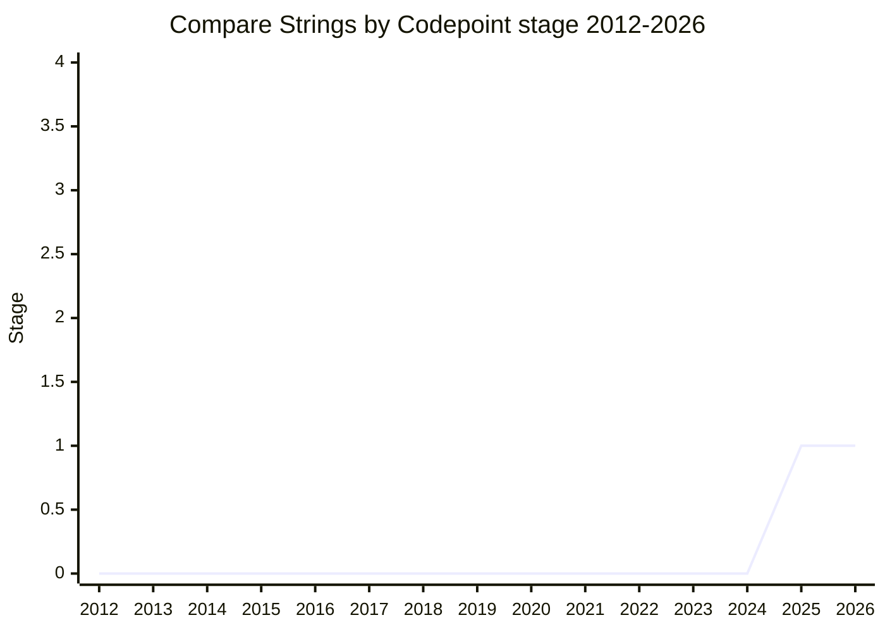

## Overview

A portable, locale-independent **string comparator that orders by Unicode code point** (candidate name `String.prototype.codePointCompare`; name open), presented by [MAH](../people/MAH.md) (Mathieu Hofman, Agoric). JavaScript strings are UTF-16 code units, and `<` / `Array.prototype.sort` compare code units - which orders surrogates (U+E000-U+FFFF) _before_ supplementary characters. Practically every other modern system (Swift, Go, Rust, and SQLite via UTF-8 byte order, which equals code point order) sorts by code point, so mixed JS/non-JS pipelines get inconsistent orderings for the same data.

`localeCompare` / `Intl.Collator` are code-point-aware but are the wrong tool: their order is locale-dependent (it legitimately changes over time and across environments) and human-oriented (confusable characters group together, equivalence classes collapse) - exactly what you cannot use when you need a stable, reproducible ordering for data processing.

## Stage history

| Meeting                                                                         | What happened                                                                                                                                                                                                         | Stage |
| ------------------------------------------------------------------------------- | --------------------------------------------------------------------------------------------------------------------------------------------------------------------------------------------------------------------- | ----- |
| [2025-04](https://github.com/tc39/notes/blob/main/meetings/2025-04/april-16.md) | "Compare Strings by Codepoint" for Stage 1 or 2 ([MAH](../people/MAH.md)). [WH](../people/WH.md): "This should have been done long ago. It fixes a bug that dates back to the beginnings of Unicode". Reached Stage 1 | → 1   |

> Stage 1 in 2025-04; no further plenary appearances in the notes as of 2026-05.

## Main issues

### UTF-16 order vs code point order

The default comparators order by code unit, so any string containing a supplementary character (an emoji, a rare CJK ideograph) sorts before U+E000-U+FFFF. [WH](../people/WH.md) gave the history: surrogate pairs were added to Unicode after the BMP was laid out, which is what produces the irregular U+E000-U+FFFF gap, and he framed code point order as the fix for a bug "that dates back to the beginnings of Unicode" - noting it has "nothing to do with UTF-8 since UCS-4 also sorts the same". [MAH](../people/MAH.md)'s driving use case: custom collections backed by two stores (in-memory JS `Map`s and SQLite), where iteration order must match between the two or results diverge - his example was `CAB` vs `CBA` ordering from the same data.

### Is the userland shim enough? ([SFC](../people/SFC.md))

[SFC](../people/SFC.md) pushed back on the premise: UTF-16 order is a perfectly well-defined total ordering, "UTF8 order is no more correct than UTF16 order", and anyone interoperating with UTF-8 systems can just sort the UTF-8 bytes - the shim is 10-12 lines. He asked for benchmark data showing the native comparator is needed. The counter from [MAH](../people/MAH.md) and [ABO](../people/ABO.md): the shim requires knowing you have the problem; even encoding-aware developers get bitten ([ABO](../people/ABO.md)'s Nova engine hit real-world WTF-8 issues), and most people simply don't realize their ordering differs from the rest of their stack.

### Generalization: comparators over code point iterables

[MF](../people/MF.md) asked the committee to explore a more general solution - comparators over iterables of numeric code points, of which string comparison would be one instance - and filed it as issue #6. [KG](../people/KG.md) was supportive and wanted coherence with the other comparator ideas before any Stage 2.7.

## Related proposals

- [Stable Formatting](stable-formatting.md) - the same determinism goal (stable across environments) on the formatting side.
- [Intl Default Behaviours](intl-default-behaviours.md) - locale-independent defaults for `Collator` / `Segmenter`; the complementary fix on the Intl side.

## Sources

- [2025-04 april-16](https://github.com/tc39/notes/blob/main/meetings/2025-04/april-16.md) - Stage 1
