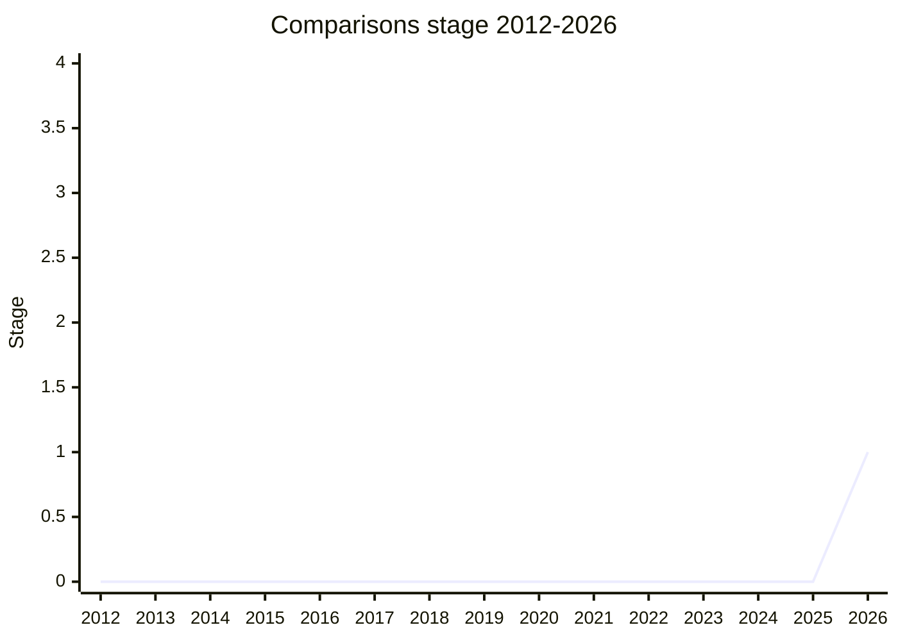

## 概要

Comparisons は、値の**深い比較(deep comparison)と差分報告(deviation reporting)**を言語に組み込む提案です。テスト用途はもちろん、production でのデータ比較や、差分の構造化された報告を native に提供することを狙います。かつての "Assertions" から改名された経緯を持ちます。

champion は [JSH](../people/JSH.md)(Jacob Smith)。2020 年の "Generic Comparison" 探索とは別系譜の、より新しい提案です。

## ステージ遷移

| 会合                                                       | できごと                                               | Stage |
| ---------------------------------------------------------- | ------------------------------------------------------ | ----- |
| [2025-05](../../raw/notes/meetings/2025-05/may-30.md)      | `Comparisons (né Assertions) for Stage 1` を提示(未達) | 0     |
| [2025-11](../../raw/notes/meetings/2025-11/november-19.md) | 継続。Stage 0 据え置き                                 | 0     |
| [2026-05](../../raw/notes/meetings/2026-05/may-21.md)      | **Stage 1 到達**(同日の continuation で consensus)     | 0 → 1 |

> 横軸=2012-2026、縦軸=Stage。2025-05・2025-11 は Stage 0 のまま、2026-05 に Stage 1 到達。

## 主な論点

### 動機の受容と AI 文脈(2026-05)

deep comparison を native に解くべき動機が広く受け入れられました。特に「ほとんど誰も正しく理解していない問題を AI 生成のコードに委ねるのではなく、native に解くべき」という point が多くの delegate を動かしました。一方で Stage 1 を投票する前に「文章化された motivation statement を見たい」との要望があり、同日の continuation で文面を確認して consensus に至りました。

### Stage 2 へ向けた懸念

surface area が極めて広く、cycle や `Set` などを含む等価性の定義で consensus を得るのは難しいと予告されました。`Deviation` のフィルタリングは `Iterator.filter` の外ではなく「内側」で行うべき(deviation 構築コストを丸ごと避けられる)との設計示唆も出ています。

## 関連提案

- かつての "Generic Comparison"(2020-06、[SYG](../people/SYG.md) ら)— 深い比較を言語に入れる先行検討。別系譜の prior art。

## 出典

- [2025-05 may-30](../../raw/notes/meetings/2025-05/may-30.md) — Stage 1 提示(né Assertions)
- [2025-11 november-19](../../raw/notes/meetings/2025-11/november-19.md) — Stage 0 据え置き
- [2026-05 may-21](../../raw/notes/meetings/2026-05/may-21.md) — Stage 1
