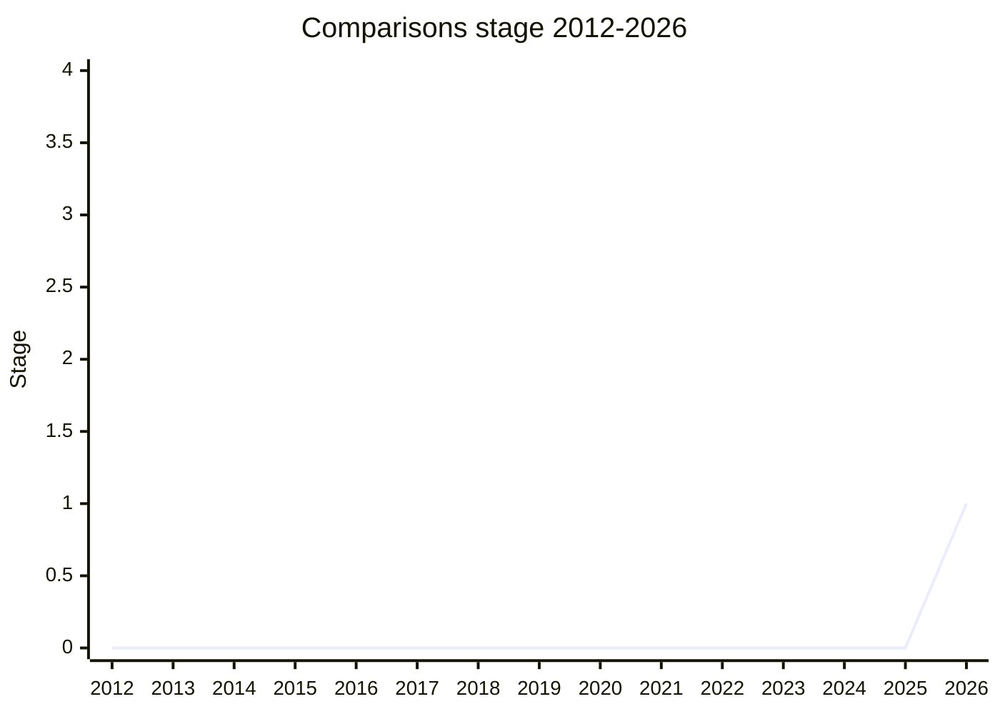

## 概要

Comparisons は、値の**深い比較(deep comparison)と差分報告(deviation reporting)**を言語に組み込む提案です。テスト用途はもちろん、HTTP patch の delta 生成・React の state 比較・logging といった production 用途も動機に挙げ、「user land 実装は性能上の理由で意図的に『正しくない』」ことを native 化の根拠とします。かつての "Assertions" から改名された経緯を持ちます。

API は `compare(a, b)` を基本に、fast モードで真偽値、full モードで `expected`/`actual`/reason を持つ deviation の iterator を返す 2 モード案。関心の分離のため `deepEqual` と `compare` の 2 関数に分割する代替案も提示されています(2026-05)。

champion は [JSH](../people/JSH.md)(Jacob Smith)。2020 年の "Generic Comparison" 探索とは別系譜の、より新しい提案です。

## ステージ遷移

| 会合                                                       | できごと                                               | Stage |
| ---------------------------------------------------------- | ------------------------------------------------------ | ----- |
| [2025-05](../../raw/notes/meetings/2025-05/may-30.md)      | `Comparisons (né Assertions) for Stage 1` を提示(未達) | 0     |
| [2025-11](../../raw/notes/meetings/2025-11/november-19.md) | 継続。Stage 0 据え置き                                 | 0     |
| [2026-05](../../raw/notes/meetings/2026-05/may-21.md)      | **Stage 1 到達**(同日の continuation で consensus)     | 0 → 1 |

```mermaid
xychart-beta
    title "Comparisons stage 2012-2026"
    x-axis [2012, 2013, 2014, 2015, 2016, 2017, 2018, 2019, 2020, 2021, 2022, 2023, 2024, 2025, 2026]
    y-axis "Stage" 0 --> 4
    line [0, 0, 0, 0, 0, 0, 0, 0, 0, 0, 0, 0, 0, 0, 1]
```

> 横軸=2012-2026、縦軸=Stage。2025-05・2025-11 は Stage 0 のまま、2026-05 に Stage 1 到達。

## 主な論点

### 動機の受容と AI 文脈(2026-05)

deep comparison を native に解くべき動機が広く受け入れられました。特に「ほとんど誰も正しく理解していない問題を AI 生成のコードに委ねるのではなく、native に解くべき」という point が多くの delegate を動かしました。[SFC](../people/SFC.md) も「正しい comparison を考えられる最良の立場に居るのは言語を書く人々ではなくこの部屋の人々」と正しさの観点から支持しています。

一方 [EAO](../people/EAO.md) は「この提案が究極的に何の問題を解こうとしているのか、簡潔で明確な説明が見えない」と motivation の文章化を要求。[JSH](../people/JSH.md) が written motivation statement(deep equality の判断を支援し、object の walk や equality 判定に要する専門知識の障壁を下げる旨)を用意し、同日の continuation で [EAO](../people/EAO.md)(起草にも関与)が「妥当」と評価して consensus に至りました。statement は explainer の README に載せることも求められています。

### equality の定義そのもの([OFR](../people/OFR.md))

[OFR](../people/OFR.md) は「最大の疑問符は equality の定義。合意できる equality に到達できるのか、それとも大量の設定オプションを要して提案を複雑化させるだけなのか」と指摘(proxy・`NaN`・floating point・holey array を列挙)。[JSH](../people/JSH.md) の baseline は SameValueZero 寄りで、`NaN` 同士は等しい、signed zero は不等、同位置の hole は等しい、niche な差異(prototype の同一性、TypedArray の型差)は customization option として必要に応じ追加する方針です。[OFR](../people/OFR.md) はさらに「1 つの equality で全 use case を賄えるのか、機能追加が果てしなく続かないか」と重ねています。

### 性能上の優位性への懐疑([KM](../people/KM.md)・[OFR](../people/OFR.md))

[KM](../people/KM.md) は「設定の組み合わせが指数的に増える以上、欲しい構成を user land で書いた方が速い実装になる」「iterator protocol 自体が際立って速くないので、速さが欲しいならそもそも iterator を使わない別 API になる」と performance 動機に懐疑を表明。[OFR](../people/OFR.md) も「真偽値を返す `compare` 部分は効率的に実装しうるが、deviation を surface する側は user space の最も複雑な object walk と同じ状態追跡をエンジンが強いられ、user land より遅くなりうる」とし、fast/full を 1 API の configuration で分ける現形では効率的な線引きが困難と述べました。`Iterator.filter` で後段フィルタする形は filter の情報を探索へ逆伝播させる非自明な最適化を要する、との指摘も [KM](../people/KM.md) から出ています。

### walk と filter の分離は複雑さを減らすか([MM](../people/MM.md)・[KM](../people/KM.md)・[MAH](../people/MAH.md))

[MM](../people/MM.md) は「再利用可能な抽象とパターンのトレードオフ」を引き、自身が用途ごとに異なる deep equality の変種を何度も書いてきた経験から「同じ走査パターンの変種をそれぞれ書く方が読み書きともに素直」と、パラメタ化された単一抽象に不快感を表明。[KM](../people/KM.md) も「差異の全種類を深く理解しないと filter は書けず、その理解があれば walk の実装も大差なく難しい。walk を提供しても全体の複雑さは減らない」と同調しました。[MAH](../people/MAH.md) は getter と data property の差異に algorithm が recurse できるかを追及し、「recurse 先の『どこ』に影響する事項はすべて configuration option になり、default では扱えない」ことを確認しています。

### encapsulation の漏洩([OFR](../people/OFR.md))

[OFR](../people/OFR.md) は private state の扱いを未解決点として提起: private symbol をどう比較しどう surface するのか、class 外から本来アクセスできない private symbol が漏れないか。「カプセル化された状態を露出させる可能性が一般にありそうだ」と述べ、持ち帰りとなりました。

### Stage 2 へ向けた懸念

Stage 1 consensus 時の forewarning として: [MF](../people/MF.md) は「Stage 1 の技術要件は満たすが Stage 2 への道は非常に困難。workable design が未知のまま進めることの community への messaging も心配」、[MAH](../people/MAH.md) は「deep equal の semantics で consensus が取れるとは思えない。最終形は deep equal にはならず、その building block になりうる別物だろう」と予告。surface area の広さ、cycle や `Set` を含む等価性定義の合意困難が挙げられ、`Deviation` のフィルタリングは `Iterator.filter` の外ではなく「内側」で行うべき(deviation 構築コストを丸ごと避けられる)との設計示唆も出ています。[SFC](../people/SFC.md) は「問題が明確化されたので、これまで提示されてきたよりずっと広い解空間の探索に進める」と評価し、Intl Collator(primary/secondary/tertiary の差異レベルを flag で畳み込む)をモデルに「strings・numbers・objects それぞれに特化した比較関数を小さく作る」方向も示唆しました。

## 関連提案

- かつての "Generic Comparison"(2020-06、[SYG](../people/SYG.md) ら)— 深い比較を言語に入れる先行検討。別系譜の prior art。

## 出典

- [2025-05 may-30](../../raw/notes/meetings/2025-05/may-30.md) — Stage 1 提示(né Assertions)
- [2025-11 november-19](../../raw/notes/meetings/2025-11/november-19.md) — Stage 0 据え置き
- [2026-05 may-21](../../raw/notes/meetings/2026-05/may-21.md) — Stage 1(本セッション + Continuation。equality 定義・性能・encapsulation の各論点もここ)
