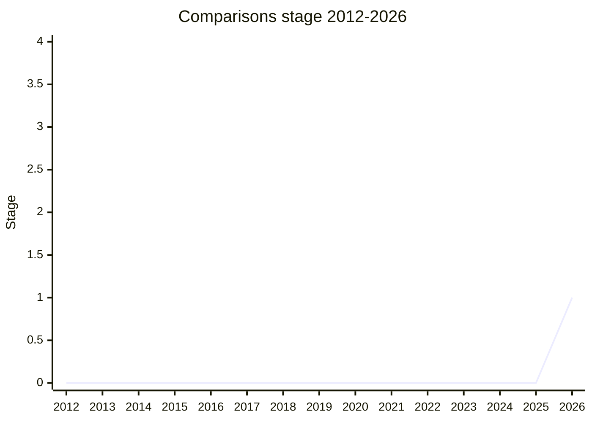

## Overview

Comparisons builds **deep comparison and deviation reporting** into the language. Testing is one motivation, and so are production uses: generating an HTTP-patch delta, comparing React state, and logging. The case for a native version is that "userland implementations are deliberately 'incorrect' for performance reasons." It was renamed from the earlier "Assertions."

The API is based on `compare(a, b)`, with two modes: a fast mode that returns a boolean, and a full mode that returns an iterator of deviations carrying `expected` / `actual` / reason. An alternative that splits this into two functions, `deepEqual` and `compare`, for separation of concerns, was also presented (2026-05).

The champion is [JSH](../people/JSH.md) (Jacob Smith). It is a newer proposal, a separate line from the 2020 "Generic Comparison" exploration.

## Stage history

| Meeting                                                                            | What happened                                                         | Stage |
| ---------------------------------------------------------------------------------- | --------------------------------------------------------------------- | ----- |
| [2025-05](https://github.com/tc39/notes/blob/main/meetings/2025-05/may-30.md)      | Presented `Comparisons (né Assertions) for Stage 1` (did not advance) | 0     |
| [2025-11](https://github.com/tc39/notes/blob/main/meetings/2025-11/november-19.md) | Continued. Stayed at Stage 0                                          | 0     |
| [2026-05](https://github.com/tc39/notes/blob/main/meetings/2026-05/may-21.md)      | **Reached Stage 1** (consensus on the same day's continuation)        | 0 → 1 |

```mermaid
xychart-beta
    title "Comparisons stage 2012-2026"
    x-axis [2012, 2013, 2014, 2015, 2016, 2017, 2018, 2019, 2020, 2021, 2022, 2023, 2024, 2025, 2026]
    y-axis "Stage" 0 --> 4
    line [0, 0, 0, 0, 0, 0, 0, 0, 0, 0, 0, 0, 0, 0, 1]
```

> Horizontal axis = 2012-2026, vertical axis = Stage. 2025-05 and 2025-11 stayed at Stage 0. Reached Stage 1 in 2026-05.

## Main issues

### Accepting the motivation, and the AI context (2026-05)

The motivation for solving deep comparison natively was widely accepted. In particular, the point that "a problem almost nobody understands correctly should be solved natively, rather than left to AI-generated code" moved many delegates. [SFC](../people/SFC.md) also supported it from the angle of correctness: "the people in the best position to think about a correct comparison are the people in this room, not the people who write the language."

[EAO](../people/EAO.md), on the other hand, asked for the motivation to be written down: "I do not see a short, clear explanation of what problem this proposal is ultimately trying to solve." [JSH](../people/JSH.md) prepared a written motivation statement (help the judgment of deep equality, and lower the barrier of expertise required to walk an object and decide equality). On the same day's continuation, [EAO](../people/EAO.md) (who also helped draft it) judged it sound, and the committee reached consensus. The statement was also asked to be put in the explainer README.

### The definition of equality itself ([OFR](../people/OFR.md))

[OFR](../people/OFR.md) said "the biggest question mark is the definition of equality. Can we arrive at an equality we can agree on, or will it just take a pile of configuration options and complicate the proposal?" (listing proxies, `NaN`, floating point, and holey arrays). [JSH](../people/JSH.md)'s baseline is near SameValueZero: `NaN` equals `NaN`, signed zero is not equal, holes in the same position are equal, and niche differences (prototype identity, TypedArray type differences) are added as customization options when needed. [OFR](../people/OFR.md) pressed further: "can one equality cover every use case, or will features keep being added without end?"

### Skepticism about a performance advantage ([KM](../people/KM.md) and [OFR](../people/OFR.md))

[KM](../people/KM.md) was skeptical of the performance motivation: "once the combinations of settings grow exponentially, writing the configuration you want in userland will be the faster implementation," and "the iterator protocol itself is not outstandingly fast, so if you want speed the API would not use an iterator at all." [OFR](../people/OFR.md) also said the boolean-returning `compare` part can be implemented efficiently, but the side that surfaces deviations forces the engine into the same state-tracking as the most complicated object walk in user space, and can be slower than userland. Splitting fast and full as configuration of one API makes an efficient line hard to draw. [KM](../people/KM.md) also pointed out that filtering afterward with `Iterator.filter` needs a non-obvious optimization that propagates the filter's information back into the search.

### Does separating walk and filter reduce complexity? ([MM](../people/MM.md), [KM](../people/KM.md), [MAH](../people/MAH.md))

[MM](../people/MM.md) invoked "the tradeoff of reusable abstractions and patterns" and, from having written different variants of deep equality for different uses many times, said "writing each variant of the same traversal pattern is more straightforward to read and to write," and was uncomfortable with one parameterized abstraction. [KM](../people/KM.md) agreed: "you cannot write the filter without deeply understanding every kind of difference, and with that understanding implementing the walk is not much harder. Providing the walk does not reduce the overall complexity." [MAH](../people/MAH.md) pressed on whether the algorithm can recurse into the difference between a getter and a data property, and confirmed that "everything that affects 'where' the recursion goes becomes a configuration option, and the default cannot handle it."

### Leaking encapsulation ([OFR](../people/OFR.md))

[OFR](../people/OFR.md) raised the treatment of private state as unresolved: how to compare a private symbol and how to surface it, and whether a private symbol that cannot normally be accessed from outside the class leaks. "It seems generally possible to expose encapsulated state," and that was taken home.

### Concerns toward Stage 2

As a forewarning at the Stage 1 consensus: [MF](../people/MF.md) said "it meets the technical requirements of Stage 1, but the road to Stage 2 is very hard. I also worry about the message to the community of proceeding while a workable design is still unknown." [MAH](../people/MAH.md) predicted "I do not think we can get consensus on deep-equal semantics. The final shape will not be deep equal; it will be something else that can be a building block of it." The breadth of the surface area, and the difficulty of agreeing on an equality definition that includes cycles and `Set`, were named. There was also a design suggestion that filtering a `Deviation` should happen "inside," not outside `Iterator.filter` (so the cost of building the deviation can be avoided entirely). [SFC](../people/SFC.md) judged that "the problem has been clarified, so we can move on to exploring a solution space much wider than what has been presented so far," and, taking Intl Collator (folding primary / secondary / tertiary difference levels into flags) as a model, suggested "making small comparison functions specialized for strings, numbers, and objects."

## Related proposals

- The earlier "Generic Comparison" (2020-06, [SYG](../people/SYG.md) and others) — a prior look at putting deep comparison in the language. Prior art on a separate line.

## Sources

- [2025-05 may-30](https://github.com/tc39/notes/blob/main/meetings/2025-05/may-30.md) — Stage 1 presented (né Assertions)
- [2025-11 november-19](https://github.com/tc39/notes/blob/main/meetings/2025-11/november-19.md) — stayed at Stage 0
- [2026-05 may-21](https://github.com/tc39/notes/blob/main/meetings/2026-05/may-21.md) — Stage 1 (this session plus the continuation; the equality, performance, and encapsulation issues are here too)
