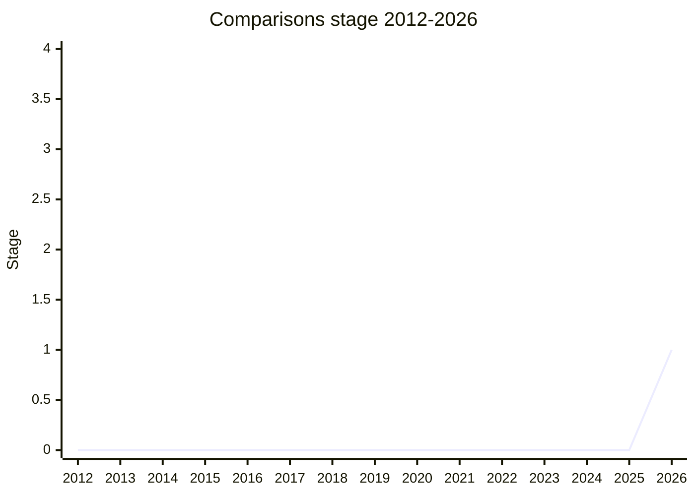

## Overview

Comparisons builds **deep comparison and deviation reporting** into the language. Testing is one motivation, and so are production uses: generating an HTTP-patch delta, comparing React state, and logging. The case for a native version is that userland implementations differ mostly for performance reasons ([JSH](../people/JSH.md): "they're like knowingly do it wrong because doing it right is too expensive"). It was renamed from the earlier "Assertions."

The API is based on `compare(a, b)`, with two modes: a fast mode that returns a boolean, and a full mode that returns an iterator of deviations carrying `expected` / `actual` / reason. An alternative that splits this into two functions, `deepEqual` and `compare`, for separation of concerns, was also presented (2026-05).

The champion is [JSH](../people/JSH.md) (Jacob Smith). It is a newer proposal, a separate line from the 2020 "Generic Comparison" exploration.

## Stage history

| Meeting                                                                            | What happened                                                         | Stage |
| ---------------------------------------------------------------------------------- | --------------------------------------------------------------------- | ----- |
| [2025-05](https://github.com/tc39/notes/blob/main/meetings/2025-05/may-30.md)      | Presented `Comparisons (né Assertions) for Stage 1` (did not advance) | 0     |
| [2025-11](https://github.com/tc39/notes/blob/main/meetings/2025-11/november-19.md) | Continued. Stayed at Stage 0                                          | 0     |
| [2026-05](https://github.com/tc39/notes/blob/main/meetings/2026-05/may-21.md)      | **Reached Stage 1** (consensus on the same day's continuation)        | 0 → 1 |

```mermaid
xychart-beta
    title "Comparisons stage 2012-2026"
    x-axis [2012, 2013, 2014, 2015, 2016, 2017, 2018, 2019, 2020, 2021, 2022, 2023, 2024, 2025, 2026]
    y-axis "Stage" 0 --> 4
    line [0, 0, 0, 0, 0, 0, 0, 0, 0, 0, 0, 0, 0, 0, 1]
```

> Horizontal axis = 2012-2026, vertical axis = Stage. 2025-05 and 2025-11 stayed at Stage 0. Reached Stage 1 in 2026-05.

## Main issues

### Accepting the motivation, and the AI context (2026-05)

The motivation for solving deep comparison natively was widely accepted. The conclusion recorded that "Many delegates were moved by the need for this problem to be solved natively rather than leaving to an AI-generated solution (to a problem almost nobody understands)." [SFC](../people/SFC.md) also supported it from the angle of correctness: "the people who are in the best position to actually think about how do you do comparison correctly are the people in this room. It's not the people writing the code."

[EAO](../people/EAO.md), on the other hand, asked for the motivation to be written down: "It is not clear to me what is the problem that this is ultimately trying to solve or what is the simple, clear short explanation of the motivation for the proposal." [JSH](../people/JSH.md) prepared a written motivation statement (help the judgment of deep equality, and lower the barrier of expertise required to walk an object and decide equality). On the same day's continuation, [EAO](../people/EAO.md) (who also helped draft it) judged it sound, and the committee reached consensus. The statement was also asked to be put in the explainer README.

### The definition of equality itself ([OFR](../people/OFR.md))

[OFR](../people/OFR.md) said the definition of equality "is my biggest question mark here, whether we will be able to come up with an equality that will actually agree on or whether this will be only possible if there are tons of configuration options that allow you to pick different equalities. Which I think would complicate the proposal quite a lot." (listing proxies, `NaN`, floating point, and holey arrays). [JSH](../people/JSH.md)'s baseline is near SameValueZero: `NaN` equals `NaN`, signed zero is not equal, holes in the same position are equal, and niche differences (prototype identity, TypedArray type differences) are added as customization options when needed. [OFR](../people/OFR.md) pressed further: "how do you intend to cover all the use cases that you mentioned with one equality, I guess that's the core of the question."

### Skepticism about a performance advantage ([KM](../people/KM.md) and [OFR](../people/OFR.md))

[KM](../people/KM.md) was skeptical of the performance motivation: "I think you will probably end up with a more efficient implementation to just write the version that you want with the configurations that you want separately or have an exponential number of all possible different functions that you can call," and "iterators themselves being the protocol is not outstandingly fast. So if you wanted something fast, you probably wouldn't even use an iterator at all." [OFR](../people/OFR.md) also said the boolean-returning `compare` part can be implemented efficiently, but the side that surfaces deviations forces the engine into the same state-tracking as the most complicated object walk in user space, and can be slower than userland. Splitting fast and full as configuration of one API makes an efficient line hard to draw. [KM](../people/KM.md) also pointed out that filtering afterward with `Iterator.filter` needs a non-obvious optimization that propagates the filter's information back into the search.

### Does separating walk and filter reduce complexity? ([MM](../people/MM.md), [KM](../people/KM.md), [MAH](../people/MAH.md))

[MM](../people/MM.md) invoked the tradeoff between patterns and reusable abstractions and, from having written different variants of deep equality for different uses many times, said "it was just more straightforward to write and to read to just have them be different variations on the same basic pattern of traversal and deep equality," and was uncomfortable with one parameterized abstraction. [KM](../people/KM.md) agreed that the walk and the filter "are probably about as difficult to implement. And so we haven't reduced the total complexity by adding this the walking for them." [MAH](../people/MAH.md) pressed on whether the algorithm can recurse into the difference between a getter and a data property, and confirmed: "So you're saying anything impacting the 'where' you find the value to recurse into needs to be a configuration object. It cannot be handled through the default."

### Leaking encapsulation ([OFR](../people/OFR.md))

[OFR](../people/OFR.md) raised the treatment of private state as unresolved: how to compare a private symbol and how to surface it, and whether a private symbol that cannot normally be accessed from outside the class leaks. "it seems like there is potential for exposing encapsulated state in general," and that was taken home.

### Concerns toward Stage 2

As a forewarning at the Stage 1 consensus: [MF](../people/MF.md) said "I do think that this is a reasonable problem statement that is sufficient for stage 1 … I also feel that it will have a very difficult path to stage 2," and worried about the messaging to the community of proceeding "because we don't yet know of a workable design." [MAH](../people/MAH.md) predicted "I doubt we will actually be able to find consensus on what deep equal semantics would be … I think we might end up with something else here, which is fine, maybe as a building block for a deep equal." The breadth of the surface area, and the difficulty of agreeing on an equality definition that includes cycles and `Set`, were named. There was also a design suggestion that filtering a `Deviation` should happen "inside," not outside `Iterator.filter` (so the cost of building the deviation can be avoided entirely). [SFC](../people/SFC.md) judged that "now you can go back and investigate the space of solutions, which is much, much bigger than a lot of the space that you've so far been presenting." Earlier in the first session, taking Intl Collator (folding primary / secondary / tertiary difference levels into flags) as a model, he had asked "can we start by building the smaller pieces?", i.e. comparison functions specialized for strings, numbers, and objects.

## Related proposals

- The earlier "Generic Comparison" (2020-06, presented by [HHM](../people/HHM.md); [SYG](../people/SYG.md) and others objected to its scope) — a prior look at putting deep comparison in the language. Prior art on a separate line.

## Sources

- [2025-05 may-30](https://github.com/tc39/notes/blob/main/meetings/2025-05/may-30.md) — Stage 1 presented (né Assertions)
- [2025-11 november-19](https://github.com/tc39/notes/blob/main/meetings/2025-11/november-19.md) — stayed at Stage 0
- [2026-05 may-21](https://github.com/tc39/notes/blob/main/meetings/2026-05/may-21.md) — Stage 1 (this session plus the continuation; the equality, performance, and encapsulation issues are here too)
