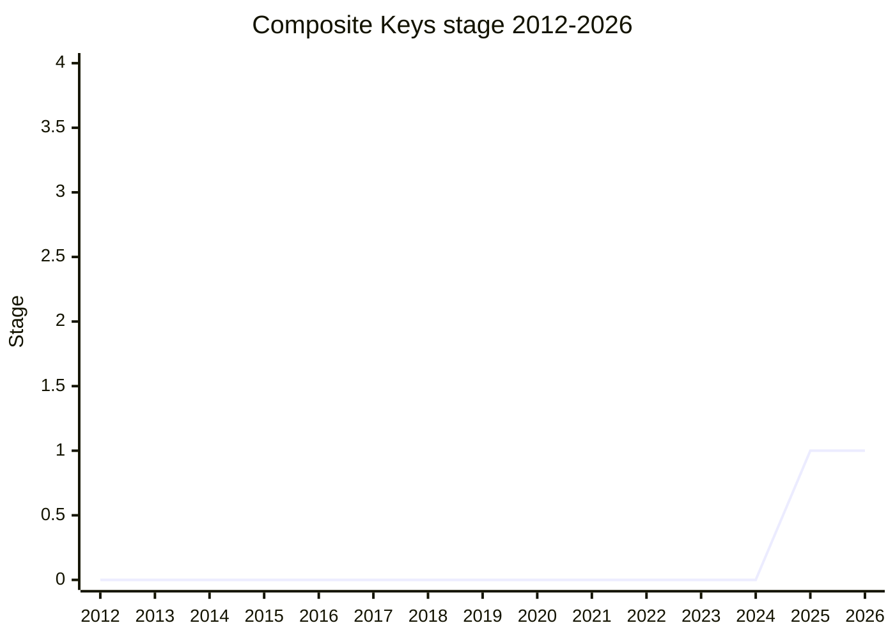

## Overview

Composite Keys (`proposal-composites`) gives JavaScript first-class support for **value-equal composite keys**: an object created through a `Composite` factory whose equality is deep along the composite backbone and identity everywhere else. Two composites holding structurally equal values are the same `Map` key, the same `Set` element, and equal under `Composite.equals` - solving the long-standing "JSON.stringify as a key" workaround for memoization caches, OpenTelemetry-style span identity, and framework signal tracking.

It is the direct successor to [Records & Tuples](records-and-tuples.md) (withdrawn at the same 2025-04 meeting) and was presented by [ACE](../people/ACE.md) as a deliberate reimagining of that space: **no new primitives** - composites are ordinary frozen objects, produced by a factory rather than a class, readable (not opaque), and generic enough to hold references. What survives from R&T is the equality-first core: if two things are deeply equal, they behave as the same key.

## Stage history

| Meeting                                                                            | What happened                                                                                                                                                                                                                                                                                                                                  | Stage |
| ---------------------------------------------------------------------------------- | ---------------------------------------------------------------------------------------------------------------------------------------------------------------------------------------------------------------------------------------------------------------------------------------------------------------------------------------------- | ----- |
| [2025-04](https://github.com/tc39/notes/blob/main/meetings/2025-04/april-15.md)    | Presented for Stage 1 ([ACE](../people/ACE.md)). Consensus reached, with explicit support from [WH](../people/WH.md), [JH](../people/JH.md), [CDA](../people/CDA.md), the SpiderMonkey team ([DLM](../people/DLM.md)), [MF](../people/MF.md), [CZW](../people/CZW.md), [NRO](../people/NRO.md), [MM](../people/MM.md), [SYG](../people/SYG.md) | → 1   |
| [2025-11](https://github.com/tc39/notes/blob/main/meetings/2025-11/november-19.md) | Comparator choice discussion (interning vs lazy deep equality), with benchmark data from two experimental implementations; [ACE](../people/ACE.md) not asking for advancement                                                                                                                                                                  | 1     |
| [2025-11](https://github.com/tc39/notes/blob/main/meetings/2025-11/november-20.md) | Continuation. Interning got the most support; research continues                                                                                                                                                                                                                                                                               | 1     |

> Stage 1 in 2025-04, and flat at Stage 1 since - the 2025-11 sessions were design research (comparator choice), not advancement asks.

## Main issues

### Successor to Records & Tuples

The proposal landed in the same meeting R&T was withdrawn, and the lineage was explicit. [KG](../people/KG.md): "This gives me everything I wanted from Records & Tuples... I am hesitant to completely dismiss" the immutable-data crowd that R&T had served. The reimagining drops what killed R&T - the `#{}` / `#[]` literal syntax and the new primitive type - and keeps the equality semantics. [SYG](../people/SYG.md) supported it but wanted the scope policed: "I would be very uncomfortable if this API were designed to be flexible enough that people just use it for immutable functional data structures... it would be great for us to have a name for that [use case] that is not this proposal". [JSC](../people/JSC.md) (person) noted they had been waiting for persistent data structures and accepted composite keys as the answer for now.

### Interning vs lazy deep equality (the comparator choice)

The core Stage 1+ design decision. Two implementation strategies were compared, with two experimental implementations and benchmarks presented in 2025-11:

- **Lazy deep equality** (as specced): compare structurally on demand. Cost shows up on every comparison.
- **Interning** (V8's preferred direction): canonicalize in the factory so every equal composite is the same reference, after which `===` works and lookups are pointer comparisons. The benchmark result: the interning overhead at creation is paid back once a key is used twice or more.

[SYG](../people/SYG.md) described the V8 version: canonicalization in the factory, with pay-as-you-go concerns about the extra branch and protector state that all equality-checking structures would carry. [ACE](../people/ACE.md) countered that canonicalization has an unbounded-lifetime problem - a `WeakRef`-style pair of numbers can never be collected while interning them - and moves cost to creation time. [MM](../people/MM.md) added a theoretical blocker for full canonicalization: **anonymous symbols cannot be canonically sorted**, since letting composites compare their symbols would open a global communications channel. In the 2025-11 continuation, "Interning composites got the most support", with throwing for invalid `Composite` `WeakMap` keys also getting most support; the champions return to plenary with more research rather than advancing.

### Equality semantics: SameValue or SameValueZero, -0, and key order

- Base case: [MF](../people/MF.md) argued strongly for **SameValue** over SameValueZero - a `Map` normalizes `-0` to `+0` on insertion, but composites make `-0` observable, so `Composite.equals(#{-0}, #{0})` should be false.
- [WH](../people/WH.md) pushed back that switching equality semantics inside Map/Set breaks their documented semantics, reviving the extensive R&T debate.
- Key order is ignored (deep equality walks both backbones), equality is reflexive and symmetric, no user code runs during comparison (which also makes cycles impossible to even construct).
- `isComposite` returning false for proxies, and the `isComposite` / `equals` methods operating on the argument rather than `this`, drew [MM](../people/MM.md)'s "dangerous precedent" warning (testing internal slots on non-`this` arguments); he accepted it as repairable for membrane transparency since membranes can produce composites without running user code.

### What composites are not

Not primitives, not classes (`new Composite` throws - open question whether that's right, given coercer expectations), not opaque (constituents are readable), not required to be deeply immutable (they can hold references to mutable values; equality then follows identity into those values). [LCA](../people/LCA.md) raised that `Date` and [Temporal](temporal.md) values are not composite-friendly as keys; [ACE](../people/ACE.md) noted Temporal instances have a canonical lossless string form and [PFC](../people/PFC.md) said special cases remain possible.

## Related proposals

- [Records & Tuples](records-and-tuples.md) - the withdrawn predecessor; composite keys keep the value-equality core and drop the primitive.
- [Comparisons](comparisons.md) - deep _comparison_ with deviation reporting; related equality space but a different job (diagnostics, not keys).
- [Upsert](upsert.md) - the Map methods whose key semantics make composite keys interesting.

## Sources

- [2025-04 april-15](https://github.com/tc39/notes/blob/main/meetings/2025-04/april-15.md) - Stage 1 (continued from april-14 design discussion)
- [2025-11 november-19](https://github.com/tc39/notes/blob/main/meetings/2025-11/november-19.md) - comparator choice, interning benchmarks
- [2025-11 november-20](https://github.com/tc39/notes/blob/main/meetings/2025-11/november-20.md) - continuation; interning got most support
