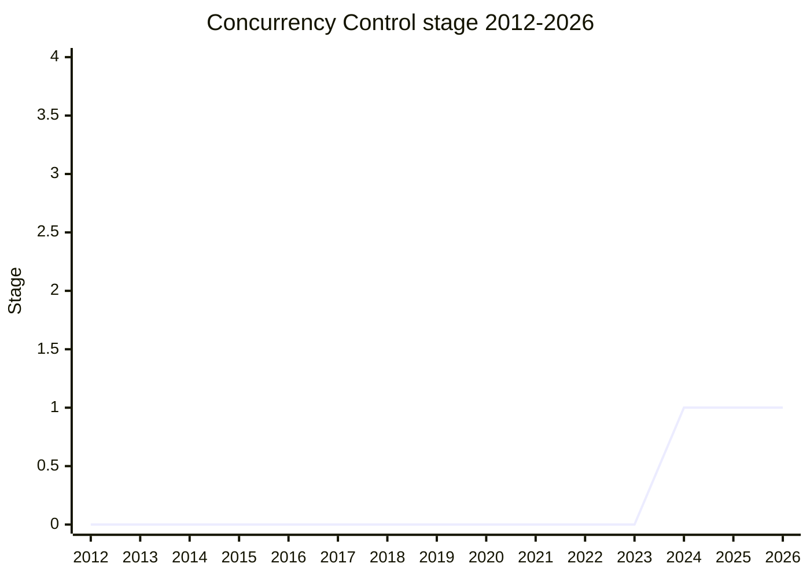

## Overview

A way to orchestrate and limit concurrent access to a resource - file handles, database connections, or (the focus) async iterators and functions. There is no built-in mechanism for this today; the ecosystem fills the gap with npm libraries such as `p-limit` and `p-map`, most of which [MF](../people/MF.md) shows reducible to one-liners with this proposal's primitives.

It is the third link in a chain of splits from Iterator Helpers: iterator helpers preserved no concurrency through transforms, so async iterator helpers was split out to preserve concurrency the underlying iterator already supports - but nothing could _drive_ an iterator concurrently or cap how many pulls run at once. This proposal adds that. A fourth split, `unordered-async-iterator-helpers`, would consume iterators concurrently for efficiency once this exists.

Three components: the **governor protocol** (an `acquire()` that resolves to a token with a `release()`, designed to be disposable via Explicit Resource Management's `using`), the **counting governor** (originally named `Semaphore` - a fixed-capacity counter implementing the protocol, shareable across non-coordinating consumers), and **integration into `AsyncIterator.prototype`** (an optional concurrency parameter on the six consuming methods, extension of `buffered`, and a new `limit()` method on the production side). Plain integers are accepted as shorthand for a counting governor, so the common case stays simple; governors generalize to strategies that change over time (exponential backoff, externally-driven capacity).

## Stage history

| Meeting                                                                            | What happened                                                                                                                                                                                                                             | Stage |
| ---------------------------------------------------------------------------------- | ----------------------------------------------------------------------------------------------------------------------------------------------------------------------------------------------------------------------------------------- | ----- |
| [2024-07](https://github.com/tc39/notes/blob/main/meetings/2024-07/july-29.md)     | Presented by [MF](../people/MF.md) and [LCA](../people/LCA.md). **Reached Stage 1**, amid heavy naming concerns over `Semaphore`, motivation skepticism from Igalia and Mozilla, and [MM](../people/MM.md)'s cross-agent sharing concerns | → 1   |
| [2025-11](https://github.com/tc39/notes/blob/main/meetings/2025-11/november-19.md) | Update: `Semaphore` renamed `CountingGovernor`; concurrent task queues scoped out entirely; motivation reinforced with npm-library download counts; open design questions and pre-Stage-2 requirements laid out                           | 1     |

> First seen 2024-07 (Stage 1 in the same session); flat at Stage 1 since, waiting on async iterator helpers.

## Main issues

### The `Semaphore` naming

The most persistent objection of the Stage 1 session. [RBN](../people/RBN.md) worried about stepping on shared-structs multi-threading, where mutexes and semaphores are coordination primitives for shared memory. [SYG](../people/SYG.md): "I will really do not want this thing to be called a semaphore. Given the mutual exclusion thing that is usually called semaphore. I would be much happier like an accounting Governor or something." [KKL](../people/KKL.md) objected on steam-engine-metaphor grounds - in that world "a governor is not a kind of semaphore and a semaphore is not a kind of governor" - and suggested checking the protocol could express AIMD-style control loops. By 2025-11 it had been renamed `CountingGovernor`, and [KG](../people/KG.md) argued for going back: "I think the people who thought it should be named not semaphore were wrong. This is what everyone in JavaScript calls it ... Semaphores are for concurrency, not parallelism." The overlap with the shared structs proposal's `Atomics.Mutex` (confusable APIs, different domains) remains open coordination work.

### Is the full governor abstraction justified?

PCO (Igalia) called giving this much control "kind of un-JavaScript like" and asked how much of the demand a plain integer could cover. [DLM](../people/DLM.md) (Mozilla) supported investigating but wanted use cases beyond async iterator helpers flushed out. [MF](../people/MF.md)'s answer, both at Stage 1 and reinforced in 2025-11, is a table of extremely popular npm concurrency libraries each replaced by a one-liner. The 2025-11 update also drew the line: **concurrent task queues are out of scope** - the library landscape there is too varied ("from one-pagers to very complex"), governors would help build them, and the space is left to the community or a possible follow-on proposal.

### Cross-agent sharing and blocking

[MM](../people/MM.md) supported Stage 1 "with reservations of everything and anything that you do that touches multi-threading": within a single agent the proposal is non-blocking, so sharing a semaphore across agents could only stay non-blocking per agent - which "violates all of the normal understanding of what a multi-threading semaphore is." [KG](../people/KG.md) noted a blocking variant off the main thread would be a normal thing to add; [MM](../people/MM.md) objected to introducing any more blocking operations in the language.

### Deadlocks and composition

[WH](../people/WH.md) asked what happens when a `forEach` governed by a governor reenters it from inside its own callback - [KG](../people/KG.md): "yes it can deadlock, any concurrency control looks anything like this will get deadlock," with the observable symptom (a promise that never settles) left as an open question. By 2025-11 [MF](../people/MF.md) concluded "it would be irresponsible to add these without adding some way to compose them," planning a `governor.all` composition using the standard multiple-acquisition strategy.

### Cancellation is the gate to Stage 2

Token acquisition needs to be abortable ("oh, never mind, I don't want that resource anymore" - [MF](../people/MF.md)), and since web cancellation is AbortController/AbortSignal, "our hands are pretty much tied" - the proposal must integrate with them. Listed alongside the open design questions (idle listeners on counting governors, `GovernorToken` prototype, a possible time-based/throttling governor, allocation-avoiding acquire, acquisition-site parameters) and updated explainer/polyfill/spec text as the pre-Stage-2 checklist.

## Related proposals

- [iterator-helpers](iterator-helpers.md) - Stage 4 origin of the chain; its MVP dropped concurrency.
- `async-iterator-helpers` - the second split (preserve concurrency through transforms); this proposal's integration points (`buffered`, consuming methods) live there (no page yet).
- [unordered-async-iterator-helpers](unordered-async-iterator-helpers.md) - the planned fourth split, expected to be the majority consumer pattern once concurrency control exists.
- [joint-iteration](joint-iteration.md) - the other Stage 2.7-stage iterator proposal waiting in the same queue.

## Sources

- [2024-07 july-29](https://github.com/tc39/notes/blob/main/meetings/2024-07/july-29.md) - Stage 1 ([MF](../people/MF.md), [LCA](../people/LCA.md))
- [2025-11 november-19](https://github.com/tc39/notes/blob/main/meetings/2025-11/november-19.md) - Stage 1 update: CountingGovernor rename, task queues scoped out
