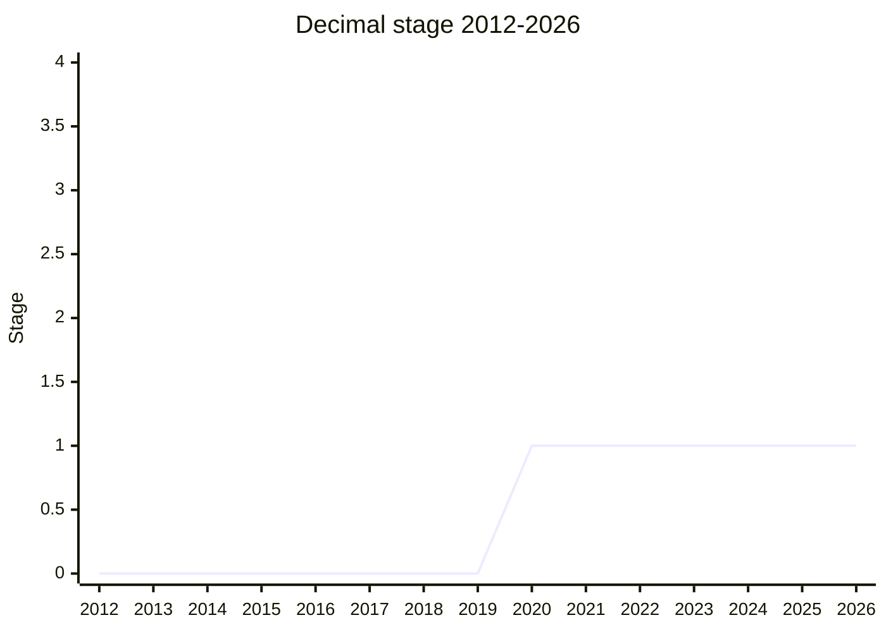

## Overview

Decimal adds exact base-10 arithmetic to JavaScript, backed by the IEEE 754 **Decimal128** format (128 bits, up to 34 significant digits). The motivating pain is that binary floating point (`Number`) cannot represent common decimal fractions exactly, which produces the classic `0.1 + 0.2 !== 0.3` class of bugs wherever human-facing numbers (money above all) are computed. A secondary motivation is data interchange: many databases, RPC schemas, and other languages (SQL, Java, Python, C#) have a native decimal type, and JavaScript sitting in the middle of such a system today has no faithful way to represent those values without going through strings.

The current design is a plain object/class (`Decimal`) with a constructor and static/instance methods for basic arithmetic (add, subtract, multiply, divide, remainder), not a new primitive: it has no operator overloading and no literal syntax. This is the result of years of back-and-forth — the proposal originally followed the `BigInt` model (new primitive, operator overloading, literal suffix), but dropped all three based on repeated, strong pushback from V8 and SpiderMonkey. Values always normalize to a single canonical mathematical value (no distinguishable trailing zeros); the precision/unit-carrying use cases that motivated keeping trailing zeros were split off into a separate proposal, now [Amount](../proposals/amount.md).

## Stage history

| Meeting                                                     | Event                                                                                                                                                                                                                                                   | Stage    |
| ----------------------------------------------------------- | ------------------------------------------------------------------------------------------------------------------------------------------------------------------------------------------------------------------------------------------------------- | -------- |
| [2017-11](../../raw/notes/meetings/2017-11/nov-29.md)       | Presented by API as "Decimal"; reached Stage 0                                                                                                                                                                                                          | → 0      |
| [2020-02](../../raw/notes/meetings/2020-02/february-4.md)   | Presented by [DE](../people/DE.md) as "BigDecimal"; reached Stage 1                                                                                                                                                                                     | 0 → 1    |
| [2021-12](../../raw/notes/meetings/2021-12/dec-15.md)       | [SHO](../people/SHO.md) takes over presenting alongside [PFC](../people/PFC.md)/API; temperature check favors a new primitive (13 for, 0 blocking)                                                                                                      | 1 (kept) |
| [2023-07](../../raw/notes/meetings/2023-07/july-12.md)      | "Decimal: Open-ended discussion"; [SYG](../people/SYG.md) (V8) leans toward not doing this without operator overloading                                                                                                                                 | 1 (kept) |
| [2023-09](../../raw/notes/meetings/2023-09/september-27.md) | Operator overloading, literal syntax, and primitive-ness dropped, per V8/SpiderMonkey feedback                                                                                                                                                          | 1 (kept) |
| [2024-04](../../raw/notes/meetings/2024-04/april-11.md)     | Stage 2 requested; blocked by [MM](../people/MM.md) and [JHD](../people/JHD.md)                                                                                                                                                                         | 1 (kept) |
| [2024-06](../../raw/notes/meetings/2024-06/june-13.md)      | Stage 2 requested with fleshed-out spec text; critical feedback keeps it at Stage 1 (rounding/quanta definition, ecosystem-usage evidence, deeper Intl.PluralRules integration)                                                                         | 1 (kept) |
| [2024-07](../../raw/notes/meetings/2024-07/july-31.md)      | Stage 2 requested again; blocked by [JHD](../people/JHD.md) (position unchanged since June). [SFC](../people/SFC.md) explicitly supportive from the Intl side; [PFC](../people/PFC.md) argued the object form does not foreclose primitives             | 1 (kept) |
| [2024-10](../../raw/notes/meetings/2024-10/october-09.md)   | Dropped trailing-zero/precision tracking to simplify; spun off "numeric value with precision"                                                                                                                                                           | 1 (kept) |
| [2025-02](../../raw/notes/meetings/2025-02/february-19.md)  | "A unified vision for measure and decimal" presented jointly; the spinoff is renamed Amount                                                                                                                                                             | 1 (kept) |
| [2025-04](../../raw/notes/meetings/2025-04/april-16.md)     | Stage 1 update for decimal & measure: "Amounts" — the `Decimal.Something` precision-carrying wrapper ([JMN](../people/JMN.md) presenting; [BAN](../people/BAN.md) on sick leave); [WH](../people/WH.md) objected that precision is not Decimal-specific | 1 (kept) |
| [2025-05](../../raw/notes/meetings/2025-05/may-28.md)       | Stage 1 update: `Decimal.Amount` (a decimal value with separately-tracked precision) presented as part of the Decimal package; no advancement asked                                                                                                     | 1 (kept) |
| [2026-07](../../raw/notes/meetings/2026-07/july-22.md)      | Presented by [CLA](../people/CLA.md); primitive-vs-object deadlock restated, [JHD](../people/JHD.md) treats it as a Stage 2 blocker                                                                                                                     | 1 (kept) |

> Reached Stage 0 in 2017-11, Stage 1 in 2020-02, and has not moved since (stalled at Stage 1 for six years as of 2026-07).

## Main issues

### Primitive vs. object-based API

What's at stake is whether Decimal should be a new primitive type (like `BigInt`, with operator overloading and a literal suffix) or a plain object with methods. [JHD](../people/JHD.md) has argued since 2024-04 that an object-only Decimal is not worth shipping, because ergonomics without operators are poor enough that userland libraries remain competitive (his Java/Ruby experience: object decimals mean "bugs abound" and tooling must police the ugly correct form, where BigInt's `n` suffix shows how low-friction the primitive path can be); at the 2026-07 meeting he stated this explicitly as a Stage 2 blocker ("I don't want the object form in the language if the primitive form isn't guaranteed to also be there eventually"). On the other side, V8 and SpiderMonkey implementers ([SYG](../people/SYG.md), [KM](../people/KM.md), [DLM](../people/DLM.md)) have repeatedly cited `BigInt`'s poor real-world return on investment (heavy implementation cost, adoption mostly limited to crypto-mining scripts) as their reason for refusing a new primitive; [ACE](../people/ACE.md) (Bloomberg, a primary driver of the proposal) explicitly said an object API is "absolutely perfectly" fine for their use case.

- Discussed at [2020-02](../../raw/notes/meetings/2020-02/february-4.md), [2021-12](../../raw/notes/meetings/2021-12/dec-15.md), [2023-07](../../raw/notes/meetings/2023-07/july-12.md), [2023-09](../../raw/notes/meetings/2023-09/september-27.md), [2024-04](../../raw/notes/meetings/2024-04/april-11.md), [2024-07](../../raw/notes/meetings/2024-07/july-31.md), [2024-10](../../raw/notes/meetings/2024-10/october-09.md), and [2026-07](../../raw/notes/meetings/2026-07/july-22.md).
- Unresolved as of 2026-07. Champion [CLA](../people/CLA.md) summarized it directly: "There are major concerns with the current Object API and not being primitive. There are also major concerns from browsers to introduce the proposal as a Primitive."

### IEEE 754 Decimal128 conformance vs. developer ergonomics

[WH](../people/WH.md) pushed hard, across several meetings, for the proposal to follow IEEE 754 Decimal128 semantics precisely — keeping `NaN`, `+Infinity`/`-Infinity`, `-0`, and not inventing new math-library semantics — arguing that deviating creates "an anticoordination point" for anyone trying to interoperate with existing IEEE-754-based systems. Champions ([DE](../people/DE.md), [JMN](../people/JMN.md)) initially leaned toward making exceptional operations (division by zero, etc.) throw rather than produce `NaN`/infinities, on the theory that JS developers expect a receipt to never print "NaN". This was walked back after pushback (see [2023-09](../../raw/notes/meetings/2023-09/september-27.md), where API also argued for full IEEE-754 fidelity, citing cross-language interchange as the motivating case).

> [WH](../people/WH.md), [2023-07](../../raw/notes/meetings/2023-07/july-12.md): "This would be an enormous mistake. This is not cleaning up. This is introducing our own alternate standard for decimal which is different from what IEEE specified."

- Resolved in [WH](../people/WH.md)'s direction on the big questions (conformant arithmetic semantics); [WH](../people/WH.md) later praised the simplified, post-2024-10 design as "so much simpler" after trailing-zero tracking was dropped.

### Trailing zeros / precision (canonicalization) — spun off into Amount

IEEE 754 Decimal128 distinguishes `1.2` from `1.20` (the "cohort" concept), and [SFC](../people/SFC.md) argued strongly, from the Intl/formatting side, that this precision information must be preserved (e.g. "1 star" vs. "1.0 stars", or `-42.00` formatting to `-42.00` and not `-42`). Champions ([JMN](../people/JMN.md), [NRO](../people/NRO.md)) countered that preserving cohort distinctions forecloses ever making Decimal a primitive, and that IEEE's rules for propagating precision through arithmetic (a worked tax-calculation example in [2024-10](../../raw/notes/meetings/2024-10/october-09.md) needed six digits of precision to compute a two-digit answer) are confusing and arbitrary.

- Discussed in depth at [2024-10](../../raw/notes/meetings/2024-10/october-09.md) and [2025-02](../../raw/notes/meetings/2025-02/february-19.md) ("A unified vision for measure and decimal", presented jointly with [EAO](../people/EAO.md)).
- Resolved by scope-splitting: Decimal itself always normalizes to a single mathematical value (no observable trailing zeros), and the precision/unit-carrying use cases became a separate proposal — first called "numeric value with precision", then Measure, renamed **Amount** at [EAO](../people/EAO.md)'s suggestion. [Amount](../proposals/amount.md) reached Stage 2 in 2026-07 and is designed to be able to wrap a `Decimal` value if/when Decimal ships.

### Decimal.Amount and the polymorphic-Amount question (2025-05)

The idea was first floated in [2025-04](../../raw/notes/meetings/2025-04/april-16.md) as a `Decimal.Something` placeholder (candidates: `Decimal.Amount`, `Decimal.WithPrecision`): a small immutable class bundling a decimal with its precision (significant digits as the single underlying notion), no arithmetic, with Intl integration and a direction of banning bare Decimals from `PluralRules`. [WH](../people/WH.md) objected from the start that precision is not Decimal-specific — "You could have Numbers or other types with precision also, so having Amount use Decimal might be foreclosing options" — that separating the classes makes set-unit/set-precision non-commutative, and that "adding a precision can make things worse"; he wanted a simple way of _not_ specifying a precision. [NRO](../people/NRO.md) defended the direction as fixing a long-standing Intl pitfall — bare numbers passed to Intl cause precision mistakes, so "let's make it difficult to make a mistake" (admitting he was "the only one pushing for three classes"); [SFC](../people/SFC.md) noted a two-class solution keeps the phases commutative, with a unit on a bare decimal inheriting its precision.

The 2025-05 update introduced `Decimal.Amount`: a small class pairing a canonical Decimal128 value with separately-tracked precision (significant digits / fraction digits / trailing zeros), meant to "round out the internationalization and data exchange stories" - round-tripping digits received over the wire, `Intl.NumberFormat` integration, and UI stepping (42.99 → 43.00 keeping its trailing zeros). Precision is metadata, not cohort observability: [MM](../people/MM.md) verified the old agreement still holds ("Any trailing zeros just gets stripped" - [JMN](../people/JMN.md)).

The fight was over whether Amount belongs to Decimal at all. [MM](../people/MM.md): "why is the amount tied to decimal?... why don't we have an amount and have it be able to hold in its value field either a decimal or a number?... This was my major objection the last time you brought this." [EAO](../people/EAO.md) added that `Intl.NumberFormat` supports up to 400 digits, so Decimal's 34-digit limit arbitrarily excludes valid Amount use cases. [SFC](../people/SFC.md) defended the single backing on implementer grounds (a polymorphic amount is "an enumeration of multiple variants, and any operation... has to go through a match statement" plus heap allocation) and on a superset argument via string round-tripping that [MM](../people/MM.md) flatly rejected as unanswered ("I register your answer did not answer my question"). [NRO](../people/NRO.md)'s one genuine asymmetry: parsing a string into value+precision cannot be split across two constructors, so the amount must parse its own numeric type.

[WH](../people/WH.md) then showed the superset claim leaks arithmetic-wise: rounding `0.15` (the float, which sits just below 0.15) to one significant digit gives `0.1`, but converting to Decimal first gives `0.2` - "double rounding will change the result". [DMM](../people/DMM.md) objected that rounding on the shortest-decimal representation is the well-established convention and called the float behavior "generally considered a bug"; the exchange strengthened [MM](../people/MM.md)'s orthogonality call. [WH](../people/WH.md) also probed the Decimal128 ceiling (π to 72 digits silently gains trailing zeros) and a round-ties-to-even gap (0.95 to one significant digit: both neighbors 0.9 and 1 have odd last digits, and Decimal128 has no one-significant-digit operation).

`equals` had been dropped from the draft after [WH](../people/WH.md)'s objection ("equality seems to fall together with addition and other decimal operations"), and [MM](../people/MM.md) pushed the further question of coupling with the composites proposal: if `Decimal.Amount`s were composite keys, an own `equals` would be "just... a trivial wrapper around composite equal" - with a NaN wrinkle (structural equality says two NaNs are equal; IEEE says otherwise). [SHS](../people/SHS.md) heard "Records and Tuples" in the whole discussion. [JMN](../people/JMN.md)'s speaker summary lists the three open uncertainties: rounding edge cases, equality vs composites, and the superset question.

### Should Decimal exist in the language at all?

Some delegates ([SYG](../people/SYG.md), [MLS](../people/MLS.md), [EAO](../people/EAO.md) early on) questioned whether the use cases justify built-in support at all, versus continuing to rely on userland libraries (`decimal.js`, `big.js`, `bignumber.js`) — echoing the same ROI skepticism raised in the primitive debate. Champions countered with concrete production case studies: Bloomberg ([ACE](../people/ACE.md)) uses decimal pervasively for cross-language financial data interchange (C++/Python/JS via a shared schema), and Alibaba's DingTalk ([LIU](../people/LIU.md)) needs it for spreadsheet-formula calculations at scale.

- Discussed at [2021-12](../../raw/notes/meetings/2021-12/dec-15.md) ([SYG](../people/SYG.md): "we're currently unconvinced of the ROI for something like bigdecimal") and [2024-04](../../raw/notes/meetings/2024-04/april-11.md) (Bloomberg/DingTalk case studies presented).
- Not formally blocking on its own — the proposal has stayed at Stage 1 rather than being rejected — but it folds into the primitive-vs-object debate above: implementers are more willing to accept an object-only Decimal than to add a new primitive for it.

## Related proposals

- [Amount](../proposals/amount.md) — took over Decimal's precision/unit/trailing-zero use cases after the 2025-02 "unified vision" split; designed to wrap a `Decimal` value once Decimal exists.
- `Math.sumPrecise` / [Fused Multiply-Add](../proposals/fused-multiply-add.md) — reduce rounding error in binary-float arithmetic without introducing decimal arithmetic; cited in 2026-07 as adjacent proposals addressing part of the same motivating pain, but not a substitute for exact decimal math.
- [Temporal](../proposals/temporal.md) — cited repeatedly (2025-02) as the model for a strongly-typed API with explicit conversions, which Decimal/Amount's design discussions try to follow.

## Sources

- [2017-11](../../raw/notes/meetings/2017-11/nov-29.md) — Decimal for Stage 0
- [2020-02](../../raw/notes/meetings/2020-02/february-4.md) — BigDecimal for Stage 1
- [2021-12](../../raw/notes/meetings/2021-12/dec-15.md) — Decimals
- [2023-07](../../raw/notes/meetings/2023-07/july-12.md) — Decimal: Open-ended discussion
- [2023-09](../../raw/notes/meetings/2023-09/september-27.md) — Decimal: Stage 1 update and discussion
- [2024-04](../../raw/notes/meetings/2024-04/april-11.md) — Decimal for stage 2
- [2024-06](../../raw/notes/meetings/2024-06/june-13.md) — Decimal for Stage 2 (kept at Stage 1)
- [2024-07](../../raw/notes/meetings/2024-07/july-31.md) — Decimal for Stage 2 (blocked)
- [2024-10](../../raw/notes/meetings/2024-10/october-09.md) — Decimal: Stage 1 Update
- [2025-02](../../raw/notes/meetings/2025-02/february-19.md) — A unified vision for measure and decimal
- [2025-04](../../raw/notes/meetings/2025-04/april-16.md) — Stage 1 update for decimal & measure: Amounts
- [2025-05](../../raw/notes/meetings/2025-05/may-28.md) — Decimal stage 1 update (Decimal.Amount); continued [2025-05 may-29](../../raw/notes/meetings/2025-05/may-29.md)
- [2026-07](../../raw/notes/meetings/2026-07/july-22.md) — Decimal stage 1 update
