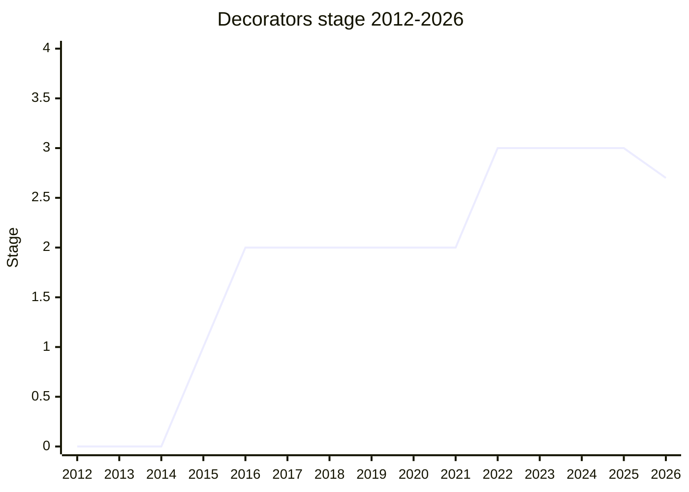

## 概要

Decorators は class の宣言・メンバに `@expr` 構文で注釈を付け、その定義を宣言時にプログラム的に書き換える/観測するための提案です。Angular・Ember・MobX といったフレームワークの dependency injection、observe、computed property といった用例が初期から動機でした。

この提案は TC39 史上もっとも難航したものの一つで、**少なくとも 3 つの全く異なる設計を経ています**。

1. **Descriptor-based design** (2014〜2019): decorator は property descriptor(後に element descriptor object)を受け取り descriptor を返す関数。`PrivateName`・finisher・initializer などを伴い肥大化。2016-07 に Stage 2 到達後、2018〜2019 にかけて 4 回以上 Stage 3 を狙うが、engine implementer の performance/static-analysis 懸念と複雑さを理由に毎回失敗。
2. **Static decorators** (2019-03 "Yet Another"): 「decorator は JS value ではなく lexically-scoped な名前で、`@wrap`/`@register` のような組み込み primitive からのみ構成できる」という静的解析可能な設計への全面再設計。これも tooling 側の懸念で停滞。
3. **Function-based design** (2020-09〜): 現行案。decorator は普通の JS function で、`(value, context)` を受け取り同形の置換値を任意で返す。class の shape を変えず、`accessor` keyword・`addInitializer`・`context.access`・metadata を備える。

この第 3 案がついに **2022-03 で Stage 2 → Stage 3** に到達しました(条件付きで metadata を別提案へ分離)。分離された **Decorator Metadata** はその後 **2023-05 に単独で Stage 3** へ到達しています。

しかし Stage 3 入り後どのエンジンも出荷せず、Test262 の不足・spec issue・active champion 不在が重なり、**2026-05 に Decorators 本体と Decorator Metadata はともに Stage 3 → Stage 2.7 へ降格 (regress)** されました(現ステージは 2.7)。「実装側の意欲が無いなら Stage 2 を超えるべきでなかった」という process failure の指摘([JHD](../people/JHD.md))もあり、必要なら後に Stage 2 へ戻す余地を残しています。

champion は初期の Yehuda Katz ([YK](../people/YK.md)) / Brian Terlson ([BT](../people/BT.md))、descriptor 期の Daniel Ehrenberg ([DE](../people/DE.md)) を経て、現行案では Kristen Hewell Garrett ([KHG](../people/KHG.md), "Chris") が主導し、TypeScript 側の Ron Buckton ([RBN](../people/RBN.md)) / Daniel Rosenwasser ([DRR](../people/DRR.md)) が export ordering 等の normative change を駆動しました。

## ステージ遷移

| 会合                                                                                                      | できごと                                                                                                                                                             | Stage            |
| --------------------------------------------------------------------------------------------------------- | -------------------------------------------------------------------------------------------------------------------------------------------------------------------- | ---------------- |
| [2014-04](../../raw/notes/meetings/2014-04/apr-10.md)                                                     | `Decorators for ES7` 初出 ([YK](../people/YK.md))。strawman 開始                                                                                                     | 0                |
| [2015-03](../../raw/notes/meetings/2015-03/mar-24.md)                                                     | Stage 1 acceptance。[YK](../people/YK.md) が設計空間を audit                                                                                                         | 0 → 1            |
| [2016-05](../../raw/notes/meetings/2016-05/may-25.md)                                                     | Stage 2 狙うも spec 不完全("uninitialized function" 未定義)で**不成立**                                                                                              | 1                |
| [2016-07](../../raw/notes/meetings/2016-07/jul-28.md)                                                     | Stage 2 到達。[DE](../people/DE.md) と協働し spec を completeに                                                                                                      | 1 → 2            |
| [2016-09](../../raw/notes/meetings/2016-09/sept-29.md)                                                    | Sigil swap (`@`↔`#`) 提案は**却下**。decorators が `@`、private fields が `#` で確定                                                                                 | 2                |
| [2017-07](../../raw/notes/meetings/2017-07/jul-27.md)                                                     | privacy/fields/decorators の相互作用。`PrivateName` 議論。Stage 2 維持                                                                                               | 2                |
| [2017-09](../../raw/notes/meetings/2017-09/sept-27.md), [28](../../raw/notes/meetings/2017-09/sept-28.md) | detailed semantics。`PrivateName` vs `Symbol`/`WeakMap`。Stage 3 reviewer 任命                                                                                       | 2                |
| [2018-03](../../raw/notes/meetings/2018-03/mar-21.md)                                                     | towards Stage 3。implementer feedback で `PrivateName` を primitive → object へ。[MM](../people/MM.md) が primitive を拒否                                           | 2                |
| [2018-05](../../raw/notes/meetings/2018-05/may-23.md)                                                     | auto-inserting parens を撤回。export ordering 論争が表面化                                                                                                           | 2                |
| [2018-07](../../raw/notes/meetings/2018-07/july-25.md)                                                    | [WH](../people/WH.md) が「class decorator は `export` の**後**であるべき」と明言。advance せず                                                                       | 2                |
| [2018-09](../../raw/notes/meetings/2018-09/sept-26.md)                                                    | private 直接 access を断念(class 全体を decorate で代替)。export ordering 紛糾。[DH](../people/DH.md)「最悪案でも ship したい」                                      | 2                |
| [2018-11](../../raw/notes/meetings/2018-11/nov-28.md)                                                     | `initializer` 追加。engine implementer ([SGN](../people/SGN.md)/[MLS](../people/MLS.md)) が startup perf/static analysis を強く懸念                                  | 2                |
| [2019-01](../../raw/notes/meetings/2019-01/jan-30.md)                                                     | Stage 3 を提案するも**失敗**。「too complex」([MLS](../people/MLS.md))・「non-optimizable」([SGN](../people/SGN.md))・「changes every month」([AK](../people/AK.md)) | 2                |
| [2019-03](../../raw/notes/meetings/2019-03/mar-27.md)                                                     | "Yet Another Decorators" = static decorators へ全面**再設計**。「decorator は value ではない」                                                                       | 2                |
| [2020-09](../../raw/notes/meetings/2020-09/sept-23.md)                                                    | static decorators から離れた **new proposal iteration**(現行 function-based 案の原型)                                                                                | 2                |
| [2021-07](../../raw/notes/meetings/2021-07/july-14.md)                                                    | function-based 設計を提示。Stage 3 reviewer 募集                                                                                                                     | 2                |
| [2021-12](../../raw/notes/meetings/2021-12/dec-15.md)                                                     | `@init` modifier を撤去し initialization を core capability 化                                                                                                       | 2                |
| [2022-03](../../raw/notes/meetings/2022-03/mar-28.md)                                                     | **Decorators が Stage 3 到達**(metadata を別 Stage 2 提案へ分離する条件付き)                                                                                         | 2 → 3            |
| [2022-03](../../raw/notes/meetings/2022-03/mar-30.md), [31](../../raw/notes/meetings/2022-03/mar-31.md)   | minor followups(`isPrivate`→`private`、`@(expr)()` 禁止、`@a.#b` 許可ほか)                                                                                           | 3                |
| [2022-06](../../raw/notes/meetings/2022-06/jun-06.md)                                                     | Flexible Initializers の normative change は Stage 3 変更として却下(follow-up へ)                                                                                    | 3                |
| [2023-01](../../raw/notes/meetings/2023-01/feb-01.md), [02](../../raw/notes/meetings/2023-01/feb-02.md)   | export ordering を「前後どちらか一方のみ可」で決着。`context.access` に `has` 追加・target 第1引数化                                                                 | 3                |
| [2023-03](../../raw/notes/meetings/2023-03/mar-21.md)                                                     | Decorators normative update(6点)。Decorator Metadata は Stage 2 のまま design option 1 で合意                                                                        | 3                |
| [2023-05](../../raw/notes/meetings/2023-05/may-16.md)                                                     | field/accessor initializer order を逆順に修正。Metadata の Stage 3 design 合意                                                                                       | 3                |
| [2023-05](../../raw/notes/meetings/2023-05/may-18.md)                                                     | **Decorator Metadata が単独で Stage 3 到達**                                                                                                                         | (metadata) 2 → 3 |
| [2026-05](../../raw/notes/meetings/2026-05/may-19.md)                                                     | **Stage 2.7 へ降格 (regress)**。出荷実装ゼロ・Test262 未完・active champion 不在。Decorator Metadata も lockstep で 2.7 へ                                           | 3 → 2.7          |

> 横軸=2012-2026、縦軸=Stage。各年末時点の stage。2014 に strawman (Stage 0)、2015-03 に Stage 1、2016-07 に Stage 2。**2016〜2021 は Stage 2 のまま横ばい**で、descriptor 案 → static 案 → function 案と再設計を重ねた難航期。2022-03 に Stage 3 到達後 4 年維持したが、**2026-05 に Stage 2.7 へ降格**(出荷実装ゼロ・Test262 未完)。Stage 4 は未到達。

## 主な論点

### `@` sigil と class fields / private fields の競合

decorators は当初から `@` を使い、後発の private fields proposal が同じ `@` を欲しがったため衝突しました。2015-01 で既に [AWB](../people/AWB.md) が「Is using @ going to cause grammar issues with using @ for private state」と指摘。Stage 2 で [YK](../people/YK.md) は「private state could use the @ sign ... this is reserved for decorators」と `@` を decorators 用に予約する意図を明言しました。

2016-09 の `Sigil swap` で「`@`→private、`#`→decorator」への入れ替えが提案され、[KS](../people/KS.md) は `@` が private を表すのに直感的と賛成しました。一方 [RW](../people/RW.md) は「Babel/TypeScript の既存利用が ES の進化を縛る悪しき前例」を挙げて swap に反対し、[AWB](../people/AWB.md) は「`@` を private のような特殊変数の sigil に使う言語は多い」と論じました([EFT](../people/EFT.md) は他言語の annotation/decorator 用法について疑問を投げかけた程度)。結論は **swap せず**(decorators が `@`、private fields が `#`)で確定しました。[WH](../people/WH.md) は sigil の選択とは独立に object-literal property への decorator が文法衝突を起こす点を繰り返し指摘しています。なお現行案でも [WH](../people/WH.md) は pipeline operator との `@` 競合を 2022-03 で再提起しています。

### Descriptor 露出 vs performance / static analysis

descriptor-based 設計では decorator が element descriptor object(`PrivateName`、finisher、initializer を含む)を授受しました。これが engine implementer の最大の障壁になりました。

2018-11 で [SGN](../people/SGN.md) (V8) は「startup performance ... Looking at the spec it looks like this will kill static analysis」、[MLS](../people/MLS.md) ([JSC](../people/JSC.md)) は「We have to change the object model to account for decorators」と懸念。2019-01 の Stage 3 bid では [SGN](../people/SGN.md) が「Initializer functions in class fields ... we can currently optimize away in V8, but with decorators ... that optimization becomes impossible」「I'm not convinced I should implement and ship the currently specified proposal in Chrome」と表明、[MLS](../people/MLS.md) は「too complex」、[AK](../people/AK.md) は「this proposal changes every month and that seems to me not ready」と stability を問題視し、**Stage 3 は不成立**。[YK](../people/YK.md) は「To me it does not seem like Decorators are happening」と落胆を述べました。

この失敗が次の再設計の直接の引き金です。

### Static decorators(2019-03 "Yet Another")の是非

[YK](../people/YK.md) は旧設計の失敗を「Basically, you have to understand proxies to be able to write a decorator」と総括し、**decorator を JS value ではなく lexically-scoped な名前**とし `@wrap`/`@register` のような組み込み primitive からのみ構成する設計へ転換しました。[DE](../people/DE.md)「Since they're not values, they can only be constructed in these fixed ways. So this enables static analysis」。

Angular の [IMR](../people/IMR.md) は「a way out of that stalemate」と歓迎し [AK](../people/AK.md)/[TST](../people/TST.md) も performance 観点で支持しましたが、CPO は「why not a value?」と前提に異議。[RBN](../people/RBN.md) は「kinda rolls back the clock to stage 1」「lexically scoped decorators cannot be namespaced」と指摘。[DRR](../people/DRR.md) は parse-time のコード生成(cross-resolution)が tooling/Babel の最大懸念と述べました。この案も Stage 2 に留まり、最終的に 2020-09 で function-based 案へ再々設計されています。

### `@init` の撤去と initialization の core 化

function-based 案では当初 `addInitializer` を使うには `@init` modifier を要しました(per-decorator のコストを opt-in にするため)。しかし「very confusing to users」で全使用箇所に keyword が必要、かつ method が初期化前に参照され得る窓を生むことから、2021-12 で撤去。**initialization を全 decorator の 4 番目の core capability** に格上げし、field は initializer を置換、method 等は `addInitializer` で登録した処理を class fields 代入前に一括実行する形に整理されました。performance 制約は維持されています。

### Decorator Metadata の分離

metadata は dependency injection の必須機能([KHG](../people/KHG.md)「Without some metadata, API dependency injection is simply impossible」)でしたが、[SYG](../people/SYG.md)/[YSV](../people/YSV.md) が「feels like a JS library」と複雑さを問題視。2022-03 で [YSV](../people/YSV.md) が WeakRefs `cleanupSome` を前例に **metadata を別 Stage 2 提案へ分離する条件付き**で Decorators 本体を Stage 3 へ通すことを提案し合意。metadata は 2023-03 に mutable な共有オブジェクト(option 1)で design 合意、2023-05 に単独で Stage 3 へ進みました。[KG](../people/KG.md) は global shared namespace を嫌い frozen object 案(option 2)を推しましたが「I am in the minority and am ok saying we can live with option one」と譲歩しています。

### export ordering(`@dec export` vs `export @dec`)

`export @dec class` か `@dec export class` か、で 2018〜2023 にわたり紛糾した最長の bikeshed です。

- **export-first 派**([JHD](../people/JHD.md)/[WH](../people/WH.md)/[BM](../people/BM.md)/[MM](../people/MM.md)): `export` は binding/module を変える statement であり、decorator は value を装飾するので `export @dec class`。`Function.prototype.toString`/`eval` を根拠に後置を強く主張したのは主に [MM](../people/MM.md)。[WH](../people/WH.md) は 2018-05 で「toString は `export` を含むべきでない。decorator を含めるかは議論の余地があるが、もし含めるなら `export` の後ろに置くことが強く示唆される」と条件付きで述べた。
- **decorator-first 派**([RBN](../people/RBN.md)/[DRR](../people/DRR.md)/Angular): `export` を modifier 扱いし keyword をまとめる。TypeScript/Babel の数年の前例([RBN](../people/RBN.md)「~2800 classes ... use export in this way」)。

[DH](../people/DH.md) が 2018-09 に「I think this is so zerosum that we can't progress. I'd rather ship the worst outcome than not ship」と漏らすほど膠着しました。最終決着は 2023-01 で **option 2**:`export`/`export default` の**前か後ろのどちらか一方のみ**可(両方指定は Syntax Error、`export` と `default` の間は不可)。さらに `export` の**前**に置いた decorator は `Function.prototype.toString()` に含めない、という source text cutoff も合意されました。

### `context.access` object API

private/public element への imperative な get/set/has を与える `access` object について、2023-01 で `access.get/set` の対象を `this` 経由ではなく **第 1 引数**(Reflect/WeakMap スタイル)に変更し、`#x in obj` に相当する **`has` メソッドを追加**することで合意しました。

### Stage 2.7 への降格(2026-05)

Stage 3 到達(2022-03)から 4 年が経っても**どのエンジンも出荷せず**、SpiderMonkey/V8/[JSC](../people/JSC.md) とも実装を halt していました。`Iterator.prototype.includes` の実装過程などで V8 が spec issue・complexity の具体的フィードバックを示し、Test262 も未完であることが顕在化します。2026-05 に [DLM](../people/DLM.md) が Stage 3 → Stage 2.7 への降格を提案しました。

[JHD](../people/JHD.md) は「Stage 3 入り時点で 2.7 があれば、テストが十分になるまで Stage 3 に上げるべきではなかった。実装の意欲が無いなら Stage 2 を超えるべきでなかった」と process failure を指摘。[KHG](../people/KHG.md)(champion)は engine 側の stonewall が停滞の一因としつつ、簡素化を含めた再開に前向きでした。降格先を Stage 2 にするか 2.7 にするかが争点となり、[JHD](../people/JHD.md)/[NRO](../people/NRO.md)/[CDA](../people/CDA.md) は「現状の課題は test 不足であり、大規模な再設計が判明するまでは 2.7 が適切。必要なら後に Stage 2 へ戻す」とし、**Stage 2.7 へ降格で consensus**。直後に [JHD](../people/JHD.md) が point of order で **Decorator Metadata も lockstep で 2.7 へ**降格させ consensus を得ました。

> ([CDA](../people/CDA.md)) 2.7 を支持する。ただし goalpost を動かさないことが条件で、「今日これが Stage 3 に来たら基準を満たすか」という厳密な解釈で測るべきだ。満たさないなら 2.7 でよい。

### 需要と実装のミスマッチ(誰が欲しいのか)

Decorators の停滞と降格を貫く構造的な問題は、**「欲しがる層」と「実装する層」が別々**だという点に尽きます。

- **欲しがっている層(ユーザーランド)**: フレームワーク作者(Angular・Ember・MobX の dependency injection / observe / computed property が初期からの動機)、TypeScript / Babel エコシステムと既存ユーザー。legacy decorators は transpiler 経由で何年も実運用され、巨大な既存利用がある([RBN](../people/RBN.md)「~2800 classes がこの形で `export` を使う」, 2023-01)。TypeScript は `ESNext` で native decorators をサポートし、それ以外は vanilla JS へ downlevel する(2026-05)。champion も Ember の [YK](../people/YK.md) → 現行の [KHG](../people/KHG.md)、TypeScript 側の [RBN](../people/RBN.md)/[DRR](../people/DRR.md) と、いずれもユーザーランド寄りの面々が駆動してきた。
- **欲しがっていない層(実装者)**: ブラウザエンジン(V8 / SpiderMonkey / [JSC](../people/JSC.md))は誰も出荷に動かなかった。[OFR](../people/OFR.md)(V8)は「spec のバグ・未整備のテスト・性能最適化が必要で、実装を続けられる形になっていない。実装は halt」と説明(2026-05)。[KHG](../people/KHG.md) は「最後の数点を直せば進めるかと何度も尋ねたが、ことごとく stonewall だった」と証言し、[JHD](../people/JHD.md) は「ブラウザはこの 10 年 merge する気の無さを telegraph してきた。distasteful disinterest だ」と process failure を指摘した。

結果として「transpiler 経由で広く使われているのにネイティブ実装は 4 年経っても出荷ゼロ」という逆説が生じ、2026-05 の Stage 2.7 降格に至った。今後 Stage 3 へ戻れるかは、設計の簡素化を通じて**エンジンの buy-in を取り戻せるか**にかかっている([KHG](../people/KHG.md)「エンジンが本当に出荷する気が無いなら、これ以上時間を投じたくない」)。

## 関連提案

- `class-fields` — `@`/`#` sigil 競合の相手。decorators は field decorator・`accessor` keyword で深く相互作用する。
- `private-methods` — `PrivateName` / private element への decorator access の議論で関与。
- `pipeline-operator` — `@` sigil を巡って [WH](../people/WH.md) が競合を指摘(2022-03)。

## 出典

- [2014-04 apr-10](../../raw/notes/meetings/2014-04/apr-10.md) — Decorators for ES7(初出)
- [2015-03 mar-24](../../raw/notes/meetings/2015-03/mar-24.md) — Stage 1 acceptance
- [2016-05 may-25](../../raw/notes/meetings/2016-05/may-25.md) — Stage 2 不成立
- [2016-07 jul-28](../../raw/notes/meetings/2016-07/jul-28.md) — Stage 2 到達
- [2016-09 sept-29](../../raw/notes/meetings/2016-09/sept-29.md) — Sigil swap 却下
- [2017-07 jul-27](../../raw/notes/meetings/2017-07/jul-27.md) — privacy/fields/decorators 相互作用
- [2017-09 sept-27](../../raw/notes/meetings/2017-09/sept-27.md), [sept-28](../../raw/notes/meetings/2017-09/sept-28.md) — detailed semantics
- [2018-01 jan-25](../../raw/notes/meetings/2018-01/jan-25.md) — towards Stage 3
- [2018-03 mar-21](../../raw/notes/meetings/2018-03/mar-21.md) — PrivateName を object へ
- [2018-05 may-23](../../raw/notes/meetings/2018-05/may-23.md) — auto-parens 撤回 / export ordering
- [2018-07 july-25](../../raw/notes/meetings/2018-07/july-25.md) — [WH](../people/WH.md) の export-after 主張
- [2018-09 sept-26](../../raw/notes/meetings/2018-09/sept-26.md), [sept-27](../../raw/notes/meetings/2018-09/sept-27.md) — private access 断念 / Export Decorator Ordering
- [2018-11 nov-28](../../raw/notes/meetings/2018-11/nov-28.md) — initializer / implementer perf 懸念
- [2019-01 jan-30](../../raw/notes/meetings/2019-01/jan-30.md) — Stage 3 失敗
- [2019-03 mar-27](../../raw/notes/meetings/2019-03/mar-27.md) — Yet Another(static decorators)再設計
- [2020-09 sept-23](../../raw/notes/meetings/2020-09/sept-23.md) — new proposal iteration
- [2021-07 july-14](../../raw/notes/meetings/2021-07/july-14.md) — function-based 設計 / Stage 3 reviewer
- [2021-12 dec-15](../../raw/notes/meetings/2021-12/dec-15.md) — Removing @init
- [2022-03 mar-28](../../raw/notes/meetings/2022-03/mar-28.md) — Stage 3 到達
- [2022-03 mar-30](../../raw/notes/meetings/2022-03/mar-30.md), [mar-31](../../raw/notes/meetings/2022-03/mar-31.md) — minor followups
- [2022-06 jun-06](../../raw/notes/meetings/2022-06/jun-06.md) — Flexible Initializers 却下
- [2023-01 feb-01](../../raw/notes/meetings/2023-01/feb-01.md), [feb-02](../../raw/notes/meetings/2023-01/feb-02.md) — export ordering 決着 / context.access
- [2023-03 mar-21](../../raw/notes/meetings/2023-03/mar-21.md) — normative update / Metadata update
- [2023-05 may-16](../../raw/notes/meetings/2023-05/may-16.md) — initializer order / Metadata Stage 3 design
- [2023-05 may-18](../../raw/notes/meetings/2023-05/may-18.md) — Decorator Metadata Stage 3 到達
- [2026-05 may-19](../../raw/notes/meetings/2026-05/may-19.md) — Decorators 本体・Decorator Metadata がともに Stage 2.7 へ降格
