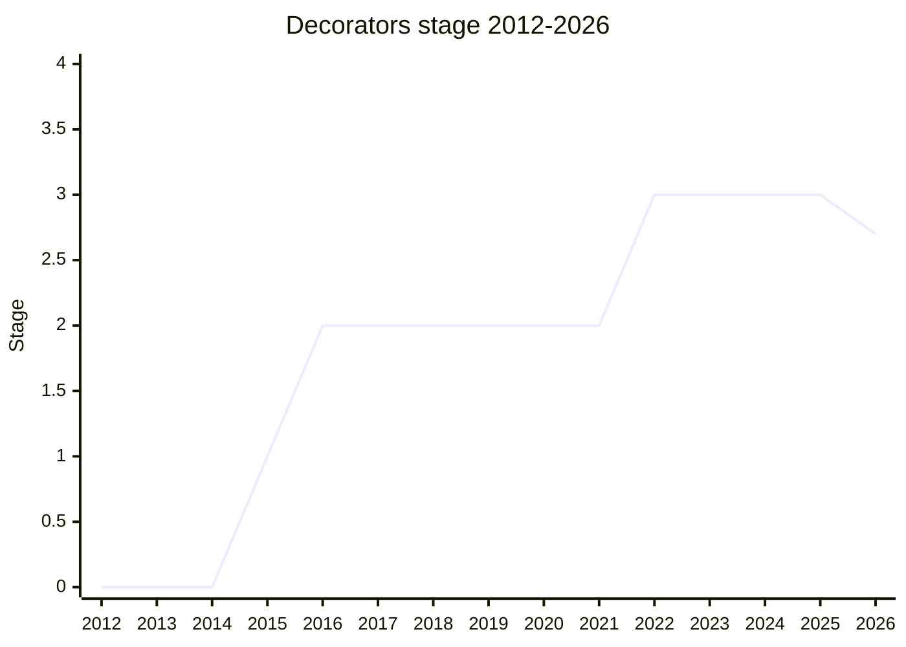

## Overview

Decorators annotates a class declaration or member with `@expr` syntax, so that the definition can be rewritten or observed programmatically at declaration time. From the start, the motivation was use cases in frameworks such as Angular, Ember, and MobX: dependency injection, observe, and computed properties.

This is one of the most difficult proposals in TC39's history. **It has been through at least three entirely different designs.**

1. **Descriptor-based design** (2014–2019): a decorator is a function that receives a property descriptor (later an element descriptor object) and returns a descriptor. It grew, carrying `PrivateName`, a finisher, an initializer, and more. After reaching Stage 2 in 2016-07, it aimed at Stage 3 four or more times through 2018–2019, and failed every time because of engine implementers' performance and static-analysis concerns, and because of complexity.
2. **Static decorators** (2019-03, "Yet Another"): a full redesign into a statically analyzable design, in which a decorator is not a JS value but a lexically scoped name, and can be built only from built-in primitives such as `@wrap` / `@register`. This also stalled on tooling concerns.
3. **Function-based design** (2020-09 onward): the current proposal. A decorator is an ordinary JS function. It receives `(value, context)` and may return a replacement of the same shape. It does not change the shape of the class, and it has an `accessor` keyword, `addInitializer`, `context.access`, and metadata.

This third design finally **reached Stage 3 in 2022-03, from Stage 2** (conditional on splitting metadata into a separate proposal). The split-out **Decorator Metadata** later **reached Stage 3 on its own in 2023-05**.

After entering Stage 3, no engine shipped it. Missing test262, spec issues, and the absence of an active champion piled up, and **in 2026-05 both Decorators itself and Decorator Metadata regressed from Stage 3 to Stage 2.7** (the current stage is 2.7). There was also a process-failure point ([JHD](../people/JHD.md): "If you weren't enthusiastic about implementing it should not have achieved it should not have graduated beyond stage two."), and room was left to return to Stage 2 later if needed.

Champions ran from the early Yehuda Katz ([YK](../people/YK.md)) / Brian Terlson ([BT](../people/BT.md)), through Daniel Ehrenberg ([DE](../people/DE.md)) in the descriptor period, to Kristen Hewell Garrett ([KHG](../people/KHG.md), "Chris") leading the current design. On the TypeScript side, Ron Buckton ([RBN](../people/RBN.md)) / Daniel Rosenwasser ([DRR](../people/DRR.md)) drove normative changes such as export ordering.

## Stage history

| Meeting                                                                                                                                                   | What happened                                                                                                                                                                                                                                                                   | Stage            |
| --------------------------------------------------------------------------------------------------------------------------------------------------------- | ------------------------------------------------------------------------------------------------------------------------------------------------------------------------------------------------------------------------------------------------------------------------------- | ---------------- |
| [2014-04](https://github.com/tc39/notes/blob/main/meetings/2014-04/apr-10.md)                                                                             | First appearance of `Decorators for ES7` ([YK](../people/YK.md)). Strawman started                                                                                                                                                                                              | 0                |
| [2015-03](https://github.com/tc39/notes/blob/main/meetings/2015-03/mar-24.md)                                                                             | Stage 1 acceptance. [YK](../people/YK.md) audited the design space                                                                                                                                                                                                              | 0 → 1            |
| [2016-05](https://github.com/tc39/notes/blob/main/meetings/2016-05/may-25.md)                                                                             | Aimed at Stage 2 and **did not pass**: the spec was incomplete ("uninitialized function" undefined)                                                                                                                                                                             | 1                |
| [2016-07](https://github.com/tc39/notes/blob/main/meetings/2016-07/jul-28.md)                                                                             | Reached Stage 2. Worked with [DE](../people/DE.md) and completed the spec                                                                                                                                                                                                       | 1 → 2            |
| [2016-09](https://github.com/tc39/notes/blob/main/meetings/2016-09/sept-29.md)                                                                            | The sigil-swap proposal (`@`↔`#`) was **rejected**. Decorators keep `@`, private fields keep `#`                                                                                                                                                                                | 2                |
| [2017-07](https://github.com/tc39/notes/blob/main/meetings/2017-07/jul-27.md)                                                                             | Interaction of privacy, fields, and decorators. `PrivateName` discussion. Stayed at Stage 2                                                                                                                                                                                     | 2                |
| [2017-09](https://github.com/tc39/notes/blob/main/meetings/2017-09/sept-27.md), [28](https://github.com/tc39/notes/blob/main/meetings/2017-09/sept-28.md) | Detailed semantics. `PrivateName` versus `Symbol` / `WeakMap`. Stage 3 reviewers appointed                                                                                                                                                                                      | 2                |
| [2018-03](https://github.com/tc39/notes/blob/main/meetings/2018-03/mar-21.md)                                                                             | Toward Stage 3. On implementer feedback, `PrivateName` went from primitive to object. [MM](../people/MM.md) rejected a primitive                                                                                                                                                | 2                |
| [2018-05](https://github.com/tc39/notes/blob/main/meetings/2018-05/may-23.md)                                                                             | Withdrew auto-inserting parentheses. The export-ordering dispute surfaced                                                                                                                                                                                                       | 2                |
| [2018-07](https://github.com/tc39/notes/blob/main/meetings/2018-07/july-25.md)                                                                            | [WH](../people/WH.md) insisted that class decorators come **after** `export`: "Moving class decorators before `export` would be a mistake." Did not advance                                                                                                                     | 2                |
| [2018-09](https://github.com/tc39/notes/blob/main/meetings/2018-09/sept-26.md)                                                                            | Gave up direct private access (decorate the whole class instead). Export ordering was tangled. [DH](../people/DH.md): "I'd rather ship the worst outcome than not ship"                                                                                                         | 2                |
| [2018-11](https://github.com/tc39/notes/blob/main/meetings/2018-11/nov-28.md)                                                                             | Added `initializer`. Engine implementers ([SGN](../people/SGN.md) / [MLS](../people/MLS.md)) strongly concerned about startup performance and static analysis                                                                                                                   | 2                |
| [2019-01](https://github.com/tc39/notes/blob/main/meetings/2019-01/jan-30.md)                                                                             | Proposed Stage 3 and **failed**. "too complex" ([MLS](../people/MLS.md)), "non-optimizable" ([SGN](../people/SGN.md)), "changes every month" ([AK](../people/AK.md))                                                                                                            | 2                |
| [2019-03](https://github.com/tc39/notes/blob/main/meetings/2019-03/mar-27.md)                                                                             | "Yet Another Decorators" = a full **redesign** to static decorators, in which decorators are not JS values ([DE](../people/DE.md): "Since they're not values, they can only be constructed in these fixed ways")                                                                | 2                |
| [2020-07](https://github.com/tc39/notes/blob/main/meetings/2020-07/july-21.md)                                                                            | Status update ([KHG](../people/KHG.md)) on the tooling constraints: transpile-ability, "downleveling" mixed native/transpiled decorators, and the byte-size cost of transpiled output. [DE](../people/DE.md): the constraints "are still in conflict even in a pure tools mode" | 2                |
| [2020-09](https://github.com/tc39/notes/blob/main/meetings/2020-09/sept-23.md)                                                                            | Left static decorators for a **new proposal iteration** (the prototype of the current function-based design)                                                                                                                                                                    | 2                |
| [2021-07](https://github.com/tc39/notes/blob/main/meetings/2021-07/july-14.md)                                                                            | Presented the function-based design. Called for Stage 3 reviewers                                                                                                                                                                                                               | 2                |
| [2021-12](https://github.com/tc39/notes/blob/main/meetings/2021-12/dec-15.md)                                                                             | Removed the `@init` modifier and made initialization a core capability                                                                                                                                                                                                          | 2                |
| [2022-03](https://github.com/tc39/notes/blob/main/meetings/2022-03/mar-28.md)                                                                             | **Decorators reached Stage 3** (conditional on splitting metadata into a separate Stage 2 proposal)                                                                                                                                                                             | 2 → 3            |
| [2022-03](https://github.com/tc39/notes/blob/main/meetings/2022-03/mar-30.md), [31](https://github.com/tc39/notes/blob/main/meetings/2022-03/mar-31.md)   | Minor follow-ups (`isPrivate`→`private`, forbid `@(expr)()`, allow `@a.#b`, and others)                                                                                                                                                                                         | 3                |
| [2022-06](https://github.com/tc39/notes/blob/main/meetings/2022-06/jun-06.md)                                                                             | The Flexible Initializers normative change was rejected as a Stage 3 change (moved to a follow-up)                                                                                                                                                                              | 3                |
| [2023-01](https://github.com/tc39/notes/blob/main/meetings/2023-01/feb-01.md), [02](https://github.com/tc39/notes/blob/main/meetings/2023-01/feb-02.md)   | Export ordering settled: decorators before or after `export`, "exclusively one position, or the other, but not both." Added `has` to `context.access` and made the target the first argument                                                                                    | 3                |
| [2023-03](https://github.com/tc39/notes/blob/main/meetings/2023-03/mar-21.md)                                                                             | Decorators normative update (6 points). Decorator Metadata stayed at Stage 2 and agreed design option 1                                                                                                                                                                         | 3                |
| [2023-05](https://github.com/tc39/notes/blob/main/meetings/2023-05/may-16.md)                                                                             | Fixed field / accessor initializer order to the reverse order. Agreed the Stage 3 design for Metadata                                                                                                                                                                           | 3                |
| [2023-05](https://github.com/tc39/notes/blob/main/meetings/2023-05/may-18.md)                                                                             | **Decorator Metadata reached Stage 3 on its own**                                                                                                                                                                                                                               | (metadata) 2 → 3 |
| [2025-02](https://github.com/tc39/notes/blob/main/meetings/2025-02/february-18.md)                                                                        | Implementation update: V8 / SpiderMonkey nearing completion, but **no engine willing to ship first**. No browser would explain its deprioritization                                                                                                                             | 3 (kept)         |
| [2025-11](https://github.com/tc39/notes/blob/main/meetings/2025-11/november-20.md)                                                                        | Status update: community excitement unchanged, browsers "still unwilling to be the first to ship them". No major decisions                                                                                                                                                      | 3 (kept)         |
| [2026-05](https://github.com/tc39/notes/blob/main/meetings/2026-05/may-19.md)                                                                             | **Regressed to Stage 2.7**. Zero shipped implementations, unfinished test262, no active champion. Decorator Metadata also went to 2.7 in lockstep                                                                                                                               | 3 → 2.7          |

```mermaid
xychart-beta
    title "Decorators stage 2012-2026"
    x-axis [2012, 2013, 2014, 2015, 2016, 2017, 2018, 2019, 2020, 2021, 2022, 2023, 2024, 2025, 2026]
    y-axis "Stage" 0 --> 4
    line [0, 0, 0, 1, 2, 2, 2, 2, 2, 2, 3, 3, 3, 3, 2.7]
```

> Horizontal axis = 2012-2026, vertical axis = Stage, the stage at each year-end. Strawman (Stage 0) in 2014, Stage 1 in 2015-03, Stage 2 in 2016-07. **2016 through 2021 is flat at Stage 2**, the difficult period of redesigning from the descriptor design to the static design to the function design. Reached Stage 3 in 2022-03 and held it for four years, then **regressed to Stage 2.7 in 2026-05** (zero shipped implementations, unfinished test262). Stage 4 has not been reached.

## Main issues

### The `@` sigil versus class fields and private fields

Decorators used `@` from the start, and the later private-fields proposal wanted the same `@`, so they collided. Already in 2015-01, [AWB](../people/AWB.md) asked "Is using @ going to cause grammar issues with using @ for private state." At Stage 2, [YK](../people/YK.md) stated the intention to reserve `@` for decorators: "private state could use the @ sign ... this is reserved for decorators."

At the 2016-09 `Sigil swap`, a swap of "`@` for private, `#` for decorator" was proposed, and [KS](../people/KS.md) supported it because `@` intuitively means private. [RW](../people/RW.md) opposed letting existing Babel / TypeScript use decide it: "We're setting a bad precedent in allowing Babel and TypeScript code to determine the course of ES evolution." [AWB](../people/AWB.md) argued that "As a sigil for identifying special kinds of variables, like private state, @ is much more common in terms of number of languages" ([EFT](../people/EFT.md) only raised a question about how other languages use annotations and decorators). The conclusion was **not to swap** (decorators keep `@`, private fields keep `#`). Independently of the sigil choice, [WH](../people/WH.md) repeatedly pointed out that a decorator on an object-literal property causes a grammar collision. In the current design too, [WH](../people/WH.md) raised the `@` collision with the pipeline operator again in 2022-03.

### Exposing a descriptor versus performance and static analysis

In the descriptor-based design, a decorator received and returned an element descriptor object (including `PrivateName`, a finisher, and an initializer). That became the biggest barrier for engine implementers.

In 2018-11, [SGN](../people/SGN.md) (V8) was concerned that "startup performance ... Looking at the spec it looks like this will kill static analysis," and [MLS](../people/MLS.md) (JSC) that "We have to change the object model to account for decorators." At the 2019-01 Stage 3 bid, [SGN](../people/SGN.md) said "Initializer functions in class fields ... we can currently optimize away in V8, but with decorators ... that optimization becomes impossible" and "I'm not convinced I should implement and ship the currently specified proposal in Chrome." [MLS](../people/MLS.md) said "too complex," and [AK](../people/AK.md) treated stability as the problem: "this proposal changes every month and that seems to me not ready." **Stage 3 did not pass.** [YK](../people/YK.md) said, discouraged, "To me it does not seem like Decorators are happening."

That failure was the direct trigger for the next redesign.

### Whether static decorators (2019-03, "Yet Another") were right

[YK](../people/YK.md) summed up the failure of the old design as "Basically, you have to understand proxies to be able to write a decorator," and switched to a design in which **a decorator is not a JS value but a lexically scoped name**, built only from built-in primitives such as `@wrap` / `@register`. [DE](../people/DE.md): "Since they're not values, they can only be constructed in these fixed ways. So this enables static analysis."

Angular's [IMR](../people/IMR.md) welcomed it as "a way out of that stalemate," and [AK](../people/AK.md) / [TST](../people/TST.md) also supported it from a performance angle, but CPO objected to the premise: "why not a value?" [RBN](../people/RBN.md) said it "kinda rolls back the clock to stage 1" and "lexically scoped decorators cannot be namespaced." [DRR](../people/DRR.md) said parse-time code generation (cross-resolution) was the biggest concern for tooling and Babel. This design also stayed at Stage 2, and was redesigned again into the function-based design in 2020-09.

### Removing `@init` and making initialization core

In the function-based design, using `addInitializer` originally required an `@init` modifier (to make the per-decorator cost opt-in). But it was "very confusing to users," the keyword was needed at every use site, and it opened a window in which a method can be referred to before initialization, so it was removed in 2021-12. **Initialization was promoted to the fourth core capability of every decorator.** A field replaces its initializer, and a method and similar run, in one batch before class-field assignment, the work registered with `addInitializer`. The performance constraint is kept.

### Splitting out Decorator Metadata

Metadata is essential for dependency injection ([KHG](../people/KHG.md): "Without some metadata, API dependency injection is simply impossible"), but [SYG](../people/SYG.md) / [YSV](../people/YSV.md) treated the complexity as a problem ([SYG](../people/SYG.md): "Feels Like a JS library"). In 2022-03, [YSV](../people/YSV.md), taking WeakRefs `cleanupSome` as precedent, proposed passing Decorators itself to Stage 3 **conditional on splitting metadata into a separate Stage 2 proposal**, and that was agreed. Metadata agreed its design in 2023-03 as a mutable shared object (option 1), and advanced to Stage 3 on its own in 2023-05. [KG](../people/KG.md) disliked a global shared namespace and preferred a frozen-object plan (option 2), but conceded: "I am in the minority and am ok saying we can live with option one."

### Export ordering (`@dec export` versus `export @dec`)

Whether it is `export @dec class` or `@dec export class` was the longest bikeshed, tangled from 2018 through 2023.

- **Export-first** ([JHD](../people/JHD.md) / [WH](../people/WH.md) / [BM](../people/BM.md) / [MM](../people/MM.md)): `export` is a statement that changes a binding or a module, and a decorator decorates a value, so `export @dec class`. It was mainly [MM](../people/MM.md) who argued strongly for the decorator coming after, on the basis of `Function.prototype.toString` / `eval`. [WH](../people/WH.md) said in 2018-05, conditionally, "I think it should not include `export`. We can quibble whether it should include the decorators or not. If it does, that strongly argues for putting the decorators after `export`."
- **Decorator-first** ([RBN](../people/RBN.md) / [DRR](../people/DRR.md) / Angular): treat `export` as a modifier and group the keywords. Several years of TypeScript / Babel precedent ([RBN](../people/RBN.md): "~2800 classes ... use export in this way").

It was stuck enough that [DH](../people/DH.md) said in 2018-09, "I think this is so zerosum that we can't progress. I'd rather ship the worst outcome than not ship." The final settlement, in 2023-01, was **option 2**: only **one of before or after** `export` / `export default` is allowed (specifying both is a Syntax Error, and between `export` and `default` is not allowed). It was also agreed that a decorator placed **before** `export` is not included in `Function.prototype.toString()`, a source-text cutoff.

### The `context.access` object API

For the `access` object, which gives imperative get / set / has on a private or public element, it was agreed in 2023-01 to change the target of `access.get` / `set` from going through `this` to **the first argument** (Reflect / WeakMap style), and to **add a `has` method** equivalent to `#x in obj`.

### Implementation deadlock (2025-02): nobody ships first

A year before the regression, the deadlock was already on the table. At an implementation update (2025-02), [KHG](../people/KHG.md) reported that the V8 implementation (contributed by Edge) was "nearing completion" and SpiderMonkey's was "around 75% complete," yet none of the three engines planned to ship:

- [MLS](../people/MLS.md) (Apple): "A, we sort of don't want to be the first to ship this, and B, we don't view it as a high priority given other priorities we have ... It's a large feature to implement."
- [DE](../people/DE.md) pressed all three engines for their reasoning: "It would be really helpful and productive for this committee if we could get more clarity from the three browsers." No answer came ("[a long period of silence]"), and he closed by saying that if implementers had no will to ship, they should have blocked Stage 3 itself: "I was expecting that Stage 3 would be a sufficiently positive signal."
- [KHG](../people/KHG.md) (champion) described the position as gatekeeping: "it feels kind of arbitrary and also it feels like a really high bar to say that, you know, we have to not be the first one to ship a feature. That can just turn into, like, you know, a never ending stalemate."
- [SFC](../people/SFC.md) offered the counterpoint of how proposals actually get implemented: the ones that advance are the ones a team champions with its own resources ("my team has been putting a lot of time into Temporal ... that's how that happens").

The session's conclusion recorded the stalemate verbatim: "Status quo remains the same, no one plans to ship currently. No browser was willing to explain the reason for their deprioritization." This is the direct precursor of the Stage 2.7 regression the following year.

### Regression to Stage 2.7 (2026-05)

Four years after reaching Stage 3 (2022-03), **no engine had shipped it**, and SpiderMonkey, V8, and JSC had all halted implementation. While working on a contributed V8 CL, V8 gave concrete feedback on spec issues and complexity, and it became clear that test262 was also unfinished. In 2026-05, [DLM](../people/DLM.md) proposed regressing from Stage 3 to Stage 2.7.

[JHD](../people/JHD.md) called it a process failure: it "should not have graduated to 3 until if 2.7 had existed, should not have graduated to 3 until we thought the tests were sufficient," and "If you weren't enthusiastic about implementing it should not have achieved it should not have graduated beyond stage two." [KHG](../people/KHG.md) (champion) said engine-side stonewalling was one cause of the stall, while being open to restarting, including simplification. Whether to regress to Stage 2 or to 2.7 was the dispute. [JHD](../people/JHD.md) / [NRO](../people/NRO.md) / [CDA](../people/CDA.md) took the position that the present problem is missing tests, so 2.7 is appropriate until a large redesign turns out to be necessary, with a return to Stage 2 later if needed ([JHD](../people/JHD.md): "I think we should move this to 2.7 because the tests aren't complete and that's the whole point of that stage"), and there was **consensus to regress to Stage 2.7**. Immediately after, [JHD](../people/JHD.md) got consensus, as a point of order, to regress **Decorator Metadata to 2.7 in lockstep** as well.

> ([CDA](../people/CDA.md)) I will support 2.7 as long as we're not moving the goalposts. And what I mean is I'd really like to take a strict interpretation of the process here and the measuring stick is: if this were coming for stage 3 today, would it meet the criteria? And if not, then 2.7 is fine.

### The mismatch of demand and implementation (who wants it)

The structural problem running through the stall and the regression of Decorators is that **the people who want it and the people who implement it are different groups.**

- **The people who want it (userland)**: framework authors (dependency injection / observe / computed property in Angular, Ember, and MobX were the motivation from the start), and the TypeScript / Babel ecosystem and its existing users. Legacy decorators have been in real use for years through a transpiler, and the existing use is huge ([RBN](../people/RBN.md): "~2800 classes in public repositories use export in this way," 2018-09). TypeScript supports native decorators in `ESNext`, and otherwise downlevels to vanilla JS (2026-05). The champions have also been userland-side people: Ember's [YK](../people/YK.md), then the current [KHG](../people/KHG.md), and on the TypeScript side [RBN](../people/RBN.md) / [DRR](../people/DRR.md).
- **The people who do not want it (implementers)**: no browser engine (V8 / SpiderMonkey / JSC) moved to ship it. [OFR](../people/OFR.md) (V8) explained that "the proposal was not in a shape where it was easy for us or where it was possible for us to continue the implementation. Because there was spec work to be done like bugs to be fixed. Tests to be written," that the CL "would need additional performance optimizations," and that "the implementation is halted until issues are resolved" (2026-05). [KHG](../people/KHG.md) testified that when the champions asked whether fixing the last few issues would let it move forward, "all the engines at the time were basically very stonewall-y," and [JHD](../people/JHD.md) called it a process failure: "browsers have effectively both explicitly and implicitly telegraphed an unwillingness to merge it, meaning a sort of disinterest a distasteful disinterest in the proposal."

The result was the paradox that it is widely used through a transpiler, and yet the native implementation had shipped zero times after four years at Stage 3, which led to the Stage 2.7 regression in 2026-05. Whether it can return to Stage 3 depends on whether, through simplifying the design, **the engines' buy-in can be won back** ([KHG](../people/KHG.md): "I just don't want to continue investing time here if it is the case that engines really aren't interested in shipping this").

## Related proposals

- `class-fields` — the other side of the `@` / `#` sigil collision. Decorators interact deeply through field decorators and the `accessor` keyword.
- `private-methods` — involved in the discussion of decorator access to `PrivateName` / private elements.
- `pipeline-operator` — [WH](../people/WH.md) pointed out a collision over the `@` sigil (2022-03).

## Sources

- [2014-04 apr-10](https://github.com/tc39/notes/blob/main/meetings/2014-04/apr-10.md) — Decorators for ES7 (first appearance)
- [2015-03 mar-24](https://github.com/tc39/notes/blob/main/meetings/2015-03/mar-24.md) — Stage 1 acceptance
- [2016-05 may-25](https://github.com/tc39/notes/blob/main/meetings/2016-05/may-25.md) — Stage 2 did not pass
- [2016-07 jul-28](https://github.com/tc39/notes/blob/main/meetings/2016-07/jul-28.md) — reached Stage 2
- [2016-09 sept-29](https://github.com/tc39/notes/blob/main/meetings/2016-09/sept-29.md) — sigil swap rejected
- [2017-07 jul-27](https://github.com/tc39/notes/blob/main/meetings/2017-07/jul-27.md) — interaction of privacy, fields, and decorators
- [2017-09 sept-27](https://github.com/tc39/notes/blob/main/meetings/2017-09/sept-27.md), [sept-28](https://github.com/tc39/notes/blob/main/meetings/2017-09/sept-28.md) — detailed semantics
- [2018-01 jan-25](https://github.com/tc39/notes/blob/main/meetings/2018-01/jan-25.md) — toward Stage 3
- [2018-03 mar-21](https://github.com/tc39/notes/blob/main/meetings/2018-03/mar-21.md) — `PrivateName` becomes an object
- [2018-05 may-23](https://github.com/tc39/notes/blob/main/meetings/2018-05/may-23.md) — withdrew auto-parens / export ordering
- [2018-07 july-25](https://github.com/tc39/notes/blob/main/meetings/2018-07/july-25.md) — [WH](../people/WH.md)'s export-after argument
- [2018-09 sept-26](https://github.com/tc39/notes/blob/main/meetings/2018-09/sept-26.md), [sept-27](https://github.com/tc39/notes/blob/main/meetings/2018-09/sept-27.md) — gave up private access / Export Decorator Ordering
- [2018-11 nov-28](https://github.com/tc39/notes/blob/main/meetings/2018-11/nov-28.md) — initializer / implementer performance concerns
- [2019-01 jan-30](https://github.com/tc39/notes/blob/main/meetings/2019-01/jan-30.md) — Stage 3 failed
- [2019-03 mar-27](https://github.com/tc39/notes/blob/main/meetings/2019-03/mar-27.md) — Yet Another (static decorators) redesign
- [2020-09 sept-23](https://github.com/tc39/notes/blob/main/meetings/2020-09/sept-23.md) — new proposal iteration
- [2021-07 july-14](https://github.com/tc39/notes/blob/main/meetings/2021-07/july-14.md) — function-based design / Stage 3 reviewers
- [2021-12 dec-15](https://github.com/tc39/notes/blob/main/meetings/2021-12/dec-15.md) — Removing @init
- [2022-03 mar-28](https://github.com/tc39/notes/blob/main/meetings/2022-03/mar-28.md) — reached Stage 3
- [2022-03 mar-30](https://github.com/tc39/notes/blob/main/meetings/2022-03/mar-30.md), [mar-31](https://github.com/tc39/notes/blob/main/meetings/2022-03/mar-31.md) — minor follow-ups
- [2022-06 jun-06](https://github.com/tc39/notes/blob/main/meetings/2022-06/jun-06.md) — Flexible Initializers rejected
- [2023-01 feb-01](https://github.com/tc39/notes/blob/main/meetings/2023-01/feb-01.md), [feb-02](https://github.com/tc39/notes/blob/main/meetings/2023-01/feb-02.md) — export ordering settled / context.access
- [2023-03 mar-21](https://github.com/tc39/notes/blob/main/meetings/2023-03/mar-21.md) — normative update / Metadata update
- [2023-05 may-16](https://github.com/tc39/notes/blob/main/meetings/2023-05/may-16.md) — initializer order / Metadata Stage 3 design
- [2023-05 may-18](https://github.com/tc39/notes/blob/main/meetings/2023-05/may-18.md) — Decorator Metadata reached Stage 3
- [2025-02 february-18](https://github.com/tc39/notes/blob/main/meetings/2025-02/february-18.md) — implementation update: no engine willing to ship first
- [2026-05 may-19](https://github.com/tc39/notes/blob/main/meetings/2026-05/may-19.md) — both Decorators itself and Decorator Metadata regressed to Stage 2.7
