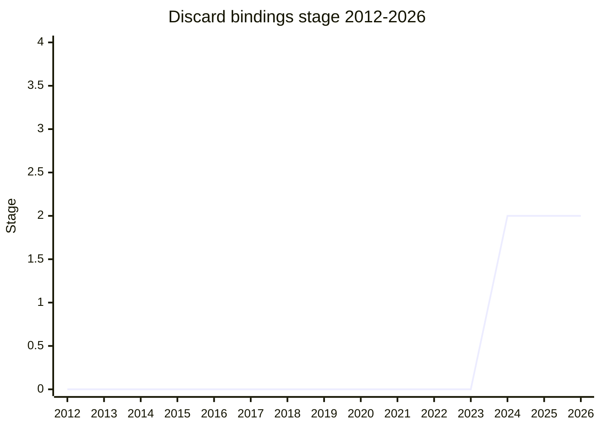

## Overview

`void` as a binding position: a way to declare that a value is intentionally not being used in destructuring patterns and other binding/assignment positions, e.g. `const [void, x, y] = arr` or ignoring object properties in a pattern without naming them. The mental model agreed at Stage 1 is "things that can declare something or assign to something" - binding and assignment patterns, not value-producing positions like array literals (where the existing elision hole semantics keep meaning something different).

The motivating bug class is array destructuring where trailing elision collides with trailing commas: `[a, b,,]` looks like three positions but produces two bindings, so the intended number of consumed elements is easy to get silently wrong. Discard bindings make the intent explicit. The champion is [RBN](../people/RBN.md), who pulled the feature out of Explicit Resource Management so it could cross-cut several proposals (destructuring, parameters, pattern matching) rather than being tied to one.

## Stage history

| Meeting                                                                           | Event                                                                                                                                   | Stage |
| --------------------------------------------------------------------------------- | --------------------------------------------------------------------------------------------------------------------------------------- | ----- |
| [2024-02](https://github.com/tc39/notes/blob/main/meetings/2024-02/feb-8.md)      | **Reached Stage 1**. [RGN](../people/RGN.md): "unusual in actually seeming to pay for itself"                                           | → 1   |
| [2024-04](https://github.com/tc39/notes/blob/main/meetings/2024-04/april-10.md)   | Stage 2 requested; blocked by [WH](../people/WH.md)'s cover-grammar concern (issue #5)                                                  | 1     |
| [2024-06](https://github.com/tc39/notes/blob/main/meetings/2024-06/june-13.md)    | Cover grammar resolved (PR #9, [WH](../people/WH.md)-approved). **Reached Stage 2**; underscore-vs-void decision deferred into Stage 2  | 1 → 2 |
| [2024-10](https://github.com/tc39/notes/blob/main/meetings/2024-10/october-09.md) | Update: the pattern-matching coupling debate (see below)                                                                                | 2     |
| [2024-10](https://github.com/tc39/notes/blob/main/meetings/2024-10/october-10.md) | Stage 3 reviewers volunteered ([ACE](../people/ACE.md), [OMT](../people/OMT.md)) - [RBN](../people/RBN.md) had forgotten to ask in June | 2     |

> Stage 1 in 2024-02, Stage 2 in 2024-06.

## Main issues

### void vs underscore

The obvious alternative spelling is `_`, and many delegates prefer it ([DMM](../people/DMM.md) described how Java formalized de-facto underscore usage with a long warning period before banning it). But [RBN](../people/RBN.md) argued it is not viable in JavaScript: `_` is too widely deployed (lodash/underscore.js), and someone would inevitably bind `_` in an inner scope and silently break a library's use of it. [NRO](../people/NRO.md) did the research on making underscore possible but agreed the prevalence problem is real. The decision was explicitly postponed to Stage 2 work.

A separate objection: `void` means the unit type in other languages, and using it for discards breaks that parallel - answered by noting JavaScript's existing `void` operator already broke it.

### Elision is the thing being replaced (on the left-hand side only)

[MLS](../people/MLS.md) pressed "why is undefined not acceptable?"; the answer separates three things people conflate: `undefined` _assigns_ a value (creating the property), elision creates a hole, and a discard binding asserts that this position exists and is deliberately left unnamed - plus the sloppy-mode hazard of a parameter actually named `undefined`. [NRO](../people/NRO.md) added that array-literal elision should not be encouraged (holey arrays); [RBN](../people/RBN.md) agreed and scoped the proposal to left-hand-side positions, with [DE](../people/DE.md)'s summary: "this is a left-hand side feature". [JHD](../people/JHD.md)'s mental model - "comma separated list" positions, excluding array/object literals - was accepted as the scoping rule of thumb.

### Must pattern matching justify it? (2024-10)

The 2024-10 update turned into a motivation debate. [JRL](../people/JRL.md) (and [JWK](../people/JWK.md), with concrete pattern-matching examples) argued pattern matching can express match-but-don't-bind without `void`, so the discard feature is redundant with a future `pattern-matching`; [SFC](../people/SFC.md) stated the committee's standing TG2 principle: "a proposal needs to be motivated by itself like not because of some future proposal that's coming along". [RBN](../people/RBN.md)'s counter: the feature was pulled out of Explicit Resource Management precisely because it cross-cuts destructuring, parameters, and matching - "It is a very small thin feature that is intent to broadly cross cut several different things." The discussion moved offline to the pattern-matching calls.

## Related proposals

- [Extractors](extractors.md) - the same destructuring-ergonomics line, same champion.
- [Explicit Resource Management](explicit-resource-management.md) - the proposal `void` bindings were split out of.
- `pattern-matching` - the future proposal whose overlap drove the 2024-10 debate (no page yet).

## Sources

- [2024-02 feb-8](https://github.com/tc39/notes/blob/main/meetings/2024-02/feb-8.md) - Stage 1 ([RBN](../people/RBN.md))
- [2024-04 april-10](https://github.com/tc39/notes/blob/main/meetings/2024-04/april-10.md) - Stage 2 blocked (cover grammar)
- [2024-06 june-13](https://github.com/tc39/notes/blob/main/meetings/2024-06/june-13.md) - Stage 2
- [2024-10 october-09](https://github.com/tc39/notes/blob/main/meetings/2024-10/october-09.md) - pattern-matching coupling debate
- [2024-10 october-10](https://github.com/tc39/notes/blob/main/meetings/2024-10/october-10.md) - Stage 3 reviewers
