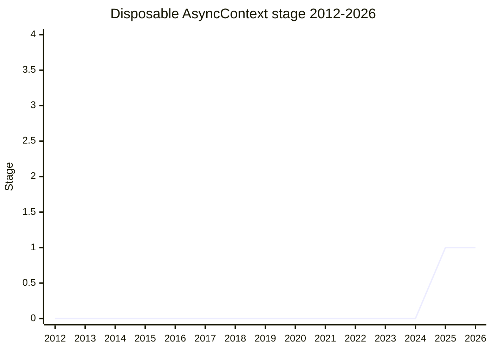

## Overview

`using` support for [AsyncContext](async-context.md) variables. Today the only way to scope an `AsyncContext.Variable` is `run(func, value)` - the value lives exactly as long as the callback. That forces refactoring (an early `break` / `return` escapes the scope), does not fit code that cannot take a function (constructors, test-framework lifecycle hooks), and makes tracing spans awkward: a span should end when the block ends, not when a callback returns. Presented by [CZW](../people/CZW.md) with [LCA](../people/LCA.md) and [GCL](../people/GCL.md) (`proposal-async-context-disposable`).

It is deliberately a **separate proposal** from AsyncContext: it depends on the Stage 1 "enforced using declaration" machinery (`Symbol.enter`), and the champions did not want it blocking AsyncContext's own Stage 2.7 path.

## Stage history

| Meeting                                                                         | What happened                                                                                                                                                                                                                                                                         | Stage |
| ------------------------------------------------------------------------------- | ------------------------------------------------------------------------------------------------------------------------------------------------------------------------------------------------------------------------------------------------------------------------------------- | ----- |
| [2025-04](https://github.com/tc39/notes/blob/main/meetings/2025-04/april-17.md) | "Disposable AsyncContext" for Stage 1 ([CZW](../people/CZW.md), [LCA](../people/LCA.md), [GCL](../people/GCL.md)). Support from [CDA](../people/CDA.md), [ABO](../people/ABO.md); [DLM](../people/DLM.md) no concerns for Stage 1 but "more experience is warranted". Reached Stage 1 | → 1   |

> Stage 1 in 2025-04; no further plenary appearances in the notes as of 2026-05.

## Main issues

### Three shapes of the solution

The session was mostly a structured comparison of three designs:

- **A. Reuse the `using` mechanism** with the Stage 1 `Symbol.enter` protocol: the variable is entered when the `using` declaration initializes and disposed at block exit. Downside: the enter can also be invoked manually (an `enterWith`-like escape hatch) and then leaks synchronously - though the leak is only observable with access to the `Variable` instance, and [SHS](../people/SHS.md) noted test frameworks might _want_ enter-without-exit (jasmine-style `before`/`after` hooks cannot adopt `run()` today). [SYG](../people/SYG.md): "Proposal A is palatable."
- **B. Make `using` itself AsyncContext-aware** (defer the enter, restore on exit): introduces new global mutable state and makes every `using` perform AsyncContext machinery. [SYG](../people/SYG.md) called B and C "deeply unpalatable because they basically hard couple AsyncContext variables to using syntax".
- **C. Internal enter/exit slots on a Scopable object**, never user-callable: breaks through `ShadowRealm` boundaries (the realm boundary cannot proxy over it) and does not compose with `DisposableStack`.

[RBN](../people/RBN.md) objected to B and C on composability grounds: they "break intuition with the disposal stack and how composition is intended to work with using declarations" - `using` is sugar over working with a disposable stack, and special-casing one type inside the syntax breaks that model.

### Baking time

[SYG](../people/SYG.md)'s overarching concern: "it certainly feels like we’re running ahead of the solution space here. … there’s zero baking time. Using is barely shipped" - the language has one year of experience with the disposal machinery, and "AsyncContext does not rise to the level of needing special casing in syntax that is itself very new yet". [DLM](../people/DLM.md) seconded that more experience is warranted. [MM](../people/MM.md) summarized the room accurately: "you heard negative comments. You have not heard objections to Stage 1. I will put myself in that category. I am very concerned about this and doubtful there's actually a feasible solution" - and Stage 1 advanced anyway.

### Generators and suspend points

[DE](../people/DE.md) asked what happens when execution yields inside the scope - a generator can outlive the frame that entered it. The champions expect all suspend points (`await`, `yield`) to restore the context on resumption, with details to be worked out. [DE](../people/DE.md)'s overall framing: "I don't think this proposal is essential for AsyncContext... this proposal is an effort to get back some of those ergonomics" that Node's `enterWith` offered.

## Related proposals

- [AsyncContext](async-context.md) - the parent proposal; this exists purely for its ergonomics.
- [Explicit Resource Management](explicit-resource-management.md) - the `using` / `DisposableStack` machinery whose semantics solutions B and C would have bent.
- `enforced using declaration` (`Symbol.enter`, Stage 1) - the protocol solution A builds on (no page yet).

## Sources

- [2025-04 april-17](https://github.com/tc39/notes/blob/main/meetings/2025-04/april-17.md) - Stage 1
