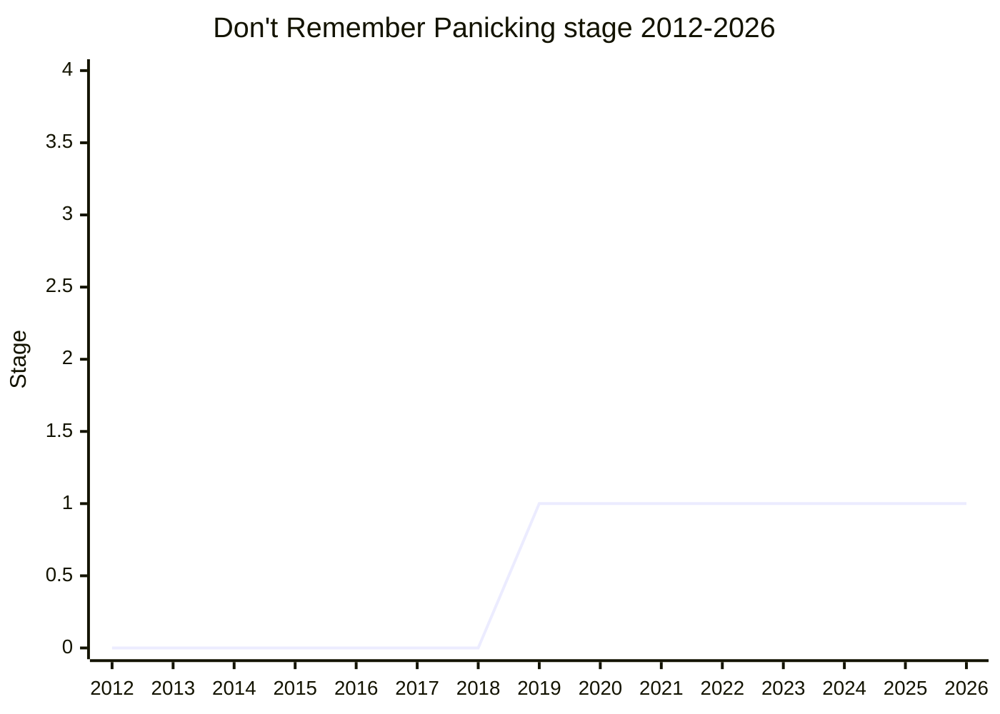

## Overview

What should a JS program be able to rely on when the engine hits a resource failure it cannot recover from - out-of-memory (OOM), stack exhaustion, internal engine errors? Championed by [MM](../people/MM.md) (Mark Miller) as **OOM Must Fail Fast** (2019), later renamed **Don't Remember Panicking**. The core claim: when a fatal fault hits, in-memory transactional state may already be corrupt ("amnesia before confusion"), so continuing to run - or unwinding into user `catch` blocks - can turn a clean crash into silent data corruption. The proposal asks for a spec-level account of fail-stop behavior and a **host fault handler hook** through which the embedder decides what "fail" means.

Six years on, the proposal remains at Stage 1 and the 2025-04 discussion showed why: the real content is not ECMA-262 but the contract between the spec, engines, and hosts (browsers kill the whole process; embedded XS reboots; Safari's engine can recover from OOM in tests). Most of the committee agrees the _problem_ is real; nearly every proposed _mechanism_ has drawn objections.

## Stage history

| Meeting                                                                           | What happened                                                                                                                                                              | Stage |
| --------------------------------------------------------------------------------- | -------------------------------------------------------------------------------------------------------------------------------------------------------------------------- | ----- |
| [2019-10](https://github.com/tc39/notes/blob/main/meetings/2019-10/october-3.md)  | "OOM Fails Fast for Stage 1" ([MM](../people/MM.md)). Reached Stage 1 ("Stage 1. 4 for 4!")                                                                                | → 1   |
| [2019-12](https://github.com/tc39/notes/blob/main/meetings/2019-12/december-5.md) | "Update on OOM Must Fail Fast"                                                                                                                                             | 1     |
| [2025-04](https://github.com/tc39/notes/blob/main/meetings/2025-04/april-15.md)   | Update under the new name "Don't Remember Panicking", plus a continuation. Extensive discussion, no conclusion; continuation asked to test viability without the panic API | 1     |

> Stage 1 in 2019-10; a 2019-12 update, then five years of silence until the 2025-04 update and continuation. Still Stage 1.

## Main issues

### The fault taxonomy and the host hook

The proposal's framework: a taxonomy of faults (OOM, out-of-stack, internal engine errors) that a conforming implementation cannot honor - the spec says the host hook returns a normal or throw completion, but `process.exit` or a browser killing the renderer is neither. "Amnesia before confusion": by the time OOM is detected, an in-progress transaction's invariants may already be broken, so best-effort recovery (XS reboots the engine; a browser shows the "blue tab of death") is the honest behavior, and the hook exists so hosts can classify severity and notify supervisors ([MAH](../people/MAH.md): workers want "kill me instead of continuing"; [ABO](../people/ABO.md) pointed to HTML's existing "aborting a running script" / killing-scripts machinery).

### Objections to `Reflect.panic`

The first 2025-04 session included a user-callable panic API (`Reflect.panic`) with severity levels, which drew the hardest objections:

- [SYG](../people/SYG.md): "There's no world where a browser vendor is going to ship an API that user code can call that makes it look like the browser's render process crashed" - and there is no meaningful interop story, since browsers disagree about what OOM even means ("Chrome kills the process. There is no notion of a dynamic agent cluster. I think that would be pretty much unimplementable and nondeterministic").
- [PFC](../people/PFC.md): panicking assert libraries "really degrade the experience for users of the web".
- [DE](../people/DE.md): a panic primitive is a strong capability whose library-ecosystem effects are unpredictable.
- [DLM](../people/DLM.md): if the need is transactional abort-and-retry, why is this not a transactions proposal instead?

[MM](../people/MM.md) offered to split the user-callable panic out into a follow-on and continue with only the host-hook part.

### Is it even a spec violation? (the 2025-04 continuation)

[SYG](../people/SYG.md) opened by retracting his earlier framing and sharpening it: "I do retract my statement... it is a violation of the spec. What I was driving at was that it is not a violation of the spec that is useful or can be acted upon." [MF](../people/MF.md) distilled the spec-side reality: "We say _what_ it must return. We don't say _when_ it must return." On the hook itself, [SYG](../people/SYG.md)'s final position split the difference: supportive of "figuring out how to better talk about real world resources in our specification", not supportive of "adding a host hook to the hopes of eventually exposing it as a configurable toggle" - a host hook here suggests configurability that browsers will never offer, and he would "prefer that we reflect reality through other editorial ways". Counterpoints from the room: Safari ([MLS](../people/MLS.md)) ships tests that recover from OOM via `try/catch`, so fail-stop is not universal reality either. The continuation ended with no conclusion.

## Related proposals

- None directly. The proposal sits at the spec/host boundary (HTML's killing-scripts section, agent clusters) rather than in the proposals family tree; its closest committee-relative is the agent-cluster machinery that [SYG](../people/SYG.md) cited as unimplementable to extend dynamically.

## Sources

- [2019-10 october-3](https://github.com/tc39/notes/blob/main/meetings/2019-10/october-3.md) - Stage 1
- [2019-12 december-5](https://github.com/tc39/notes/blob/main/meetings/2019-12/december-5.md) - update
- [2025-04 april-15](https://github.com/tc39/notes/blob/main/meetings/2025-04/april-15.md) - renamed update + continuation
