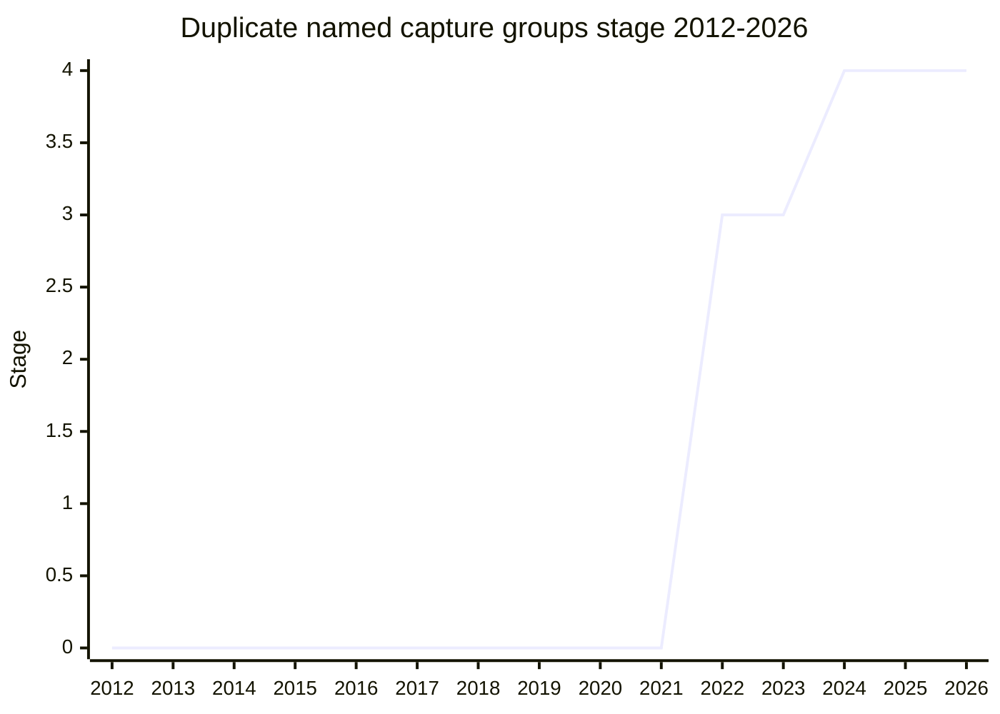

## Overview

Allows the same named capture group to appear more than once in a single regular expression, as long as the duplicates can never both participate in a match (they must sit in different alternatives, separated by `|`). Backreferences and the `.groups` object of the match result resolve to whichever occurrence actually matched; for a group inside a repetition, the last repetition wins, mirroring the existing behavior of unnamed capture groups.

The practical motivation is alternation-heavy patterns where the same field appears in several branches, e.g. matching dates in either `YYYY-MM-DD` or `MM/DD/YYYY` order with one named group per field instead of `validDateYear`/`validDateYear2`. Because the feature only makes previously-illegal syntax legal (no existing pattern changes meaning), the web-compatibility risk was judged minimal.

Championed by [KG](../people/KG.md) (Kevin Gibbons).

## Stage history

| Meeting                                                                         | Event                                                                                                                                                                                  | Stage |
| ------------------------------------------------------------------------------- | -------------------------------------------------------------------------------------------------------------------------------------------------------------------------------------- | ----- |
| [2022-06](https://github.com/tc39/notes/blob/main/meetings/2022-06/jun-06.md)   | Presented by [KG](../people/KG.md) "for stage 1, 2 or 3"; conditional advancement to Stage 2 pending [WH](../people/WH.md)'s spec review                                               | → 2   |
| [2022-06](https://github.com/tc39/notes/blob/main/meetings/2022-06/jun-07.md)   | [WH](../people/WH.md)'s review feedback addressed; property iteration order of the `groups` object made deterministic (first appearance in the literal regex). Unconditionally Stage 2 | 2     |
| [2022-07](https://github.com/tc39/notes/blob/main/meetings/2022-07/jul-20.md)   | Reached Stage 3                                                                                                                                                                        | 2 → 3 |
| [2023-07](https://github.com/tc39/notes/blob/main/meetings/2023-07/july-12.md)  | Status update: tests ready for about a year, waiting on implementations ([MF](../people/MF.md) relaying [KG](../people/KG.md): "please, please, please implement this")                | 3     |
| [2024-04](https://github.com/tc39/notes/blob/main/meetings/2024-04/april-08.md) | **Reached Stage 4**. Shipping in Safari and Chrome 125; Firefox integration underway ([DLM](../people/DLM.md): "our implementation is in progress")                                    | 3 → 4 |

> First presented 2022-06, Stage 3 the following month (2022-07), Stage 4 in 2024-04.

## Main issues

### A two-year wait on implementations (2022-2024)

The design itself moved fast - Stage 2 on first presentation, Stage 3 the next month - and then the proposal sat at Stage 3 for two years waiting for engines. The 2023-07 update was effectively a plea: tests had been in test262 for about a year, Safari was about to ship, and Mozilla had implementation work under way. A structural reason for the slowness: SpiderMonkey reuses V8's RegExp engine under the hood, so supporting the feature required cross-engine integration work rather than an isolated patch.

- Discussed at [2023-07](https://github.com/tc39/notes/blob/main/meetings/2023-07/july-12.md) and [2024-04](https://github.com/tc39/notes/blob/main/meetings/2024-04/april-08.md).
- Resolved: Chrome shipped the feature in 125 and the 2024-04 Stage 4 request passed with "overwhelming support" ([USA](../people/USA.md): "this is probably the most statements of expressed support that I have seen").

### Deterministic iteration order (2022-06)

[WH](../people/WH.md)'s spec review found that the iteration order of the `groups` object (and of `groups` inside the match `indices`) depended on the actual string matched against. Fixed during the Stage 2 window: the order is now simply the order in which each group name first appears in the literal regex.

## Related proposals

- [RegExp.escape](regexp-escaping.md) - the other 2022-2024 RegExp-line proposal by the same champion.
- [RegExp modifiers](regexp-modifiers.md) - adjacent RegExp-syntax extension of the same period.

## Sources

- [2022-06 jun-06](https://github.com/tc39/notes/blob/main/meetings/2022-06/jun-06.md) - Stage 1/2 (conditional)
- [2022-06 jun-07](https://github.com/tc39/notes/blob/main/meetings/2022-06/jun-07.md) - unconditionally Stage 2
- [2022-07 jul-20](https://github.com/tc39/notes/blob/main/meetings/2022-07/jul-20.md) - Stage 3
- [2023-07 july-12](https://github.com/tc39/notes/blob/main/meetings/2023-07/july-12.md) - status update (waiting on implementations)
- [2024-04 april-08](https://github.com/tc39/notes/blob/main/meetings/2024-04/april-08.md) - Stage 4
