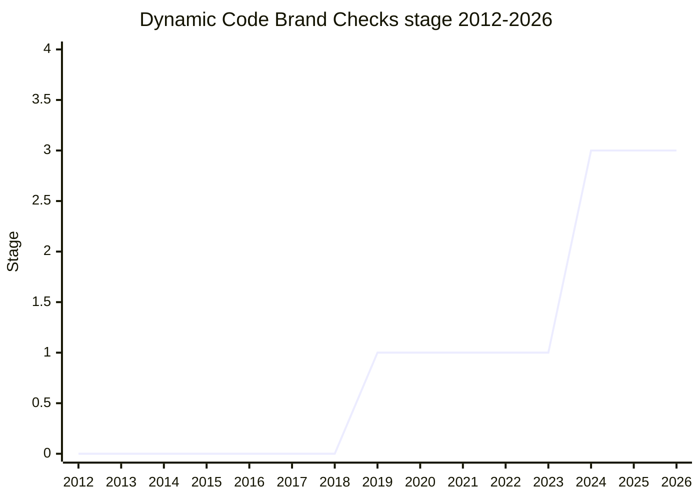

## 概要

Dynamic Code Brand Checks は、`eval` や `new Function` に渡されたコードが「ただの文字列」か「host が信頼を付与したオブジェクト(Trusted Types の `TrustedScript` 等)」かを区別できるようにする提案です。host が動的コード実行点に brand check を挟めるようにし、Web の Trusted Types と `eval`/`new Function` を統合して XSS 対策を強化することが狙いです。

champion は [KOT](../people/KOT.md)(Krzysztof Kotowicz)・[MSL](../people/MSL.md)(Mike Samuel)・[NRO](../people/NRO.md)(Nicolò Ribaudo)。

## ステージ遷移

| 会合                                                      | できごと                                                                                                                                                                            | Stage |
| --------------------------------------------------------- | ----------------------------------------------------------------------------------------------------------------------------------------------------------------------------------- | ----- |
| [2019-07](../../raw/notes/meetings/2019-07/july-25.md)    | Stage 2 を要求するも見送り。`_IsCodeLike_` の attack surface に [WH](../people/WH.md) が懸念、[MM](../people/MM.md)/[WH](../people/WH.md) が将来の reviewer 候補に                  | 1     |
| [2019-12](../../raw/notes/meetings/2019-12/december-5.md) | **Stage 2 非承認**。[MSL](../people/MSL.md) が [MM](../people/MM.md) らと次回へ向け継続                                                                                             | 1     |
| [2021-01](../../raw/notes/meetings/2021-01/jan-26.md)     | Stage 2 を再要求するも not advancing(`Dynamic host brand checks`)                                                                                                                   | 1     |
| [2024-04](../../raw/notes/meetings/2024-04/april-10.md)   | `eval`/`new Function` の Trusted Types 連携として **Stage 1 から直接 Stage 3 へ**(`new Function` の全文字列露出は除外)。[NRO](../people/NRO.md) が「Stage 1 版を Stage 3 に」と要求 | 1 → 3 |
| [2024-06](../../raw/notes/meetings/2024-06/june-11.md)    | eval / Trusted Types の update                                                                                                                                                      | 3     |
| [2026-05](../../raw/notes/meetings/2026-05/may-19.md)     | 全ブラウザ実装済み。だが `toString` 挙動が以前の committee consensus から乖離と判明。**normative change に consensus**。Stage 4 は提案・実装更新後に再要求                          | 3     |

> 横軸=2012-2026、縦軸=Stage。Stage 1 のまま 2019-2021 は Stage 2 要求が 3 度とも見送られ(`_IsCodeLike_` の attack surface 懸念ほか)、2024-04 に **Stage 2 を経ず 1 → 3** へ一気に前進。2026-05 は Stage 4 を狙ったが、normative change のみ consensus で Stage 4 は持ち越し。

## 主な論点

### `toString` 挙動の consensus 乖離(2026-05)

全ブラウザが実装を出荷済みで Stage 4 を狙いましたが、proposal が `toString` の挙動について過去の committee consensus から意図せず乖離していたことが判明。元の consensus に proposal と実装を揃え直す normative change に合意し、Stage 4 は「proposal と実装を更新した後に再要求」とされました。

### Trusted Types との統合(what / why)

`eval`/`new Function` に渡る値を、信頼付与済みオブジェクトかどうかで brand check できるようにすることで、Web の Trusted Types ポリシーと言語機能を接続し、文字列ベースの動的コード実行による XSS を抑止します。

### 長い Stage 1 停滞と 1 → 3 の直接前進

2019-2021 は Stage 2 を 3 度要求するも、いずれも見送られました。論点は判定方法の attack surface で、[WH](../people/WH.md) は「`_IsCodeLike_` の現在の選択では Stage 2 に進むのは不安だ」と述べ、[MM](../people/MM.md) も「internal slot を使うのは誤り、symbol はさらに悪い」と設計を問題視しました。その後 2024-04 に設計が `eval`/`new Function` の host hook 露出という形へ収束し、[NRO](../people/NRO.md) が「Stage 1 のままだった版を、host hook 更新を加えて Stage 3 にしたい」と要求。test を含む要件は概ね満たすとして **Stage 2 を経ず直接 Stage 3** に到達しました(ただし [MF](../people/MF.md) は「ここまで速く stage を通すのは落ち着かない」と拙速さに留保、[MM](../people/MM.md) は 2.7 を望むと表明したが最終的に 3 を支持)。

## 関連提案

- `is-template-object`(下記)— 同じく Trusted Types / 安全な DSL 文脈で Mike Samuel・Krzysztof Kotowicz が関与した brand check 系。

## 出典

- [2019-07 july-25](../../raw/notes/meetings/2019-07/july-25.md) — Stage 2 要求(見送り)
- [2019-12 december-5](../../raw/notes/meetings/2019-12/december-5.md) — Stage 2 非承認
- [2021-01 jan-26](../../raw/notes/meetings/2021-01/jan-26.md) — Stage 2 再要求(not advancing)
- [2024-04 april-10](../../raw/notes/meetings/2024-04/april-10.md) — Stage 1 → 3
- [2026-05 may-19](../../raw/notes/meetings/2026-05/may-19.md) — normative change / Stage 4 持ち越し
