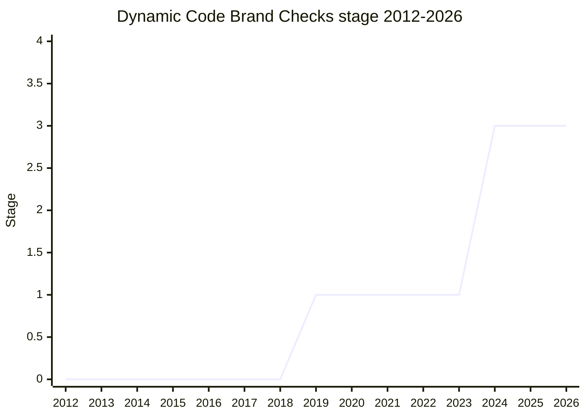

## Overview

Dynamic Code Brand Checks lets `eval` and `new Function` tell "a plain string" apart from "an object the host has marked trusted" (Trusted Types' `TrustedScript`, and others). The aim is to let a host insert a brand check at a dynamic-code execution point, and to strengthen XSS defense by integrating the web's Trusted Types with `eval` / `new Function`.

The champions are [KOT](../people/KOT.md) (Krzysztof Kotowicz), [MSL](../people/MSL.md) (Mike Samuel), and [NRO](../people/NRO.md) (Nicolò Ribaudo).

## Stage history

| Meeting                                                   | What happened                                                                                                                                                                                                                            | Stage |
| --------------------------------------------------------- | ---------------------------------------------------------------------------------------------------------------------------------------------------------------------------------------------------------------------------------------- | ----- |
| [2019-07](../../raw/notes/meetings/2019-07/july-25.md)    | Asked for Stage 2 and was deferred. [WH](../people/WH.md) was concerned about the attack surface of `_IsCodeLike_`. [MM](../people/MM.md) / [WH](../people/WH.md) were named as possible future reviewers                                | 1     |
| [2019-12](../../raw/notes/meetings/2019-12/december-5.md) | **Stage 2 not approved**. [MSL](../people/MSL.md) continues toward the next meeting with [MM](../people/MM.md) and others                                                                                                                | 1     |
| [2021-01](../../raw/notes/meetings/2021-01/jan-26.md)     | Asked for Stage 2 again and did not advance (`Dynamic host brand checks`)                                                                                                                                                                | 1     |
| [2024-04](../../raw/notes/meetings/2024-04/april-10.md)   | As Trusted Types integration for `eval` / `new Function`, **straight from Stage 1 to Stage 3** (exposing every string from `new Function` was excluded). [NRO](../people/NRO.md) asked to "put the Stage 1 version at Stage 3"           | 1 → 3 |
| [2024-06](../../raw/notes/meetings/2024-06/june-11.md)    | Update on eval / Trusted Types                                                                                                                                                                                                           | 3     |
| [2026-05](../../raw/notes/meetings/2026-05/may-19.md)     | Implemented in every browser. But `toString` behavior was found to have drifted from an earlier committee consensus. **Consensus on a normative change**. Stage 4 will be asked again after the proposal and implementations are updated | 3     |

```mermaid
xychart-beta
    title "Dynamic Code Brand Checks stage 2012-2026"
    x-axis [2012, 2013, 2014, 2015, 2016, 2017, 2018, 2019, 2020, 2021, 2022, 2023, 2024, 2025, 2026]
    y-axis "Stage" 0 --> 4
    line [0, 0, 0, 0, 0, 0, 0, 1, 1, 1, 1, 1, 3, 3, 3]
```

> Horizontal axis = 2012-2026, vertical axis = Stage. It stayed at Stage 1 through 2019-2021: a Stage 2 request was deferred all three times (including concern about the attack surface of `_IsCodeLike_`). In 2024-04 it jumped **1 → 3 without passing through Stage 2**. 2026-05 aimed at Stage 4, but only the normative change reached consensus, and Stage 4 carries over.

## Main issues

### `toString` behavior drifted from consensus (2026-05)

Every browser had shipped an implementation and the aim was Stage 4, but the proposal had unintentionally drifted from a past committee consensus on `toString` behavior. The committee agreed on a normative change that lines the proposal and the implementations back up with the original consensus. Stage 4 is "ask again after the proposal and the implementations are updated."

### Integration with Trusted Types (what / why)

By brand-checking whether a value passed to `eval` / `new Function` is an already-trusted object, it connects the web's Trusted Types policy to the language feature and restrains XSS from string-based dynamic code execution.

### A long Stage 1 stall, then a direct 1 → 3 advance

From 2019 to 2021, Stage 2 was requested three times and deferred every time. The issue was the attack surface of the check. [WH](../people/WH.md) said "with the current choice of `_IsCodeLike_`, I am uneasy about advancing to Stage 2," and [MM](../people/MM.md) also treated the design as a problem: "using an internal slot is wrong; a symbol is even worse." Later, in 2024-04, the design converged on exposing a host hook for `eval` / `new Function`, and [NRO](../people/NRO.md) asked to "take the version that was still at Stage 1, add the host-hook update, and put it at Stage 3." The requirements, including tests, were judged mostly met, and it **reached Stage 3 without passing through Stage 2** ([MF](../people/MF.md) reserved that "pushing a stage through this fast is uncomfortable," and [MM](../people/MM.md) said they wanted 2.7, but in the end supported 3).

## Related proposals

- `is-template-object` — another brand-check line in the Trusted Types / safe-DSL context, which Mike Samuel and Krzysztof Kotowicz were also involved in.

## Sources

- [2019-07 july-25](../../raw/notes/meetings/2019-07/july-25.md) — Stage 2 requested (deferred)
- [2019-12 december-5](../../raw/notes/meetings/2019-12/december-5.md) — Stage 2 not approved
- [2021-01 jan-26](../../raw/notes/meetings/2021-01/jan-26.md) — Stage 2 requested again (not advancing)
- [2024-04 april-10](../../raw/notes/meetings/2024-04/april-10.md) — Stage 1 → 3
- [2026-05 may-19](../../raw/notes/meetings/2026-05/may-19.md) — normative change / Stage 4 deferred
