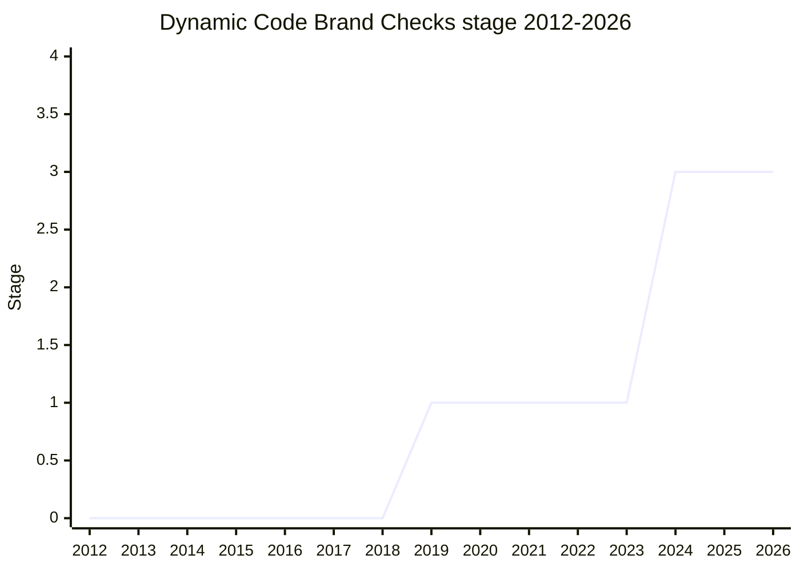

## Overview

Dynamic Code Brand Checks lets `eval` and `new Function` tell "a plain string" apart from "an object the host has marked trusted" (Trusted Types' `TrustedScript`, and others). The aim is to let a host insert a brand check at a dynamic-code execution point, and to strengthen XSS defense by integrating the web's Trusted Types with `eval` / `new Function`.

The champions are [KOT](../people/KOT.md) (Krzysztof Kotowicz), [MSL](../people/MSL.md) (Mike Samuel), and [NRO](../people/NRO.md) (Nicolò Ribaudo).

## Stage history

| Meeting                                                                           | What happened                                                                                                                                                                                                                                                                                                                        | Stage |
| --------------------------------------------------------------------------------- | ------------------------------------------------------------------------------------------------------------------------------------------------------------------------------------------------------------------------------------------------------------------------------------------------------------------------------------ | ----- |
| [2019-06](https://github.com/tc39/notes/blob/main/meetings/2019-06/june-4.md)     | [MSL](../people/MSL.md) gave a context-setting explanation of Trusted types (WICG) ahead of the Stage 0 proposals that followed                                                                                                                                                                                                      | 0     |
| [2019-06](https://github.com/tc39/notes/blob/main/meetings/2019-06/june-5.md)     | `evalable for Stage 1 or 2` ([MSL](../people/MSL.md)). Conclusion "Stage 1 acceptance"; [MM](../people/MM.md) and [KG](../people/KG.md) objections to be resolved before Stage 2. The companion `Host compile value adjustment for Stage 1 or 2` got "No consensus for Stage 2 yet" and was to "Combine with prior stage 1 proposal" | 0 → 1 |
| [2019-07](https://github.com/tc39/notes/blob/main/meetings/2019-07/july-25.md)    | Asked for Stage 2 and was deferred. [WH](../people/WH.md) was concerned about the attack surface of `_IsCodeLike_`. [MM](../people/MM.md) / [WH](../people/WH.md) were named as possible future reviewers                                                                                                                            | 1     |
| [2019-12](https://github.com/tc39/notes/blob/main/meetings/2019-12/december-5.md) | **Stage 2 not approved**. [MSL](../people/MSL.md) continues toward the next meeting with [MM](../people/MM.md) and others                                                                                                                                                                                                            | 1     |
| [2021-01](https://github.com/tc39/notes/blob/main/meetings/2021-01/jan-26.md)     | Asked for Stage 2 again and did not advance (`Dynamic host brand checks`)                                                                                                                                                                                                                                                            | 1     |
| [2024-04](https://github.com/tc39/notes/blob/main/meetings/2024-04/april-10.md)   | As Trusted Types integration for `eval` / `new Function`, **straight from Stage 1 to Stage 3** (exposing every string from `new Function` was excluded). [NRO](../people/NRO.md) asked to advance "the version of the proposal that was at Stage 1", with an updated host hook, to Stage 3                                           | 1 → 3 |
| [2024-06](https://github.com/tc39/notes/blob/main/meetings/2024-06/june-11.md)    | Update on eval / Trusted Types                                                                                                                                                                                                                                                                                                       | 3     |
| [2026-05](https://github.com/tc39/notes/blob/main/meetings/2026-05/may-19.md)     | Implemented in every browser. But `toString` behavior was found to have drifted from an earlier committee consensus. **Consensus on a normative change**. Stage 4 will be asked again after the proposal and implementations are updated                                                                                             | 3     |

```mermaid
xychart-beta
    title "Dynamic Code Brand Checks stage 2012-2026"
    x-axis [2012, 2013, 2014, 2015, 2016, 2017, 2018, 2019, 2020, 2021, 2022, 2023, 2024, 2025, 2026]
    y-axis "Stage" 0 --> 4
    line [0, 0, 0, 0, 0, 0, 0, 1, 1, 1, 1, 1, 3, 3, 3]
```

> Horizontal axis = 2012-2026, vertical axis = Stage. Stage 1 in 2019-06 (as `evalable`), and it stayed at Stage 1 through 2019-2021: a Stage 2 request was deferred all three times (including concern about the attack surface of `_IsCodeLike_`). In 2024-04 it jumped **1 → 3 without passing through Stage 2**. 2026-05 aimed at Stage 4, but only the normative change reached consensus, and Stage 4 carries over.

## Main issues

### `toString` behavior drifted from consensus (2026-05)

Every browser had shipped an implementation and the aim was Stage 4, but the proposal had unintentionally drifted from a past committee consensus on `toString` behavior. The committee agreed on a normative change that lines the proposal and the implementations back up with the original consensus. Per the conclusion, "Stage 4 will be revisited after the proposal and implementations are updated".

### Integration with Trusted Types (what / why)

By brand-checking whether a value passed to `eval` / `new Function` is an already-trusted object, it connects the web's Trusted Types policy to the language feature and restrains XSS from string-based dynamic code execution.

### A long Stage 1 stall, then a direct 1 → 3 advance

From 2019 to 2021, Stage 2 was requested three times and deferred every time. The issue was the attack surface of the check. [WH](../people/WH.md) said "I'm uncomfortable going to Stage 2 with the current choice of _IsCodeLike_", and [MM](../people/MM.md) also treated the design as a problem: "IsCodeLike is wrong. Using an internal slot is wrong. The symbol would be worse." (both 2019-07). Later, in 2024-04, the design converged on exposing a host hook for `eval` / `new Function`, and [NRO](../people/NRO.md) asked for "consensus on advancing the proposal, the version of the proposal that was at Stage 1, with this changes – updated host hook", to Stage 3. The requirements, including tests, were judged mostly met, and it **reached Stage 3 without passing through Stage 2** ([MF](../people/MF.md) said it "makes me a bit uncomfortable with how quickly we're looking to move this through the stage process", and [MM](../people/MM.md) said "I would still like to see this only go to Stage 2.7 at this meeting", but in the end "I am fine with 3").

## Related proposals

- `is-template-object` — another brand-check line in the Trusted Types / safe-DSL context, which Mike Samuel and Krzysztof Kotowicz were also involved in.

## Sources

- [2019-06 june-4](https://github.com/tc39/notes/blob/main/meetings/2019-06/june-4.md) — Trusted types context (Stage 0)
- [2019-06 june-5](https://github.com/tc39/notes/blob/main/meetings/2019-06/june-5.md) — `evalable` Stage 1
- [2019-07 july-25](https://github.com/tc39/notes/blob/main/meetings/2019-07/july-25.md) — Stage 2 requested (deferred)
- [2019-12 december-5](https://github.com/tc39/notes/blob/main/meetings/2019-12/december-5.md) — Stage 2 not approved
- [2021-01 jan-26](https://github.com/tc39/notes/blob/main/meetings/2021-01/jan-26.md) — Stage 2 requested again (not advancing)
- [2024-04 april-10](https://github.com/tc39/notes/blob/main/meetings/2024-04/april-10.md) — Stage 1 → 3
- [2026-05 may-19](https://github.com/tc39/notes/blob/main/meetings/2026-05/may-19.md) — normative change / Stage 4 deferred
