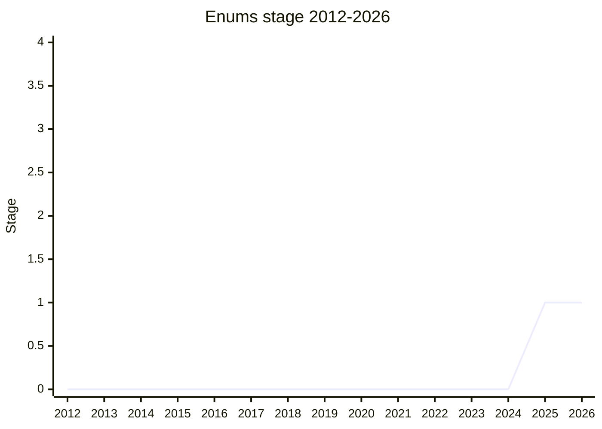

## Overview

`enum` as language syntax: a closed, fixed set of named members with restricted value types (String / Number / BigInt / Boolean / Symbol), presented by [RBN](../people/RBN.md) (Ron Buckton, TypeScript team). The immediate trigger is **Node.js type stripping** (`--experimental-strip-types`, `erasableSyntaxOnly`): TypeScript's `enum` is the one major non-erasable feature, so type-stripping users cannot use it, and the Node.js committee reached out to TC39. The ecosystem scale is large - roughly 250,000 `enum` declarations on GitHub.

The proposal is deliberately **not** "TypeScript enums in JS". It keeps what makes an enum an enum (a closed domain, self-reference for bitmask definitions, static-tooling recognition) and drops the parts TC39 would never accept (auto-numbering, declaration merging, reverse mapping, `const enum`). The door is left open to later grow ADT-style enums (`Option` / `Result`) alongside `pattern-matching`.

## Stage history

| Meeting                                                                         | What happened                                                                                                                                                                                                                                       | Stage |
| ------------------------------------------------------------------------------- | --------------------------------------------------------------------------------------------------------------------------------------------------------------------------------------------------------------------------------------------------- | ----- |
| [2022-01](https://github.com/tc39/notes/blob/main/meetings/2022-01/jan-25.md)   | Prehistory: a separate `Enum for Stage 1` by [JWK](../people/JWK.md). [WH](../people/WH.md): "This is too vague at this point. I don't see the problem space identified." Conclusion "Does not reach stage 1"; form a champion group asynchronously | 0     |
| [2025-04](https://github.com/tc39/notes/blob/main/meetings/2025-04/april-15.md) | Presented for Stage 1 by [RBN](../people/RBN.md) (TypeScript team). Stage 1 with explicit support from [MM](../people/MM.md), [PFC](../people/PFC.md), [JHX](../people/JHX.md), [CDA](../people/CDA.md), [NRO](../people/NRO.md)                    | → 1   |

> An earlier, unrelated enum proposal ([JWK](../people/JWK.md), 2022-01) did not reach Stage 1, so the chart starts from this proposal. Stage 1 in 2025-04; no further plenary appearances in the notes as of 2026-05.

## Main issues

### Why not an ObjectLiteral?

The obvious counter - just freeze an object literal - misses what makes enums closed: members are non-writable and non-configurable on a null-prototype, non-extensible object; the value domain is restricted (functions are forbidden, to keep the ADT door open); members can self-reference during definition (bitmask use); and the syntax is recognizable to static tooling. The runtime is deliberately boring: an ordinary object desugared one member at a time, with `Symbol.iterator` yielding the domain.

### The TypeScript divergences

Accepted differences from TS enums, each a deliberate cut:

- **No auto-numbering by default.** The numeric auto-increment is a known footgun (rename or reorder silently renumbers). TS would keep auto-initializers and down-level them, with the new syntax available opt-in (an `auto` keyword or an `of` clause).
- **No declaration merging** (TS 6.0 is deprecating it anyway; about one major case in the top 1000 projects).
- **No reverse mapping** (unreliable in TS; `Symbol.iterator` gives the domain instead).
- **No `const enum`.**

[SYG](../people/SYG.md) pressed the adoption story: if the new syntax has different semantics from TS enums, TS must make the distinction visible in code, and he warned he will assess any new proposal by "how much is a pure DX thing that can be desugared, versus whether there are concrete benefits for the browser during runtime" - on type stripping support: "That’s not a runtime benefit" for browsers.

### Desugaring exposes partially-initialized enums ([MM](../people/MM.md))

Because the runtime is a one-at-a-time desugaring, there is no TDZ protection: swap two lines and a member reads `undefined` instead of erroring, and `F(E).B` can leak the uninitialized `E` out of the module (tracked as issue #25). [MM](../people/MM.md) was otherwise supportive - "enums were the biggest hole in the valuable things that had to be removed from TypeScript" for erasable TS - and [RBN](../people/RBN.md) was open to predeclaring the shape so members at least exist before initialization.

### Where it goes next

The design keeps functions out of the value domain specifically to preserve the option of ADT enums (tagged unions like `Option` / `Result`) later, which would interlock with `pattern-matching` and extractors. Interactions with [decorators](decorators.md) and shared structs were named as open areas.

## Related proposals

- [Decorators](decorators.md) - named as an interplay area for member-level metadata.
- `pattern-matching` - the consumption side of potential future ADT enums (no page yet).
- `structs` - shared structs were named as an interplay area (no page yet).

## Sources

- [2022-01 jan-25](https://github.com/tc39/notes/blob/main/meetings/2022-01/jan-25.md) - prehistory: `Enum for Stage 1` ([JWK](../people/JWK.md)), did not reach Stage 1
- [2025-04 april-15](https://github.com/tc39/notes/blob/main/meetings/2025-04/april-15.md) - Stage 1
