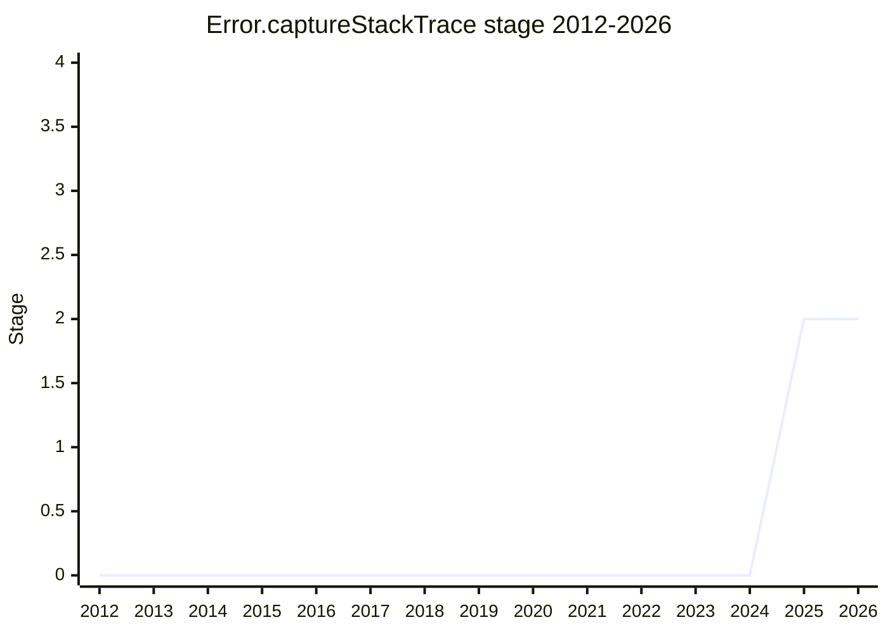

## Overview

`Error.captureStackTrace(object)` is a Chrome API (shipped as early as 2015) that prepares a stack trace on an arbitrary object (not only real `Error` instances). JavaScriptCore and SpiderMonkey later shipped it as well, driven by web compatibility problems - leaving three engines shipping the feature with no standard. This proposal standardizes the web reality.

Champions are [MAG](../people/MAG.md) (Matthew Gaudet) and [DLM](../people/DLM.md) (Daniel Minor).

## Stage history

| Meeting                                                                            | What happened                                                                                                                                                                          | Stage |
| ---------------------------------------------------------------------------------- | -------------------------------------------------------------------------------------------------------------------------------------------------------------------------------------- | ----- |
| [2025-02](https://github.com/tc39/notes/blob/main/meetings/2025-02/february-19.md) | First presented for Stage 1 (a web reality with three engines shipping it)                                                                                                             | → 1   |
| [2025-07](https://github.com/tc39/notes/blob/main/meetings/2025-07/july-29.md)     | Update. V8's `prepareStackTrace` extension (an observable-changes API) will not be standardized                                                                                        | 1     |
| [2025-11](https://github.com/tc39/notes/blob/main/meetings/2025-11/november-18.md) | **Reached Stage 2** with an accessor-based design whose getter lazily fills a dynamically added internal slot. [JHD](../people/JHD.md) / [MF](../people/MF.md) are Stage 2.7 reviewers | 1 → 2 |

> Stage 1 in 2025-02, Stage 2 in 2025-11.

## Main issues

### DataProperty vs accessor (2025-11)

The champion iterated through three designs: a DataProperty (rejected by the V8 team, because preparing the stack trace eagerly is not acceptable), a closure-based getter/setter, and finally an accessor pair that dynamically adds an internal slot - the only place in the specification where an internal slot is added after creation. The getter returns the slot's value (or `undefined`); the setter replaces the accessor pair with a DataProperty, which matches what JSC and SpiderMonkey ship and what V8 shipped for years.

[JHD](../people/JHD.md) pushed for locking down one strategy ("anything that is not fully locked down in the spec is something that library authors ... have to deal with permutations") and prefers the DataProperty, while [OFR](../people/OFR.md) explained why V8 needs the accessor: the unspecced `prepareStackTrace` hook (used on 0.1% of page loads, and by the whole Node.js ecosystem via [JRL](../people/JRL.md)'s account) requires laziness, since preparing the trace must not run user code until `.stack` is read. The compromise that reached Stage 2: the accessor approach is specified but marked as not recommended for new implementations (legacy).

## Related proposals

- [Error Stack Accessor](../proposals/error-stack-accessor.md) - standardizes `Error.prototype.stack` as an accessor; TG3 discussed but rejected sharing the accessors between the two proposals.

## Sources

- [2025-02 february-19](https://github.com/tc39/notes/blob/main/meetings/2025-02/february-19.md) - Stage 1
- [2025-07 july-29](https://github.com/tc39/notes/blob/main/meetings/2025-07/july-29.md) - update
- [2025-11 november-18](https://github.com/tc39/notes/blob/main/meetings/2025-11/november-18.md) - Stage 2
