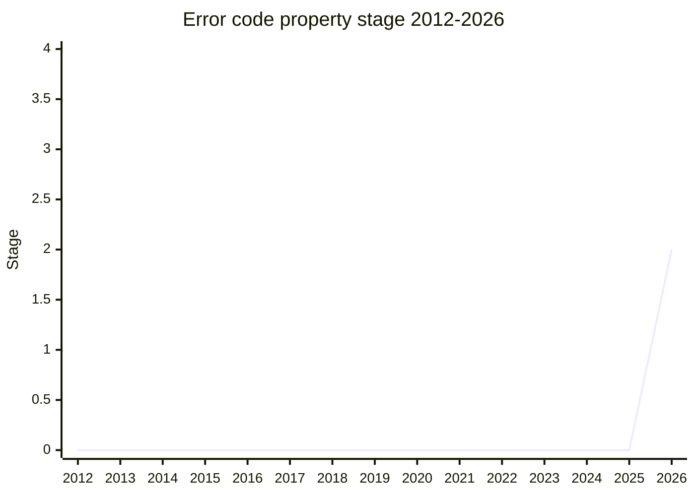

## 概要

Error code property は、`Error` に **`code` property を標準の仕組みとして追加する**提案です。`cause` と同様に constructor の options bag で渡し、non-enumerable な own property として instance に設置します。値は任意の型を許容します(典型は string)。Node.js の `err.code`(`ENOENT` 等)をはじめ、ecosystem では error の機械判別に `code` を使う慣行が広く定着しており、これを言語側で規格化します。`SuppressedError` / `AggregateError` にも options bag 経由で `code` を渡せるようにします。

champion は [JSL](../people/JSL.md)(James Snell、Cloudflare)。spec text・test262 の draft・V8 の draft 実装が揃った状態で Stage 2 に到達しました。

## ステージ遷移

| 会合                                                    | できごと                                                                                           | Stage |
| ------------------------------------------------------- | -------------------------------------------------------------------------------------------------- | ----- |
| [2026-03](../../raw/notes/meetings/2026-03/march-11.md) | 「Error code property for Stage 1, 2, or 2.7」として初提示、**Stage 1 到達**                       | 0 → 1 |
| [2026-07](../../raw/notes/meetings/2026-07/july-21.md)  | **Stage 2 到達**。以降の advancement は DOMException との整合が条件                                | 1 → 2 |
| [2026-07](../../raw/notes/meetings/2026-07/july-22.md)  | Stage 2 reviewer に [JHD](../people/JHD.md) / [RGN](../people/RGN.md) が就任(前日の指名漏れの補完) | 2     |

> 横軸=2012-2026、縦軸=Stage。2026-03 に Stage 1、2026-07 に Stage 2。

## 主な論点

### DOMException の `code` との衝突

唯一の実質的争点。DOMException は歴史的に numeric な `code` を **prototype getter** として持ちます。[AVK](../people/AVK.md)(WHATWG 側)が「`.code` に 2 つの意味が生まれ混乱する」と懸念を提起しました。[JSL](../people/JSL.md) / [JHD](../people/JHD.md) は「設置方法(own property vs prototype getter)も値空間も異なり実質の conflict は無い」との立場で、[KG](../people/KG.md) は WHATWG が DOMException の `code` を legacy 扱いし `.name` を推奨している経緯を説明。[JSL](../people/JSL.md) はむしろ「ecosystem の `code` 慣行を `.name` に付け替える方が breaking」と主張しました。

[KM](../people/KM.md) は [AVK](../people/AVK.md) の休暇中の advancement に慎重で、[KG](../people/KG.md) も「DOMException との一貫した story なしに Stage 2 を超えるべきでない」として、**Stage 2 まで**(2.7 は見送り)+「DOMException との整合が以降の advancement の条件」という決着になりました([LVU](../people/LVU.md) のみ 2.7 も支持)。整合の道筋は issue として提案を募っています。

### `SuppressedError` への options bag 追加

[MM](../people/MM.md) が「`SuppressedError` constructor には options bag が無いが?」と確認し、本提案が options bag を追加して `cause` / `code` の両方を渡せるようにすることを確かめたうえで支持しました。

## 関連提案

- [Error Stack Accessor](../proposals/error-stack-accessor.md) — 同じく Error まわりの de facto 挙動を標準化する隣接提案。
- `error-cause` — `cause` property(ES2022)。本提案は設置方式(non-enumerable own property + options bag)をこれに揃える。

## 出典

- [2026-03 march-11](../../raw/notes/meetings/2026-03/march-11.md) — Stage 1 到達
- [2026-07 july-21](../../raw/notes/meetings/2026-07/july-21.md) — Stage 2 到達
- [2026-07 july-22](../../raw/notes/meetings/2026-07/july-22.md) — reviewer 指名([JHD](../people/JHD.md) / [RGN](../people/RGN.md))
