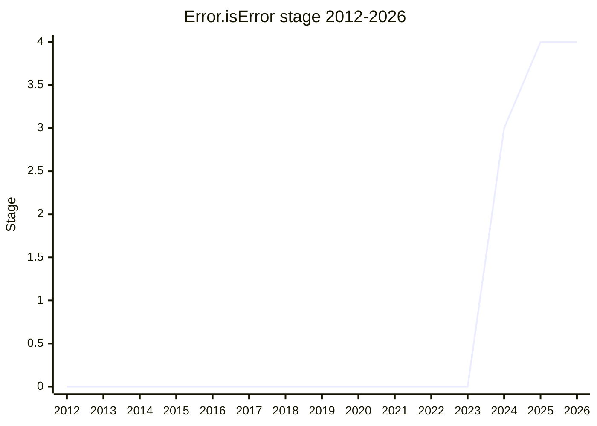

## Overview

`Error.isError(value)` is a brand check for error objects: it returns true for objects with an `Error` internal slot, including cross-realm errors and (per the HTML integration) `DOMException`. Today the only in-language approximation is `Object.prototype.toString` sniffing, which `Symbol.toStringTag` breaks, and `instanceof` fails across realms. The proposal was championed by [JHD](../people/JHD.md) throughout, but its road was unusually long: first presented in 2015-11, rejected on principle, resurrected in 2024-04, and Stage 4 in 2025-05.

Shipped in Chrome, Node, Firefox, Safari, Porffor, Kiesel, and Boa by the time of the Stage 4 ask, with the HTML spec merged so that platform exceptions count as errors.

## Stage history

| Meeting                                                                            | What happened                                                                                                                                | Stage   |
| ---------------------------------------------------------------------------------- | -------------------------------------------------------------------------------------------------------------------------------------------- | ------- |
| [2015-11](https://github.com/tc39/notes/blob/main/meetings/2015-11/nov-19.md)      | First presented by [JHD](../people/JHD.md). [DD](../people/DD.md): "This is not useful. We shouldn't be encouraging brand-check programming" | (none)  |
| [2016-03](https://github.com/tc39/notes/blob/main/meetings/2016-03/march-29.md)    | Discussed again. [DH](../people/DH.md) objected to blessing an idiom; no advancement                                                         | (none)  |
| [2024-04](https://github.com/tc39/notes/blob/main/meetings/2024-04/april-10.md)    | Brought back "for stage 1 or 2 (or even 2.7)". Reached Stage 1                                                                               | → 1     |
| [2024-06](https://github.com/tc39/notes/blob/main/meetings/2024-06/june-11.md)     | Reached Stage 2                                                                                                                              | 1 → 2   |
| [2024-07](https://github.com/tc39/notes/blob/main/meetings/2024-07/july-30.md)     | Not ready for 2.7; consensus to remove proxy piercing (issue 11)                                                                             | 2       |
| [2024-10](https://github.com/tc39/notes/blob/main/meetings/2024-10/october-09.md)  | Reached Stage 2.7                                                                                                                            | 2 → 2.7 |
| [2024-12](https://github.com/tc39/notes/blob/main/meetings/2024-12/december-02.md) | Reached Stage 3                                                                                                                              | 2.7 → 3 |
| [2025-05](https://github.com/tc39/notes/blob/main/meetings/2025-05/may-28.md)      | Reached Stage 4 (unanimous; eight to nine explicit supports)                                                                                 | 3 → 4   |

> Presented 2015-11 and discussed 2016-03 without advancement; brought back in 2024-04 and moved one stage per meeting from there (Stage 1 in 2024-04 through Stage 4 in 2025-05).

## Main issues

### Should error brand-checking exist at all? (2015-2016)

The early rejections were about principle, not design. [DD](../people/DD.md) (2015-11): "This is not useful. We shouldn't be encouraging brand-check programming" - errors per the spec are ordinary objects, not an exotic type, and blessing an `isError` idiom would encourage API designs that branch on it. [DH](../people/DH.md) (2016-03) accepted the need but attacked the framing: `Array.isArray` is a poor precedent because arrays are a genuinely narrow case with literal syntax, and "using the same snow clone (lol) is a message that people should design their APIs like this, which is bad"; he added "I think Error.isError is the wrong name." [MM](../people/MM.md) explored routing the need through `System.getStack` instead. The idea then sat dormant for eight years; when it returned in 2024 the committee's mood had shifted (WebIDL and platform errors made the check genuinely necessary), and it advanced.

### Proxy piercing (removed 2024-07)

The Stage 2 design could see through proxies to the error underneath, which drew three independent objections: it would add a fifth entry to [KG](../people/KG.md)'s list of things whose proxies reveal themselves (primitives, functions, proxies, arrays), and [MF](../people/MF.md) noted `Object.prototype.toString` does not pierce, so combining the two would detect a proxy of an error even though `Error.isError` tried to mask it. [JHD](../people/JHD.md) put up the removal himself: "I find all of the arguments to be very strong", reducing the spec to "is it an object with an error data internal slot?". [MM](../people/MM.md) supported removal but flagged the surviving irregularity - testing an internal slot on a non-`this` argument - as something that "should not become a precedent", noting membranes can still be transparent because they reflect errors by recreating them.

### Platform errors and the HTML integration

The 2024-07 HTML integration PR encoded the committee's expectation "that platform exceptions are considered an error and are not differentiated from language exceptions by this method" - so `DOMException` returns true. [JHD](../people/JHD.md) treated the merged HTML PR and Firefox's handling of internal errors as the field experience that justified Stage 4.

## Related proposals

- [Error.captureStackTrace](error-capture-stack-trace.md) - the same champion's effort to standardize error-introspection surfaces, advanced the same year.
- [Error Stack Accessor](error-stack-accessor.md) - standardizes `Error.prototype.stack`; the stack discussion of 2015-16 (`System.getStack`) is its direct ancestor.

## Sources

- [2015-11 nov-19](https://github.com/tc39/notes/blob/main/meetings/2015-11/nov-19.md) - first presentation (brand-check objections)
- [2016-03 march-29](https://github.com/tc39/notes/blob/main/meetings/2016-03/march-29.md) - second discussion, no advancement
- [2024-04 april-10](https://github.com/tc39/notes/blob/main/meetings/2024-04/april-10.md) - brought back, Stage 1
- [2024-06 june-11](https://github.com/tc39/notes/blob/main/meetings/2024-06/june-11.md) - Stage 2
- [2024-07 july-30](https://github.com/tc39/notes/blob/main/meetings/2024-07/july-30.md) - proxy piercing removed
- [2024-10 october-09](https://github.com/tc39/notes/blob/main/meetings/2024-10/october-09.md) - Stage 2.7
- [2024-12 december-02](https://github.com/tc39/notes/blob/main/meetings/2024-12/december-02.md) - Stage 3
- [2025-05 may-28](https://github.com/tc39/notes/blob/main/meetings/2025-05/may-28.md) - Stage 4
