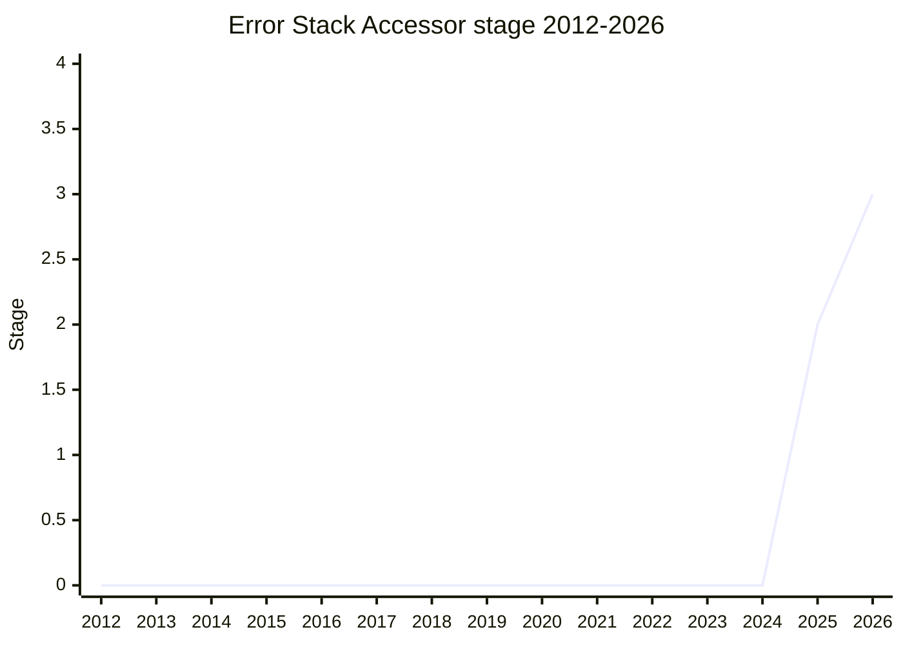

## 概要

Error Stack Accessor は、事実上すべての engine が実装している `Error.prototype.stack` を、`Error.prototype` 上の accessor(getter/setter)として標準化する提案です。長く続いた「Error Stacks」系の大きな議論から、まず既存の de-facto 挙動を最小限に仕様化する部分を切り出したものです。スタックトレースの構造化(Error Stacks Structure)とは別に、`.stack` のアクセス経路だけを先行して固める狙いです。

champion は [JHD](../people/JHD.md)(Jordan Harband)・[MM](../people/MM.md)(Mark Miller)。

## ステージ遷移

| 会合                                                       | できごと                                                                      | Stage   |
| ---------------------------------------------------------- | ----------------------------------------------------------------------------- | ------- |
| [2025-02](../../raw/notes/meetings/2025-02/february-19.md) | `Error Stack Accessor` を提示(旧 Error Stacks 系からの carve-out)             | 2       |
| [2026-03](../../raw/notes/meetings/2026-03/march-10.md)    | **Stage 2.7 到達**。HTML 統合 PR 提出                                         | 2 → 2.7 |
| [2026-05](../../raw/notes/meetings/2026-05/may-19.md)      | Stage 3 を要求(tests レビュー中)。週内 day 3 へ継続                           | 2.7     |
| [2026-05](../../raw/notes/meetings/2026-05/may-21.md)      | **Stage 3 到達**。tests が次回までに未マージなら 2.7 への降格を求める条件付き | 2.7 → 3 |

> 横軸=2012-2026、縦軸=Stage。本提案は 2025-02 に Error Stacks 系から切り出された比較的新しい proposal。Stage 2.7 が 2026-03、Stage 3 が 2026-05。Error stacks 自体の議論は 2017 年まで遡るが、それは別系譜のため本グラフには含めない。

## 主な論点

### tests マージを条件にした Stage 3(2026-05)

day 1 では tests がレビュー中・HTML PR 承認済みとして Stage 3 を要求しましたが結論は day 3 へ持ち越し。day 3 で tests 承認を確認し Stage 3 に到達しました。ただし「次回会合までに tests がマージされなければ Stage 2.7 への降格を求める」という条件が付きました。

### Error Stacks 系からの carve-out

スタックトレースの完全な構造化(Error Stacks Structure)は重く、合意が難しいため、まず `Error.prototype.stack` の accessor 化という最小スコープを先行させる戦略です。

## 関連提案

- `error-stacks-structure` — スタックの構造化(より大きな未決の系譜)。提案ページ未作成。
- `error-capture-stack-trace`(`Error.captureStackTrace`)— V8 互換 API の標準化。提案ページ未作成。

## 出典

- [2025-02 february-19](../../raw/notes/meetings/2025-02/february-19.md) — carve-out 提示
- [2026-03 march-10](../../raw/notes/meetings/2026-03/march-10.md) — Stage 2.7
- [2026-05 may-19](../../raw/notes/meetings/2026-05/may-19.md) — Stage 3 要求(継続)
- [2026-05 may-21](../../raw/notes/meetings/2026-05/may-21.md) — Stage 3(条件付き)
