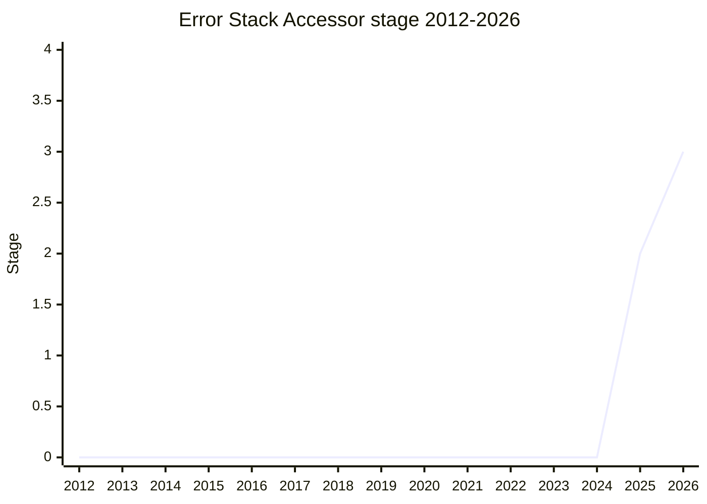

## Overview

Error Stack Accessor standardizes `Error.prototype.stack`, which essentially every engine implements, as an accessor (getter / setter) on `Error.prototype`. It is the piece carved out of the long, large "Error Stacks" discussion so that the existing de facto behavior can be specified first, at minimum scope. Separate from structuring stack traces (Error Stacks Structure), the aim is to pin down only the access path of `.stack` ahead of the rest.

The champions are [JHD](../people/JHD.md) (Jordan Harband) and [MM](../people/MM.md) (Mark Miller).

## Stage history

| Meeting                                                                            | What happened                                                                                                                                                                                                                                        | Stage   |
| ---------------------------------------------------------------------------------- | ---------------------------------------------------------------------------------------------------------------------------------------------------------------------------------------------------------------------------------------------------- | ------- |
| [2024-12](https://github.com/tc39/notes/blob/main/meetings/2024-12/december-03.md) | Pre-history: the Error Stacks Structure Stage 2 ask did not advance, and the champions announced "a new, smaller proposal with just the existing stack accessor" (this proposal), with the existing proposal to "rebase" on top of it as it advances | –       |
| [2025-02](https://github.com/tc39/notes/blob/main/meetings/2025-02/february-19.md) | Presented `Error Stack Accessor` (a carve-out from the older Error Stacks line)                                                                                                                                                                      | 2       |
| [2026-03](https://github.com/tc39/notes/blob/main/meetings/2026-03/march-10.md)    | **Reached Stage 2.7**. HTML integration PR filed                                                                                                                                                                                                     | 2 → 2.7 |
| [2026-05](https://github.com/tc39/notes/blob/main/meetings/2026-05/may-19.md)      | Asked for Stage 3 (tests under review). Continued to day 3 the same week                                                                                                                                                                             | 2.7     |
| [2026-05](https://github.com/tc39/notes/blob/main/meetings/2026-05/may-21.md)      | **Reached Stage 3**. Conditional: if the tests are not merged by the next meeting, ask to regress to 2.7                                                                                                                                             | 2.7 → 3 |

```mermaid
xychart-beta
    title "Error Stack Accessor stage 2012-2026"
    x-axis [2012, 2013, 2014, 2015, 2016, 2017, 2018, 2019, 2020, 2021, 2022, 2023, 2024, 2025, 2026]
    y-axis "Stage" 0 --> 4
    line [0, 0, 0, 0, 0, 0, 0, 0, 0, 0, 0, 0, 0, 2, 3]
```

> Horizontal axis = 2012-2026, vertical axis = Stage. This proposal is relatively new: carved out of the Error Stacks line (announced 2024-12, first presented 2025-02 at Stage 2). Stage 2.7 in 2026-03, Stage 3 in 2026-05. The Error stacks discussion itself goes back to 2017, but that is a separate line and is not on this chart.

## Main issues

### Stage 3 conditional on merging the tests (2026-05)

On day 1, Stage 3 was requested with the tests under review and the HTML PR approved, but the conclusion carried to day 3. On day 3 the test approval was confirmed and it reached Stage 3, with the condition that "if the tests are not merged by the next meeting, ask to regress to Stage 2.7."

### Carve-out from the Error Stacks line

Fully structuring stack traces (Error Stacks Structure) is heavy and hard to agree on, so the strategy is to go first with the minimum scope of making `Error.prototype.stack` an accessor. The split was announced at the 2024-12 plenary, where the Error Stacks Structure Stage 2 ask did not advance and the conclusion was to plan "a new, smaller proposal with just the existing stack accessor" - with the existing proposal to "rebase" on top of that as it advances.

## Related proposals

- `error-stacks-structure` — structuring the stack (the larger, still-open line). No proposal page yet.
- `error-capture-stack-trace` (`Error.captureStackTrace`) — standardizing the V8-compatible API. No proposal page yet.

## Sources

- [2024-12 december-03](https://github.com/tc39/notes/blob/main/meetings/2024-12/december-03.md) — carve-out announced (Error Stacks Structure Stage 2 ask did not advance)
- [2025-02 february-19](https://github.com/tc39/notes/blob/main/meetings/2025-02/february-19.md) — carve-out presented
- [2026-03 march-10](https://github.com/tc39/notes/blob/main/meetings/2026-03/march-10.md) — Stage 2.7
- [2026-05 may-19](https://github.com/tc39/notes/blob/main/meetings/2026-05/may-19.md) — Stage 3 request (continued)
- [2026-05 may-21](https://github.com/tc39/notes/blob/main/meetings/2026-05/may-21.md) — Stage 3 (conditional)
