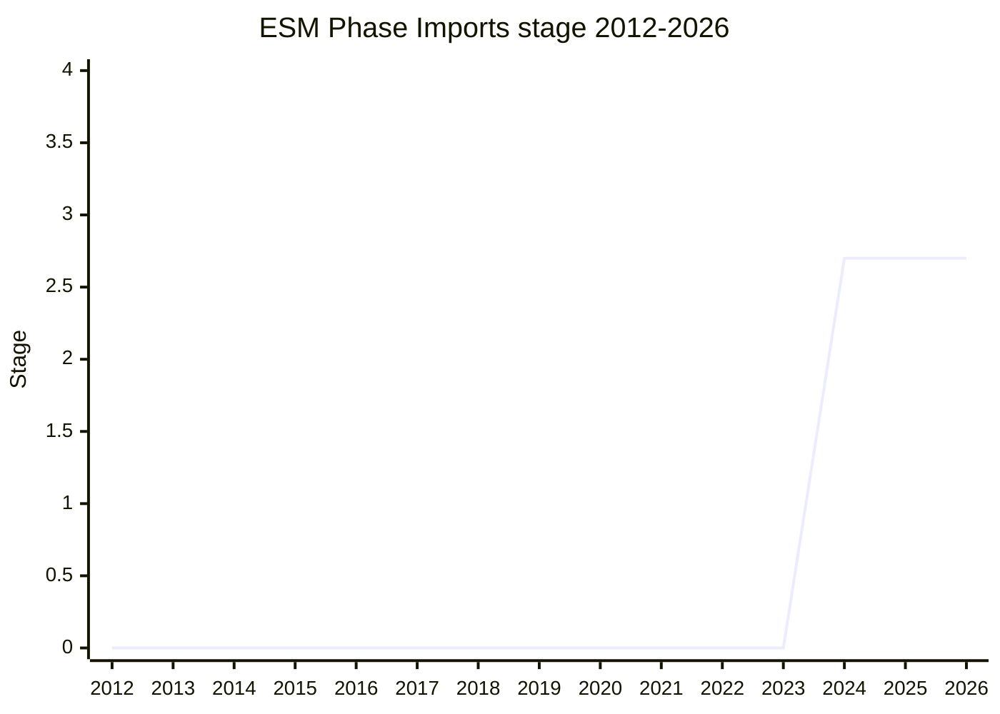

## Overview

The generalization of `source phase imports` into a uniform system of **phase imports**: syntax for obtaining a module at an earlier phase of its lifecycle than the evaluated instance - `import source` for the compiled `ModuleSource`, later joined by machinery to resume loading from that phase to full evaluation. Where source phase imports (Stage 3) cover Wasm-style "give me the compiled module" for a fixed phase, ESM Phase Imports defines the general phase model and the JavaScript-module `ModuleSource` on top of it, and unblocks the rest of the module pipeline: module expressions/declarations can now be syntax over `ModuleSource`s instead of needing the (since-shelved) ModuleInstance concept, and creating workers from module sources flows through the same machinery (with WHATWG integration).

The proposal was deliberately slimmed on the way through: static analysis of module sources moved out (re-homed with the future module loader hooks proposal), keeping this proposal focused on phases and JS module sources.

## Stage history

| Meeting                                                                            | Event                                                                                                                                                            | Stage      |
| ---------------------------------------------------------------------------------- | ---------------------------------------------------------------------------------------------------------------------------------------------------------------- | ---------- |
| [2024-02](https://github.com/tc39/notes/blob/main/meetings/2024-02/feb-8.md)       | Stage 1 (as the generalized successor to the Stage 3 source phase imports)                                                                                       | → 1        |
| [2024-06](https://github.com/tc39/notes/blob/main/meetings/2024-06/june-13.md)     | Stage 2                                                                                                                                                          | 1 → 2      |
| [2024-10](https://github.com/tc39/notes/blob/main/meetings/2024-10/october-08.md)  | Update; related source-phase PR #65 (syntax-error form) reached consensus                                                                                        | 2 (kept)   |
| [2024-12](https://github.com/tc39/notes/blob/main/meetings/2024-12/december-02.md) | Call for Stage 2.7 reviewers                                                                                                                                     | 2 (kept)   |
| [2024-12](https://github.com/tc39/notes/blob/main/meetings/2024-12/december-04.md) | Stage 2.7, conditional on [MM](../people/MM.md) interrogating the semantics via TG3 meetings before the next plenary                                             | 2 → 2.7    |
| [2026-03](https://github.com/tc39/notes/blob/main/meetings/2026-03/march-11.md)    | Update (first in about a year): normative PRs 58/61 presented; consensus deferred to the next meeting for review time; Node VM integration not a Stage 3 blocker | 2.7 (kept) |
| [2026-05](https://github.com/tc39/notes/blob/main/meetings/2026-05/may-21.md)      | Consensus on PR #61 - supporting cross-realm imports of module sources                                                                                           | 2.7 (kept) |

> Stage 1 in 2024-02, Stage 2 in 2024-06, Stage 2.7 in 2024-12. A restart-at-Stage-1 of ideas first advanced under source phase imports (which had reached Stage 3 in 2023-07 and remains a separate proposal).

## Main issues

### The relationship to source phase imports

The 2023 source phase imports proposal reached Stage 3, but the committee wanted the _general_ phase story rather than a one-off. ESM Phase Imports restarted at Stage 1 in 2024-02 to build that generalization, and the two now coexist: source phase imports holds Stage 3 for `import source` semantics, while the phase framework and JavaScript `ModuleSource`s advance here. [NRO](../people/NRO.md)'s Module Harmony overview (2024-12) made the dependency explicit - "ESM phase imports is already building on that" - and recorded the downstream unblocking: module expressions/declarations and worker creation no longer depend on a ModuleInstance phase import, because phase imports' machinery carries the metadata instead.

### Conditional advancement on [MM](../people/MM.md)'s semantics review

The 2024-12 Stage 2.7 grant was explicitly conditional: approval "from Mark for further interrogation of the semantics, through meetings at TG3, which will happen before the next meeting". [DE](../people/DE.md) defended the pattern when it came up: conditional advancements "based on someone needing a bit more time for review, including with Mark in particular" are standard, and 2.7 exists precisely to force observable semantics to be worked out before the implementation signal. The follow-through took time - the next update came only in 2026-03, with consensus on its normative PRs deferred once more for review, and PR #61 (cross-realm imports of module sources) reaching consensus in 2026-05.

## Related proposals

- [import defer](import-defer.md) / [Import Sync](import-sync.md) - the deferred-evaluation and sync-execution ends of the module lifecycle this proposal models the earlier phases of.
- `source phase imports` - the Stage 3 predecessor this generalizes (no page yet).
- [Module Global](module-global.md) - neighboring module-map work.

## Sources

- [2024-02 feb-8](https://github.com/tc39/notes/blob/main/meetings/2024-02/feb-8.md) - Stage 1
- [2024-06 june-13](https://github.com/tc39/notes/blob/main/meetings/2024-06/june-13.md) - Stage 2
- [2024-10 october-08](https://github.com/tc39/notes/blob/main/meetings/2024-10/october-08.md) - update
- [2024-12 december-02](https://github.com/tc39/notes/blob/main/meetings/2024-12/december-02.md) - call for reviewers
- [2024-12 december-04](https://github.com/tc39/notes/blob/main/meetings/2024-12/december-04.md) - Stage 2.7 (conditional)
- [2026-03 march-11](https://github.com/tc39/notes/blob/main/meetings/2026-03/march-11.md) - update, PRs 58/61
- [2026-05 may-21](https://github.com/tc39/notes/blob/main/meetings/2026-05/may-21.md) - PR #61 consensus
