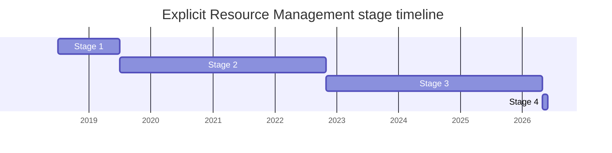

## 概要

Explicit Resource Management は、ブロックスコープに束ねた**決定的なリソース解放**を JavaScript に与える提案です。`using x = ...` / `await using x = ...` 宣言は RAII(resource acquisition is initialization)スタイルで、宣言した場所でリソースを確保し、宣言がスコープを抜けるときに解放します。解放は `Symbol.dispose`(同期)/ `Symbol.asyncDispose`(非同期)メソッドの呼び出しで行われ、これらをオブジェクトに定義するための protocol も提供します。

あわせて `DisposableStack` / `AsyncDisposableStack` のコンテナクラス(リソースの集約と、dispose 構文に未対応な既存 API との相互運用)と、ブロック本体と解放処理の双方が例外を投げたときに両者を包む `SuppressedError` を導入します。動機は、ファイル IO・ネットワーク・メモリといったリソースを、GC 任せや package ごとに異なる `close`/`dispose` 規約に頼らず、効率的かつ決定的に解放することです。

champion は長年 [RBN](../people/RBN.md)(Ron Buckton)が一貫して務めました。Stage 3 到達は 2022-12 で、Stage 2.7 制度の導入前だったため **2 → 3 を直接遷移**しています。最後の関門は設計ではなく Test262 のレビュー滞留で、2025-05 に **conditional Stage 4** を得た後、全テストがマージされた 2026-05 に正式 Stage 4(finished)となりました。

## ステージ遷移

| 会合                                                    | できごと                                                                                               | Stage         |
| ------------------------------------------------------- | ------------------------------------------------------------------------------------------------------ | ------------- |
| [2018-07](../../raw/notes/meetings/2018-07/july-24.md)  | Stage 1 到達(当時 `proposal-using-statement`)。[WH](../people/WH.md) が `using` 構文に懸念             | 0 → 1         |
| [2019-07](../../raw/notes/meetings/2019-07/july-25.md)  | Stage 2 到達(23 日に tabled、25 日に承認)。[YK](../people/YK.md)/[WH](../people/WH.md) が reviewer     | 1 → 2         |
| [2021-10](../../raw/notes/meetings/2021-10/oct-27.md)   | `try using` ブロックを廃し `using const` の RAII 宣言へ。[SYG](../people/SYG.md) が reviewer 追加      | 2             |
| [2022-11](../../raw/notes/meetings/2022-11/dec-01.md)   | **Stage 3 到達**(直接 2 → 3)。`AsyncDisposableStack` と `async using` は Stage 2 据え置き              | 2 → 3         |
| [2023-03](../../raw/notes/meetings/2023-03/mar-23.md)   | Async ERM が Stage 3。`await using` のキーワード順で決着([WH](../people/WH.md) の文法レビュー条件付き) | (async) 2 → 3 |
| [2023-07](../../raw/notes/meetings/2023-07/july-11.md)  | sync/async を 1 リポジトリへ統合完了。normative PR 群に consensus                                      | 3             |
| [2025-04](../../raw/notes/meetings/2025-04/april-15.md) | `switch` の bare `case` での `using` 禁止 PR に consensus(V8/SpiderMonkey の try/finally 化要望)       | 3             |
| [2025-05](../../raw/notes/meetings/2025-05/may-28.md)   | **conditional Stage 4**(残り Test262 と ECMA-262 PR の最終承認待ち)                                    | 3 → (cond.) 4 |
| [2026-05](../../raw/notes/meetings/2026-05/may-19.md)   | **Stage 4(finished)**。全条件達成、全エディタ承認・Test262 マージ済み                                  | (cond.) 4 → 4 |

> 各 Stage の横棒 = その stage に居た期間(横軸 = 実時間)。2018-07 Stage 1 → 2019-07 Stage 2 → 2022-11 Stage 3(Stage 2.7 制度前なので 2 → 3 直接)。**Stage 2・Stage 3 とも長い**。2025-05 に conditional Stage 4 を経て 2026-05 に正式 Stage 4(約 8 年)。

## 主な論点

### 構文の bikeshed(`using` か `try (...)` か独自キーワードか)

2018-2021 にわたる最長の論点です。当初は cover grammar を要する `using` キーワードと `try (...)` 風ブロックの両案がありました。

> ([WH](../people/WH.md), 2018-07) `using` 構文には反対だ。cover grammar の上に cover grammar を重ねることになる。`try` 構文なら問題ない。

非公式なユーザー調査で「新構文は混乱を招き、独自キーワードの方が分かりやすい」との声も出ましたが、最終的に 2021-10 で [RBN](../people/RBN.md) が `try using` ブロックを廃し、`using` / `await using` 宣言の形に収束しました。

### 非同期 dispose と `await using` のキーワード順

[MM](../people/MM.md) は「interleaving 点に明確な構文マーカーが無ければ」非同期 dispose を block しました。答えは `await` キーワードでしたが、順序が `using await` か `await using` か `async using` かで割れました。2023-03 の投票を経て [RBN](../people/RBN.md) は `await using` に傾きます。

> ([RBN](../people/RBN.md), 2023-03) champion の好みとしては `await using` に傾いてきている。キーワードの順序が先行例(C#)とも一致する。

[MM](../people/MM.md) も「`using await` を支持していた懸念は `await using` で完全に解消された」とし、文法は 2 トークン先読みで済むことが確認されて Stage 3 に至りました。

### sync と async の提案統合

非同期版(`AsyncDisposableStack` / `async using`)は一度 Stage 2 で分離されましたが、後に本体へ統合されました。

> ([RBN](../people/RBN.md), 2023-07) async と sync の提案を統合することに合意していた。さらに両提案を 1 つのリポジトリに統合した。

### conditional Stage 4 の長い待機(Test262 レビュー滞留)

正式 Stage 4 への関門は新規設計ではなく Test262 のレビュー/マージの滞留でした。

> ([RBN](../people/RBN.md), 2025-05) テスト自体は数年前に完成している。ただ規模が大きいためレビューとマージが終わっていない。テスト数の多さによる滞留があっただけだ。

2026-05 に「全 Test262 が承認・マージされ、全エディタの承認も得た」と報告され、conditional advancement の前例(条件達成時点で advance)に従って再投票なしで finished・Stage 4 となりました。

## 関連提案

- `async-explicit-resource-management` — 当初は分離された後継提案(`AsyncDisposableStack`・`await using`)。2023 に本体へ統合(別ページは設けない)。
- `error-cause` — `SuppressedError` はリソース解放時の例外抑制を表す類似物(error cause の系譜)。提案ページ未作成。
- `iterator-helpers` / Python 風 context manager / `Symbol.enter` — 2023-07 で follow-up 候補として議論(確定なし)。

## 出典

- [2018-07 july-24](../../raw/notes/meetings/2018-07/july-24.md) — Stage 1
- [2019-07 july-23](../../raw/notes/meetings/2019-07/july-23.md), [july-25](../../raw/notes/meetings/2019-07/july-25.md) — Stage 2(tabled → 承認)
- [2021-10 oct-27](../../raw/notes/meetings/2021-10/oct-27.md) — `using const` RAII へ
- [2022-11 dec-01](../../raw/notes/meetings/2022-11/dec-01.md) — Stage 3 到達
- [2023-03 mar-21](../../raw/notes/meetings/2023-03/mar-21.md), [mar-23](../../raw/notes/meetings/2023-03/mar-23.md) — `await using` 決着 / Async ERM Stage 3
- [2023-07 july-11](../../raw/notes/meetings/2023-07/july-11.md), [july-12](../../raw/notes/meetings/2023-07/july-12.md) — sync/async 統合 / follow-up 議論
- [2024-04 april-09](../../raw/notes/meetings/2024-04/april-09.md), [2024-06 june-13](../../raw/notes/meetings/2024-06/june-13.md) — normative PR 群
- [2025-02 february-18](../../raw/notes/meetings/2025-02/february-18.md) — spec バグ修正
- [2025-04 april-15](../../raw/notes/meetings/2025-04/april-15.md) — `switch`/`case` の `using` 禁止
- [2025-05 may-28](../../raw/notes/meetings/2025-05/may-28.md) — conditional Stage 4
- [2026-05 may-19](../../raw/notes/meetings/2026-05/may-19.md) — Stage 4(finished)
