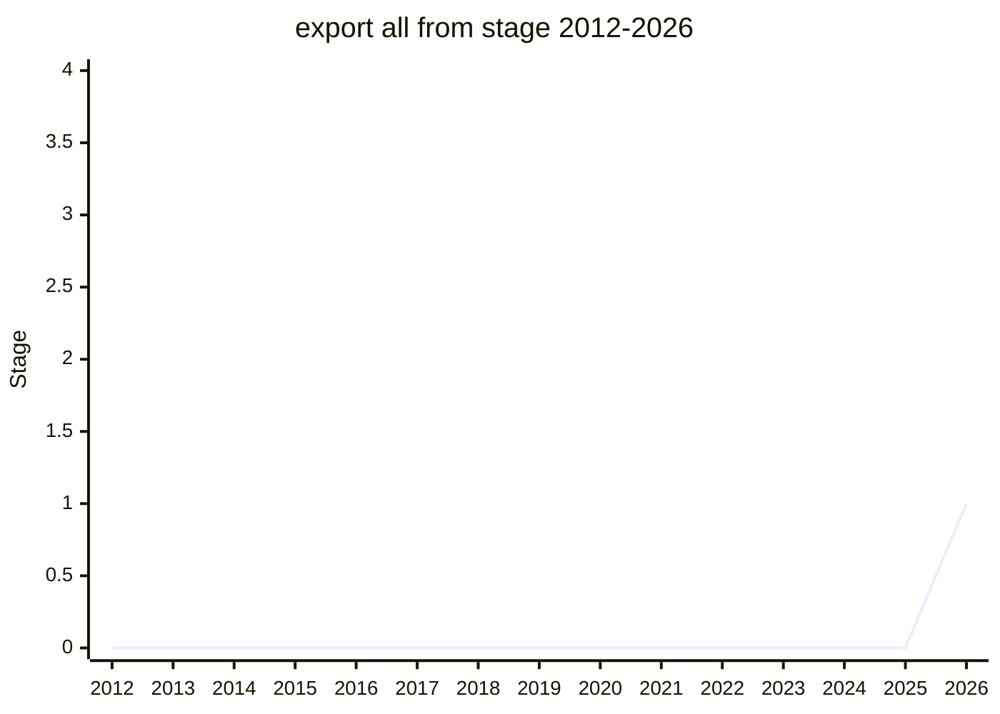

## 概要

export all from は、モジュールの再エクスポート構文を拡張する提案です(`export * from` 系の人間工学改善)。author は Guy Bedford、champion は [NRO](../people/NRO.md)(Nicolò Ribaudo)。`export * as ns from`・`export default from` といった既存の再エクスポート系譜の延長にあります。

## ステージ遷移

| 会合                                                  | できごと                | Stage |
| ----------------------------------------------------- | ----------------------- | ----- |
| [2026-05](../../raw/notes/meetings/2026-05/may-20.md) | **Stage 1 到達**        | → 1   |
| [2026-05](../../raw/notes/meetings/2026-05/may-21.md) | Stage 2 reviewer の募集 | 1     |

> 横軸=2012-2026、縦軸=Stage。2026-05 に Stage 1 到達(初出)。同会期 day 3 で Stage 2 reviewer の募集も行われた。

## 主な論点

このトピックでは speaker による summary / conclusion が提供されていません(notes 上は記載なし)。Stage 1 到達と Stage 2 reviewer 募集の事実が記録されています。

## 関連提案

- `export-default-from` / `export-ns-from`(`export * as ns from`)— 再エクスポート構文の既存系譜。提案ページ未作成。
- family: [Modules](../families/modules.md)

## 出典

- [2026-05 may-20](../../raw/notes/meetings/2026-05/may-20.md) — Stage 1
- [2026-05 may-21](../../raw/notes/meetings/2026-05/may-21.md) — Stage 2 reviewer 募集
