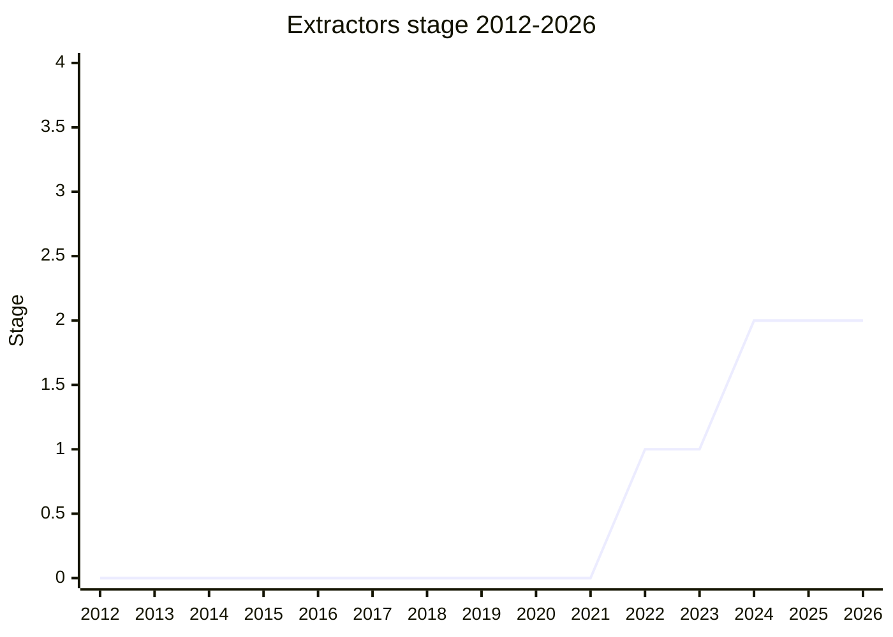

## Overview

Array and object **extractors**: pattern-matching-style bindings for assignment targets, e.g. `const [a, b] = arr`, `const {x, y} = obj` in places destructuring cannot appear today. The motivating case is destructuring function parameters with rest patterns and re-assignment of deeply nested paths (`({a: {b}} = obj)` today requires surrounding parentheses and errors silently when malformed). The proposal started (2022-09) with both array and object extractors; **object extractors were dropped in 2024-02** (they overlapped with pattern matching's future), keeping only the array form plus a "fixed" binding form for the ASI problem below.

The champion is [RBN](../people/RBN.md) (Microsoft, TypeScript team).

## Stage history

| Meeting                                                                           | Event                                                                                   | Stage |
| --------------------------------------------------------------------------------- | --------------------------------------------------------------------------------------- | ----- |
| [2022-09](https://github.com/tc39/notes/blob/main/meetings/2022-09/sep-15.md)     | Presented with both array and object extractors. Reached Stage 1                        | → 1   |
| [2024-02](https://github.com/tc39/notes/blob/main/meetings/2024-02/feb-7.md)      | Update: object extractors dropped; array extractors + the ASI fix carried forward       | 1     |
| [2024-04](https://github.com/tc39/notes/blob/main/meetings/2024-04/april-10.md)   | Stage 2 request **failed** on the ASI/NoLineTerminator concern (see below)              | 1     |
| [2024-10](https://github.com/tc39/notes/blob/main/meetings/2024-10/october-09.md) | **Reached Stage 2**. Stage 3 reviewers [JHD](../people/JHD.md), [JRL](../people/JRL.md) | 1 → 2 |

> Stage 1 in 2022-09, Stage 2 in 2024-10 (after a failed request in 2024-04).

## Main issues

### ASI and the NoLineTerminator fix

The 2024-04 Stage 2 failure. Extractors make `[` and `{` valid at the start of an expression position where they previously could only start a statement, which interacts with automatic semicolon insertion: `a = b\n[c] = d` would reparse in surprising ways. The fix - a `NoLineTerminator` restriction on the construct, plus the "fixed" binding form - was judged inconsistent (accepting some call-expression-like patterns and not others) and the request was refused. The refined grammar came back in 2024-10 and carried Stage 2.

### Is this syntax worth it? (the JSSugar debate)

The recurring objection, pressed hardest at the 2024-10 Stage 2 discussion by [SYG](../people/SYG.md):

> ([SYG](../people/SYG.md), 2024-10) It is a prime candidate for a JS sugar feature ... doesn't meet the bar to be implemented natively.

The counterpoint from [ACE](../people/ACE.md) (Bloomberg): "Type-directed emit would be a major issue for Bloomberg" - when the codebase cannot rely on a build step, syntax has no polyfill. [DE](../people/DE.md) proposed the working agreement that carried the day: advance now, and resolve the sugar question definitively by Stage 2.7. Related threads: iterator-protocol-based destructuring performance (engines must deopt to generic paths for exotic cases) and [YSV](../people/YSV.md)'s concern about the power of the construct.

## Related proposals

- `pattern-matching` - the fuller pattern syntax this was scoped against; the reason object extractors were dropped (no page yet).
- `discard-bindings` - the `void` binding, from the same destructuring ergonomics line (no page yet).

## Sources

- [2022-09 sep-15](https://github.com/tc39/notes/blob/main/meetings/2022-09/sep-15.md) - Stage 1 (array + object extractors)
- [2024-02 feb-7](https://github.com/tc39/notes/blob/main/meetings/2024-02/feb-7.md) - object extractors dropped
- [2024-04 april-10](https://github.com/tc39/notes/blob/main/meetings/2024-04/april-10.md) - Stage 2 request failed (ASI)
- [2024-10 october-09](https://github.com/tc39/notes/blob/main/meetings/2024-10/october-09.md) - Stage 2 ([RBN](../people/RBN.md))
